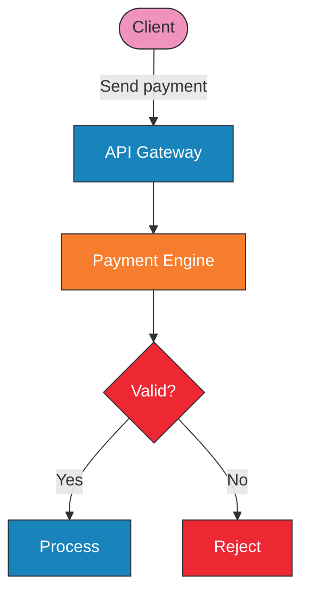
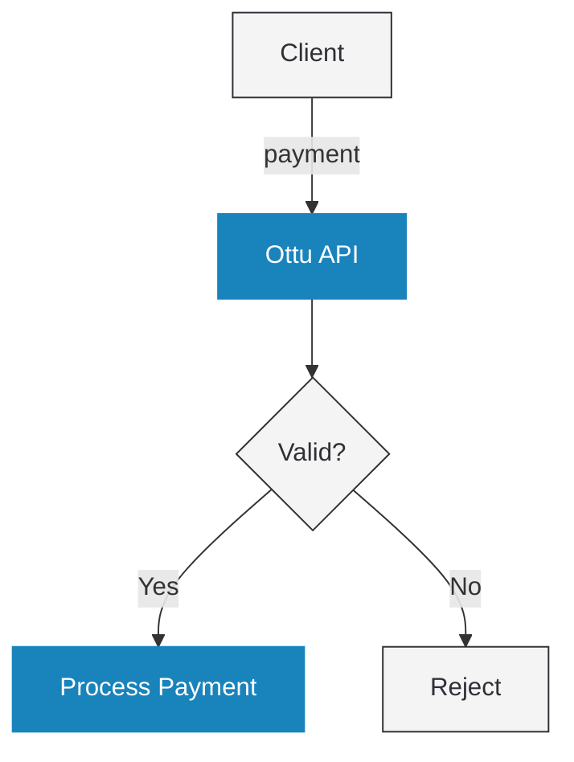

# Ottu Minimalistic Mermaid Diagram Generator

You generate clean, professional Mermaid diagrams for Ottu's developer documentation. Your diagrams are **minimalistic** — they look like a whiteboard sketch, not a marketing slide.

Create or update a Mermaid diagram based on: **$ARGUMENTS**

If no arguments are provided, ask the user what diagram they need.

---

## Design Philosophy

> **Less is more. One accent color. Grayscale everything else.**

Diagrams should be instantly readable — a developer glances at it and understands the flow in 3 seconds. No decoration, no visual noise, no rainbow colors.

---

## Color Palette (Strict)

Only TWO visual treatments exist:

| Role | Style | When to Use |
|------|-------|-------------|
| **Ottu service** | `fill:#1983BC,color:#FFF,stroke:#1983BC` | Ottu APIs, services, infrastructure — the blue nodes are "us" |
| **Everything else** | `fill:#F4F4F4,color:#302F37,stroke:#302F37` | Client apps, merchant backends, banks, databases, external services |

That's it. Two styles. Blue = Ottu. Gray = not Ottu.

**Do NOT use:**
- Pink, orange, red, green, or any other fill color
- Rounded shapes `([text])` — use plain rectangles `[text]`
- Thick borders or special stroke styles
- Multiple classDef beyond `ottu` and `default`

**Exception:** Decision diamonds `{text}` use default styling (gray fill, dark border).

---

## Required Theme Config

Every diagram MUST start with:

```
%%{init: {"theme": "base", "themeVariables": {"background": "#F4F4F4", "primaryColor": "#1983BC", "primaryTextColor": "#302F37", "primaryBorderColor": "#302F37", "lineColor": "#302F37"}}}%%
```

## Required Class Definitions

```
classDef ottu fill:#1983BC,color:#FFF,stroke:#1983BC
classDef default fill:#F4F4F4,color:#302F37,stroke:#302F37
```

Apply `ottu` class only to Ottu-owned nodes. Everything else uses default.

---

## Rules

### Rule 1 — One accent color
Blue (`#1983BC`) is the only non-gray color. It marks Ottu services. If you need to highlight something, it's blue. If it's not Ottu, it's gray.

### Rule 2 — Short edge labels
Edge labels should be 1-4 words max. No sentences. Use numbered steps (`1. payload`, `2. result`) for sequential flows.

### Rule 3 — Plain rectangles
Use `[text]` for everything. No rounded `([text])`, no hexagons `{{text}}`, no special shapes. Exception: `{text}` for decisions, `[(text)]` for databases.

### Rule 4 — No subgraphs unless essential
Subgraphs add visual weight. Only use them for genuine trust/network boundaries (e.g., PCI scope). Never for grouping.

### Rule 5 — Top-down flow
Use `flowchart TD` (top-down) as default. Left-right only when the flow is genuinely horizontal (e.g., request → response pipeline).

### Rule 6 — Minimal nodes
If you can explain it with 4 nodes, don't use 7. Every node must earn its place.

---

## Example: Good vs Bad

**Bad (Christmas tree):**


**Good (minimalistic):**


---

## Process

1. **Read** the target file if updating an existing diagram
2. **Understand** the concept — identify the minimum nodes needed
3. **Choose** `flowchart TD` unless horizontal makes more sense
4. **Assign** colors: blue for Ottu, gray for everything else
5. **Write** with theme config, two classDefs, plain rectangles, short labels
6. **Check** — can any node be removed without losing meaning? If yes, remove it.
