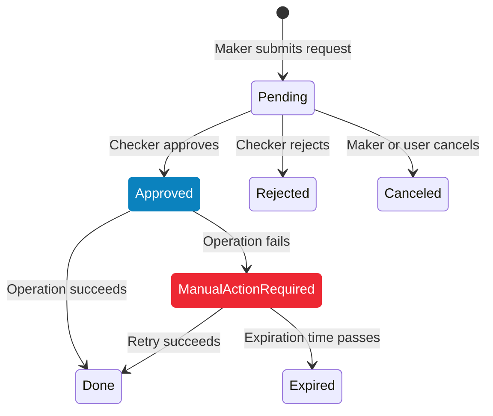

import StepGuide from "@site/src/components/StepGuide";

# Two-Step Refund & Void Authorization

The Two-Step Authorization feature implements a **maker-checker** workflow for refund and void operations. One user (the maker) submits the request, and another user (the checker) approves or rejects it. This ensures no single person can unilaterally issue a refund or void a transaction.

## Maker and Checker Roles

| Role | Description |
|------|-------------|
| **Maker** | A user with refund/void permissions (see [Refund & Void Access Control](./refund-void-access-control.mdx)) who submits operation requests |
| **Checker** | The single authorized user who approves or rejects submitted requests. The checker can also execute refunds and voids directly without going through the approval flow. |

:::note
A merchant can have **multiple makers**, but only **one checker**. The checker has the authority to process refunds and voids directly.
:::

## Activating the Feature

<StepGuide steps={[
  {
    title: "Navigate to Installed Plugins",
    description: <>From the Ottu Dashboard, open the <strong>Administration Panel</strong> and navigate to <strong>Plugins &gt; Installed Plugins</strong>.</>,
    image: "/img/business/operations/two-step-installed-plugins.png",
    imageAlt: "Installed Plugins in Administration Panel",
  },
  {
    title: "Add the Operations Approval plugin",
    description: <>Find and add the <strong>Operations Approval</strong> plugin from the list.</>,
    image: "/img/business/operations/two-step-add-plugin.png",
    imageAlt: "Add Operations Approval plugin",
  },
]} nextSectionId="assigning-the-checker" />

## Assigning the Checker

Only one authorized user can designate the checker:

1. Go to **Ottu Dashboard > Administration Panel > Operations Approval Plugin > Operations Approval Plugin Config**.
2. Select the user who will serve as the checker.

## How the Workflow Operates

### Request Lifecycle

1. **Maker submits** a refund or void request.
2. The request enters **Pending** state.
3. **Checker reviews** the request and either approves or rejects it.
4. Based on the checker's decision:
   - **Approved** — The operation executes automatically. If successful, the state transitions to **Done**. If it fails, the state becomes **Manual Action Required**.
   - **Rejected** — The state transitions to **Rejected**.

### State Transitions

### Key Rules

- **No duplicate requests** — You cannot submit a new operation request while a **Pending** request exists for the same transaction. The system displays: *"Requested \{Operation\} is pending for approval."*
- **Canceled request protection** — If the checker tries to approve a request that was already canceled, an error message is returned.
- **Automatic execution on approval** — Once approved, the refund or void executes automatically.
- **Retry capability** — In the **Approved** or **Manual Action Required** state, any user with permission can click **Retry** to re-attempt the operation.
- **Auto-expiration** — Requests in **Manual Action Required** state expire after **48 hours** (configurable) if no action is taken.
- **Remaining funds** — After an operation reaches **Done**, additional requests for the same transaction are only allowed if there are remaining funds, and only refund (not void) is permitted.

:::warning
When an operation transitions to **Manual Action Required**, the maker is notified via email. Respond promptly — the request will expire and become unrecoverable if the 48-hour window passes without action.
:::

### Whitelisted Users

The user who assigns the checker can also add **whitelisted users** who have elevated access within the Operations Approval workflow. Configure this at:

**Administration Panel > Operations Approval Plugin > Operations Approval Plugin Config**

## Email Notifications

The system sends email notifications at key points in the workflow:

| Event | Recipient |
|-------|-----------|
| Operation transitions to **Manual Action Required** | Maker |
| Refund or void completes (**Done** state) | Customer (and optionally the maker) |
| Operation is **Rejected** | Maker only |

:::tip
To include the maker in "Done" notification emails, enable the **BCC initiator** setting: go to **Ottu Dashboard > Administration Panel > Unit > Unit Configs** and check the **BCC initiator** checkbox.
:::

## Operation Request Table

The Operation Request Table is located under the **Tickets** tab on the Ottu Dashboard. It provides a centralized view of all refund and void requests with filtering by state, operation type, date, payment gateway, and currency.

### Table Columns

| Column | Description |
|--------|-------------|
| **ID** | Unique identification number of the operation request |
| **Date** | When the request was created |
| **Requested By** | The maker who initiated the request |
| **For Transaction** | The original transaction ID (click to view payment details) |
| **Operation** | Whether this is a refund or a void |
| **Amount** | Total amount of the original payment transaction |
| **Operation Amount** | The specific amount requested for the refund or void |
| **Status** | Current state: Pending, Approved, Rejected, Manual Action Required, or Expired |
| **Currency** | Currency of the payment transaction |
| **Payment Gateway** | The gateway used for the original transaction |
| **Action** | Available actions depend on role — **Checker**: Approve, Reject, or Retry. **Maker**: Cancel or Retry. |

## What's Next?

- [Refund & Void Access Control](./refund-void-access-control.mdx) — Set up the underlying permissions
- [Operations & Controls](./index.md) — Overview of all operational security features
- [Payment Management](../payment-management/index.md) — Manage transactions and view operation history
- [Notifications](../notifications/index.md) — Configure notification delivery channels
