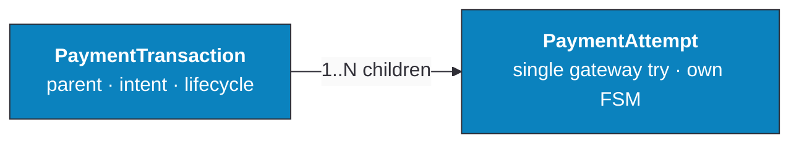
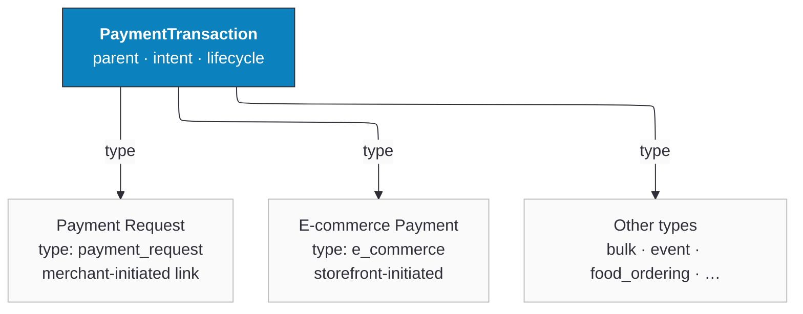

# Transaction States

Every payment in Ottu moves through a series of states, from creation to completion. Understanding these states helps you maintain an accurate audit trail, manage [operations](/business/operations) efficiently, and know exactly where each payment stands.

:::tip
For the full technical state machine, see [Payment States](/developers/reference/payment-states).
:::

## Payment Object Model

Every payment in Ottu is described by four core objects. Knowing what each one is — and how they relate — makes the state tables below much easier to follow.

- **[PaymentTransaction](/glossary#term-payment-transaction)** — the parent record holding the customer's intent to pay (amount, currency, allowed gateways, lifecycle state).
- **[PaymentAttempt](/glossary#term-payment-attempt)** — a single gateway-level try against a `PaymentTransaction`. One transaction can have many attempts; at most one reaches a `paid` state.
- **[Payment Request](/glossary#term-payment-request)** — a `PaymentTransaction` with `type: payment_request`, merchant-initiated and typically delivered as a payment link.
- **[E-commerce Payment](/glossary#term-e-commerce-payment)** — a `PaymentTransaction` with `type: e_commerce`, customer-initiated from an external storefront (Shopify, WooCommerce, Magento, etc.).

### Hierarchy

A `PaymentTransaction` is the parent record. Every gateway-level try against it is a `PaymentAttempt` child:

The `type` field on `PaymentTransaction` tells you what kind of intent it represents — a `Payment Request`, an `E-commerce Payment`, or one of several other types:

:::note
The "Parent Transaction" and "Child Transaction" terms used in the rest of this page refer to a separate concept: a child transaction is a record Ottu creates when a [post-payment operation](/business/operations) (capture, refund, void) is performed on the original payment. They are **not** the same as `PaymentAttempts` above — `PaymentAttempts` are the customer's individual tries on a single payment, while child transactions track later operations on a completed payment.
:::

Transactions in Ottu fall into two categories:

- **Parent Transaction** -- Stores all the essential data about the payment. This is the primary record of the transaction.
- **Child Transaction** -- Created when a subsequent operation is performed on a parent transaction, such as a capture, refund, or void.

## Parent States

The parent state reflects the overall status of the original payment transaction.

| State | Description | Actor |
|---|---|---|
| **Created** | The payment has been initiated successfully. | Merchant |
| **Pending** | The customer has interacted with the payment (viewed the checkout page, accessed the link, etc.) but has not completed it yet. | Customer |
| **Attempted** | The payment failed on the customer's end and is waiting for a retry. It stays in this state until successfully processed, expired, or canceled. | Customer |
| **Authorized** | The customer entered card details, and the bank has allocated (held) the amount, but it has not been deducted yet. | Customer |
| **Paid** | The bank has successfully deducted the payment amount. | Customer |
| **Failed** | The transaction encountered an error and could not be completed. Only applies to transactions that allow a single attempt. | Customer |
| **Canceled** | The merchant canceled the payment. No further action can be taken. | Merchant |
| **Expired** | The payment link's lifespan has ended. | Customer |
| **Invalid** | The payment is no longer available due to changes in payment configuration, currency exchange settings, or other unforeseen events. | Merchant |
| **COD** | Cash on Delivery -- the customer chose to pay in cash. | Customer |

:::note
The **Pending** state is only available when using an Ottu [plugin](/business/plugins) with the checkout page. The **Attempted** state does not exist for single-attempt transactions; those go directly to **Failed** or **Authorized**.
:::

## Child Payment States

Child transactions are created when a merchant performs an operation (capture, refund, void) on a parent transaction. The table below shows each child state, its originating parent state, and what it means.

| Child State | Parent State | Description |
|---|---|---|
| **Paid** | Authorized | A portion or all of the authorized amount has been captured. A child transaction record is created to track the capture. |
| **Refunded** | Authorized / Paid | A partial or full refund has been returned to the customer. |
| **Refund-queued** | Authorized / Paid | The refund is awaiting bank approval. |
| **Refund-rejected** | Authorized / Paid | The bank did not approve the refund. |
| **Voided** | Authorized | The authorized amount has been reversed. The full amount (including any fee) is returned to the customer. |

:::warning
Voiding can only be performed on authorized transactions that have not been captured. Once a capture occurs (even a partial one), the void option is no longer available -- use a [refund](/business/operations) instead.
:::

The figure below illustrates a payment transaction with both parent and child states. The parent transaction is in the **Authorized** state, and the child transactions show **Paid** (captured) and **Refunded** states for the same payment.

## Payment Attempts

A payment attempt represents a customer's individual try at completing a payment. When a transaction fails, the customer can retry -- potentially multiple times -- until the payment succeeds, expires, or is canceled.

### Attempt States

Each attempt has its own state, separate from the parent transaction state:

| Attempt State | Description |
|---|---|
| **Pending** | The customer has viewed the transaction details. |
| **Failed** | Payment failed (insufficient funds, card declined, etc.). The number of allowed attempts depends on the payment configuration. |
| **Canceled** | The customer clicked the cancel button. |
| **Success** | The payment attempt was successful. |
| **Error** | A payment gateway error occurred (service unavailable, network issue, etc.). |
| **COD** | Cash on Delivery was selected. |

:::note
When **COD** is used, a payment attempt is still created. Every change in the final state of a payment transaction must be associated with a payment attempt.
:::

### State Combinations

Understanding how parent transaction states and attempt states interact is key:

**For transactions that allow multiple attempts:**

- If the attempt state is `canceled` or `failed`, the parent transaction remains in the `attempted` state. The customer can try again until the transaction either expires or succeeds.
- If the attempt state is `success`, the parent transaction moves to `paid` or `authorized`.

**For transactions that allow only a single attempt:**

- There is no `attempted` state. The transaction goes directly to either `failed` or `authorized`.

---

## What's Next?

- [Transaction Insights](/business/payment-management/transaction-insights) -- Review amounts, fees, and dashboard charts
- [Operations](/business/operations) -- Perform captures, refunds, and voids
- [Notifications & Timing](/business/payment-management/notifications-timing) -- Configure when notifications are sent for each state change
- [Search & Filter Payments](/business/payment-management/search-and-filter) -- Find transactions by state, user, or gateway
