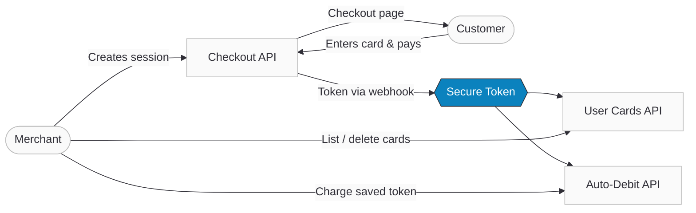

# Cards & Tokenization

Ottu provides a complete card management and tokenization solution that enables merchants to securely save customer payment methods, manage saved cards, and charge them automatically for recurring billing — all without handling sensitive card data directly.

## Capabilities

This section covers three core capabilities that work together:

### Save Cards (Tokenization)

Replace sensitive card data with secure tokens. Ottu handles PCI DSS compliance — you store only the token, never the card number.

Two methods available:
- **Save without payment** — store a card for future use without charging (`payment_type: save_card`, `amount: 0`)
- **Save during payment** — tokenize the card as part of a successful transaction

[**Go to Tokenization Guide →**](tokenization.md)

### Manage Saved Cards (User Cards API)

List and delete saved cards for a customer. The API returns only the last 4 digits and a token — never the full card number.

- Retrieve all saved cards for a `customer_id`
- Delete specific cards by token
- Cards are displayed automatically when using the [Checkout SDK](/developers/payments/checkout-sdk)

[**Go to User Cards API →**](user-cards.mdx)

### Charge Saved Cards (Recurring Payments & Auto-Debit)

Use saved tokens to charge customers automatically — for subscriptions, installments, or on-demand billing.

- **CIT (Cardholder Initiated)** — first payment where the customer saves their card
- **MIT (Merchant Initiated)** — subsequent automatic charges using the saved token
- Multiple integration paths: Auto-Debit API, One-Step Checkout, or Native Payments

[**Go to Recurring Payments Guide →**](recurring-payments.md)

## How They Connect

**Typical flow:**
1. Merchant creates a payment session via the [Checkout API](/developers/payments/checkout-api) and presents the checkout page to the customer (via [SDK](/developers/payments/checkout-sdk) or redirect)
2. Customer enters their card details and completes the payment — on success, the card is tokenized and the token is delivered to the merchant via [webhook](/developers/webhooks/payment-events)
3. Merchant stores the token and can list/manage saved cards via the [User Cards API](user-cards.mdx)
4. For subsequent charges, merchant uses the token with the [Auto-Debit API](recurring-payments.md) or [One-Step Checkout](/developers/payments/checkout-api#one-step-checkout)

## Prerequisites

- A [Payment Gateway](/developers/payments/payment-methods#activating-payment-gateway-codes) that supports tokenization (currently: MasterCard, Visa, STC Pay)
- The [Checkout API](/developers/payments/checkout-api) for creating payment sessions
- A `customer_id` to associate saved cards with a customer
- A `webhook_url` to receive token delivery notifications

:::tip
Not sure where to start? If you need to save cards, start with the [Tokenization Guide](tokenization.md). If you already have tokens and want to set up automatic billing, go directly to [Recurring Payments](recurring-payments.md).
:::

## What's Next?

- [**Tokenization**](tokenization.md) — How to save cards securely
- [**User Cards**](user-cards.mdx) — Manage saved cards via API
- [**Recurring Payments**](recurring-payments.md) — Auto-debit and subscription billing
