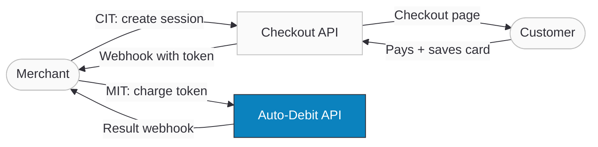

import ApiDocEmbed from "@site/src/components/ApiDocEmbed";
import RecurringDemo from "@site/src/components/RecurringDemo";
import TestCardCallout from "@site/src/components/TestCardCallout";
import FAQ, { FAQItem } from "@site/src/components/FAQ";
import StepGuide from "@site/src/components/StepGuide";

# Recurring Payments & Auto-Debit

Auto-debit is a financial arrangement where a customer authorizes a merchant to automatically deduct money from their saved card. This covers subscriptions, installments, recurring billing, and event-based charges — all processed without the customer needing to be present after the initial setup.

:::tip[Boost Your Integration]
Ottu offers SDKs and tools to speed up your integration. See [Getting Started](/developers/getting-started/#boost-your-integration) for all available options.
:::

## When to Use

- **Subscriptions** — monthly or annual recurring charges for SaaS, memberships, or content
- **Installment payments** — split a single purchase into multiple scheduled charges
- **On-demand billing** — charge customers when events occur (e.g., account top-ups, usage-based billing)
- **Recurring invoices** — automatically collect payment on invoice due dates

## Setup

Before implementing auto-debit, ensure you have:

- A [Payment Gateway](/developers/payments/payment-methods/) with auto-debit capability enabled
- The [Checkout API](/developers/payments/checkout-api/) for creating payment sessions
- [Tokenization](/developers/cards-and-tokens/tokenization/) set up — cards must be tokenized before they can be auto-debited
- A [webhook endpoint](/developers/webhooks/) configured to receive payment notifications
- Familiarity with the [User Cards API](/developers/cards-and-tokens/user-cards/) for card management

## Guide

### Key Concepts

Auto-debit payments involve two types of transactions:

- **CIT (Cardholder Initiated Transaction)** — The first payment where the customer is present, enters their card details, and authorizes future charges. This establishes the agreement and saves the card token.
- **MIT (Merchant Initiated Transaction)** — Subsequent automatic charges triggered by the merchant using the saved token. The customer is not present during these transactions.

#### Agreement

An agreement is a commercial contract between you and your customer that authorizes you to store and use their payment details for subsequent transactions. Each agreement has:

- A unique `id` that you define
- A `type` (recurring, unscheduled, or installment)
- Scheduling parameters (`frequency`, `cycle_interval_days`, `total_cycles`, `expiry_date`)
- Amount rules (`amount_variability`: fixed or variable)

:::warning
Only **one card** can be linked to an agreement at any time. To change the card, a new CIT (customer-present) transaction is required.
:::

#### Agreement Types

| Type            | Use Case                                  | Required Fields                                                                                         |
| --------------- | ----------------------------------------- | ------------------------------------------------------------------------------------------------------- |
| **Recurring**   | Subscriptions, regular billing            | `id`, `frequency`, `amount_variability`, `expiry_date`, `cycle_interval_days`, `total_cycles`           |
| **Unscheduled** | On-demand charges (e.g., account top-ups) | `id`, `frequency`                                                                                       |
| **Installment** | Split payments for a single purchase      | `id`, `frequency`, `amount_variability`, `expiry_date`, `cycle_interval_days`, `total_cycles`, `seller` |

### Workflow



1. **CIT** — Merchant creates a session with `payment_type: auto_debit` and an `agreement` object.
2. **Payment** — Customer enters their card via the Checkout SDK or hosted page and completes 3DS authentication.
3. **Webhook** — Ottu delivers the token. Save `token.token` and `token.pg_code` for future charges.
4. **MIT** — Merchant charges the token by creating a new session, then calling the Auto-Debit API (or using [One-Step Checkout](/developers/payments/checkout-api#one-step-checkout)).
5. **Result** — Webhook confirms the charge. No customer interaction needed.

### Live Demo

Experience the complete recurring payment lifecycle. Save a test card, watch the webhook deliver the token in real time, then charge the card automatically — choose between Two-Step or One-Step checkout.

<TestCardCallout />

<RecurringDemo />

### Step-by-Step

#### First Payment (CIT)

<StepGuide steps={[
  {
    title: "Discover Payment Methods",
    description: <>Before creating a session, call the <a href="/developers/payments/payment-methods/">Payment Methods API</a> with <code>auto_debit: true</code> to discover which gateways support tokenization and auto-debit.<br /><br /><pre><code>{`POST /b/pbl/v2/payment-methods/

{
  "plugin": "payment_request",
  "operation": "purchase",
  "currencies": ["KWD"],
  "auto_debit": true
}`}</code></pre> Use the returned <code>pg_codes</code> in the next step.</>,
  },
  {
    title: "Create Payment Session",
    description: <>Create a session with <code>payment_type: auto_debit</code> and the <code>agreement</code> object. Use a unique <code>customer_id</code> per customer — all future MIT charges and saved cards are associated with this ID.<br /><br /><pre><code>{`POST /b/checkout/v1/pymt-txn/

{
  "type": "e_commerce",
  "amount": "200.00",
  "payment_type": "auto_debit",
  "currency_code": "KWD",
  "pg_codes": ["credit-card"],
  "customer_id": "cust_123",
  "webhook_url": "https://yourwebsite.com/webhook",
  "agreement": {
    "id": "A123456789",
    "type": "recurring",
    "amount_variability": "fixed",
    "start_date": "01/04/2026",
    "expiry_date": "01/04/2027",
    "cycle_interval_days": 30,
    "total_cycles": 12,
    "frequency": "monthly",
    "seller": {
      "name": "Your-Business-Name",
      "short_name": "YBN",
      "category_code": "1234"
    }
  }
}`}</code></pre></>,
  },
  {
    title: "Collect Card Details",
    description: <>Collect the customer's card using one of these options:<br /><br />• <strong><a href="../payments/checkout-sdk/">Checkout SDK</a></strong> (recommended) — initialize with the <code>session_id</code><br />• <strong>Redirect to <code>checkout_url</code></strong> — sends the customer to Ottu's hosted checkout page<br />• <strong>Redirect to <code>payment_methods.redirect_url</code></strong> — sends the customer directly to a specific gateway's card entry page</>,
  },
  {
    title: "Receive Webhook with Token",
    description: <>After the customer completes the payment, Ottu sends a <a href="../webhooks/payment-events">webhook notification</a> with the token:<br /><br /><pre><code>{`{
  "session_id": "4a462681df6aab64e27cedc9bbf733cd6442578b",
  "result": "success",
  "state": "paid",
  "payment_type": "auto_debit",
  "customer_id": "cust_123",
  "agreement": {
    "id": "A123456789",
    "type": "recurring"
  },
  "token": {
    "token": "9923965822244314",
    "customer_id": "cust_123",
    "brand": "VISA",
    "number": "\*\*\*\* 1019",
    "pg_code": "credit-card",
    "agreements": ["A123456789"]
  }
}`}</code></pre><strong>Save the <code>token.token</code> and <code>token.pg_code</code></strong> — you'll need them for subsequent charges.</>,
},
]} nextSectionId="subsequent-payments-mit" />

#### Subsequent Payments (MIT)

Once you have the token, you can charge the customer automatically using either of the following approaches.

**Two-Step (Checkout API + Auto-Debit API):**

1. Create a new session via the [Checkout API](/developers/payments/checkout-api/) with the same `pg_code`, `agreement.id`, and `customer_id`
2. Call the Auto-Debit API with the `session_id` and `token`:

```json title="POST /b/pbl/v2/auto-debit/ — Charge Saved Card"
{
  "session_id": "19aa7cd3cfc43d9d7641f6c433767b25cbcd6c18",
  "token": "9923965822244314"
}
```

:::info
Use the **same** `pg_code`, `agreement.id`, and `customer_id` as the first payment. The amount may vary if the agreement's `amount_variability` is set to `"variable"`.
:::

**One-Step (Checkout API with `payment_instrument`):**

Combine session creation and payment in a single call using [`payment_instrument`](/developers/payments/checkout-api#one-step-checkout). To see this in action, try the [Live Demo](#live-demo) above.

```json title="POST /b/checkout/v1/pymt-txn/ — One-Step Checkout"
{
  "type": "e_commerce",
  "amount": "19.000",
  "payment_type": "auto_debit",
  "currency_code": "KWD",
  "pg_codes": ["credit-card"],
  "customer_id": "cust_123",
  "webhook_url": "https://yourwebsite.com/webhook",
  "agreement": { "id": "A123456789", "type": "recurring" },
  "payment_instrument": {
    "instrument_type": "token",
    "payload": { "token": "9923965822244314" }
  }
}
```

### Use Cases

#### Updating Card Information

Card changes for auto-debit **always require a CIT** (the customer must be present):

**Customer-Initiated Update:**

1. Customer visits your card management section
2. Your backend creates a new Checkout session with the same `agreement.id`
3. Present the [Checkout SDK](/developers/payments/checkout-sdk/) or redirect to `checkout_url`
4. Customer selects or enters a new card
5. After successful payment, the new card is associated with the agreement
6. You receive the updated token via webhook

**Merchant-Requested Update:**

When a card is about to expire or a payment fails, notify the customer via email/SMS with a direct link to a checkout page where they can enter a new card.

:::tip
Set up notifications for upcoming card expirations to avoid disruptions. Prompt customers to update their card details before expiry.
:::

#### Error Handling

When an MIT payment fails:

1. **Notify the customer** — send an email/SMS explaining the failure reason
2. **Provide a payment link** — include a `checkout_url` so the customer can pay manually
3. **Retry after 24 hours** — create a new session with appropriate grace period parameters
4. **Allow card update** — the customer may need to update their saved card

Common failure reasons:

- **Insufficient funds** — retry after a delay
- **Expired card** — request card update from customer
- **Gateway decline** — check with payment gateway for details
- **Token invalidated** — requires new CIT to re-establish

#### Pre-Charge Notifications

For recurring billing, notify customers before each charge:

- **1 week before** — upcoming charge notification
- **1 day before** — final reminder with option to modify
- Include a link to update card or cancel subscription

## API Reference

<ApiDocEmbed path="auto-debit.api.mdx" />

## Best Practices

- **Track schedules** — maintain a scheduling system for recurring payment dates
- **Keep records** — store detailed transaction records for reconciliation and dispute handling
- **Communicate** — send clear pre-charge and post-charge notifications to customers
- **Include links** — always provide direct checkout links in notifications for easy card updates
- **Handle failures gracefully** — implement retry logic with increasing intervals
- **Monitor token health** — track card expirations and proactively request updates

## FAQ

<FAQ>
  <FAQItem question="Do I need PCI DSS compliance for auto-debit?">
    No. Ottu handles all sensitive card data securely and never exposes it to
    merchants. You only store tokens, which are safe to keep in your database.
  </FAQItem>
  <FAQItem question="Can I store card tokens in my database?">
    Yes. Tokens are not actual card numbers — they are secure identifiers
    generated through
    [tokenization](/developers/cards-and-tokens/tokenization/). They cannot be
    used outside of Ottu's payment environment.
  </FAQItem>
  <FAQItem question="What if I don't have an agreement ID?">
    Create a unique identifier for your use case. You can use an existing
    identifier from your system (e.g., subscription ID, order ID) or generate
    one specifically for the agreement.
  </FAQItem>
  <FAQItem question="When should I save the card token?">
    Immediately after the first successful payment. While you can always
    retrieve tokens via the [User Cards
    API](/developers/cards-and-tokens/user-cards/), storing them locally reduces
    API calls and simplifies your implementation.
  </FAQItem>
  <FAQItem question="Can I recover a missed token?">
    Yes. Use the [User Cards API](/developers/cards-and-tokens/user-cards/) with
    the `agreement.id` to retrieve saved cards associated with the agreement.
  </FAQItem>
  <FAQItem question="Can I update an existing agreement?">
    This functionality is not currently available via API. Contact
    [support@ottu.com](mailto:support@ottu.com) for assistance.
  </FAQItem>
  <FAQItem question="What happens if the customer's card expires?">
    Transactions using an expired token will fail. Set up card expiration
    monitoring and proactively notify customers to update their card details.
    See [Updating Card Information](#updating-card-information).
  </FAQItem>
  <FAQItem question="Must I use the Checkout SDK?">
    No, but it's recommended. You can control the payment flow using [Checkout
    API](/developers/payments/checkout-api/) responses directly. However, the
    SDK simplifies UI implementation and is required for certain payment methods
    like Apple Pay and Google Pay.
  </FAQItem>
</FAQ>

## What's Next?

- [**Operations**](/developers/operations/) — Refund, capture, or void auto-debit transactions
- [**Webhooks**](/developers/webhooks/payment-events/) — Handle payment notifications for recurring charges
- [**User Cards**](/developers/cards-and-tokens/user-cards/) — Manage saved cards and retrieve tokens
- [**One-Step Checkout**](/developers/payments/checkout-api#one-step-checkout) — Combine session creation and payment in a single call
