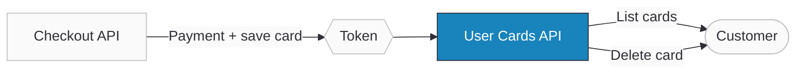

import ApiDocEmbed from "@site/src/components/ApiDocEmbed";
import FAQ, { FAQItem } from '@site/src/components/FAQ';

# User Cards

With Ottu, managing your customers' saved cards is straightforward and secure. The User Cards API lets you fetch all saved cards for a customer or delete a specific card. By incorporating this functionality, you ensure a seamless, personalized, and efficient payment experience.

:::info
User Cards API is not available in KSA.
:::

:::tip Boost Your Integration
Ottu offers SDKs and tools to speed up your integration. See [Getting Started](../getting-started/#boost-your-integration) for all available options.
:::

## When to Use

- **Display saved cards** — show customers their previously tokenized cards at checkout for one-click payments.
- **Delete saved cards** — let customers or your backend remove cards they no longer want stored.
- **Build custom card management UI** — if the [Checkout SDK](../payments/checkout-sdk/) doesn't fit your UX needs, use these APIs directly.
- **Pre-filter cards for auto-debit** — retrieve tokenized cards before initiating [recurring payments](./recurring-payments).

## Setup

When integrating the User Cards API, here are the key points:

1. You will not receive the full card number (PAN). Instead, you'll get the last 4 digits and a token. This token is what you use for payments or authorizations.
2. If you're using the [Checkout SDK](../payments/checkout-sdk/), customers can delete their saved cards at any point. This gives users control over their payment information.
3. When a customer saves their card during payment, the corresponding token is included in the payload sent to your [webhook_url](../payments/checkout-api).
4. Ottu already handles displaying saved cards and card deletion. Use these APIs only if you need more granular control.

:::info Successful Payment is a Prerequisite
A saved card (token) can only be created after the customer completes a successful payment transaction. This ensures card validity and enables tokenization. See the [Tokenization documentation](./tokenization#implementation) for implementation details.
:::

## Guide

### Workflow

1. **Customer pays and saves card** — during a [Checkout API](../payments/checkout-api) payment with tokenization enabled, Ottu creates a token.
2. **Token delivered via webhook** — the token is included in the webhook payload sent to your `webhook_url`.
3. **List saved cards** — call the User Cards API with `customer_id` to retrieve all saved cards (masked PAN + token).
4. **Delete a card** — call the delete endpoint with the card token to remove it.

### Step-by-Step

1. **Fetch saved cards** — call `GET /b/pbl/v2/card/?customer_id={id}` to retrieve all tokenized cards for a customer.
2. **Display cards** — show the masked card number, brand, and expiry in your UI.
3. **Delete a card** — call `DELETE /b/pbl/v2/card/{token}/` to remove a specific card.
4. **Use a card for payment** — pass the token to the [Checkout API](../payments/checkout-api) or [Auto-Debit API](../payments/native-payments) for subsequent charges.

## API Reference

<ApiDocEmbed path="get-user-cards.api.mdx" />

---

<ApiDocEmbed path="delete-user-cards.api.mdx" />

## FAQ

<FAQ>
  <FAQItem question="1. Can I save a card without making a successful payment?">
    Not currently. A card can only be tokenized after a successful payment transaction. This ensures the card's validity.
  </FAQItem>
  <FAQItem question="2. How can I delete a card?">
    Two options: call the User Cards API [delete endpoint](#api-reference) directly, or use the [Checkout SDK](../payments/checkout-sdk/) which handles card management for you.
  </FAQItem>
  <FAQItem question="3. Can I trigger auto-debit payments?">
    Yes, but only if the customer has agreed and their card is enabled for auto-debit. See the [Recurring Payments](./recurring-payments) documentation.
  </FAQItem>
  <FAQItem question="4. Does Ottu store cards internally?">
    No. Card details are stored in an external PCI-compliant vault, typically at the [payment gateway](../payments/payment-methods) with which the merchant has a contract.
  </FAQItem>
</FAQ>

## What's Next?

- [**Recurring Payments**](./recurring-payments) — Use saved tokens for auto-debit and recurring billing
- [**Tokenization**](./tokenization) — How cards get saved during payment
- [**Checkout SDK**](../payments/checkout-sdk/) — Drop-in UI that handles card management automatically
