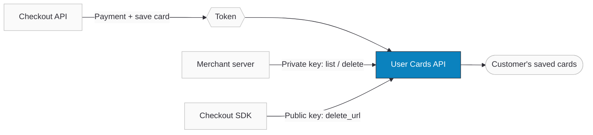
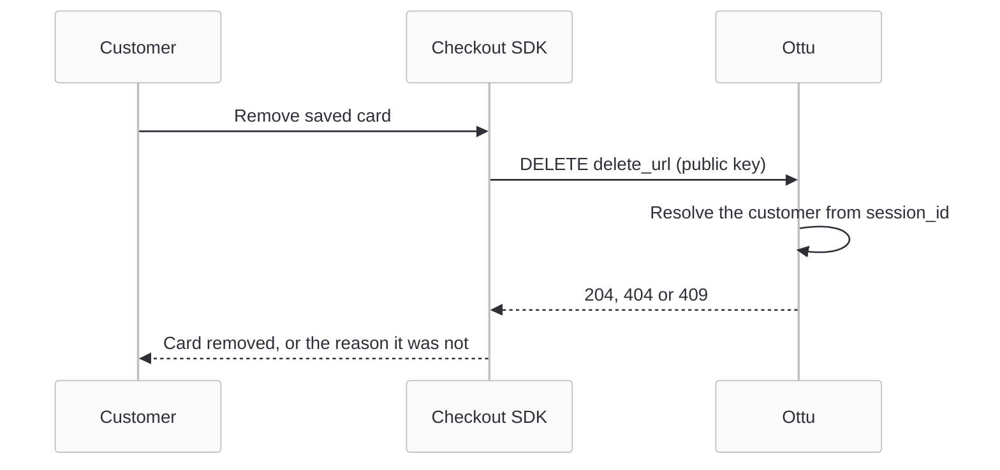

import ApiDocEmbed from "@site/src/components/ApiDocEmbed";
import FAQ, { FAQItem } from '@site/src/components/FAQ';
import Tabs from "@theme/Tabs";
import TabItem from "@theme/TabItem";
import CodeBlock from "@theme/CodeBlock";
import { OTTU_CONNECT_BASE_URL } from "@site/src/constants/api";

# User Cards

With Ottu, managing your customers' saved cards is straightforward and secure. The User Cards API lets you fetch all saved cards for a customer or delete a specific card from your server, and gives the [Checkout SDK](/developers/payments/checkout-sdk/) a session-scoped route to delete a card on the customer's behalf.

:::info
User Cards API is not available in KSA.
:::

:::tip[Boost Your Integration]
Ottu offers SDKs and tools to speed up your integration. See [Getting Started](/developers/getting-started/#boost-your-integration) for all available options.
:::

## When to Use

- **Display saved cards** — show customers their previously [tokenized](/developers/cards-and-tokens/tokenization/) cards at checkout for one-click payments.
- **Delete saved cards** — let customers or your backend remove cards they no longer want stored.
- **Build custom card management UI** — if the [Checkout SDK](/developers/payments/checkout-sdk/) doesn't fit your UX needs, call these APIs from your server.
- **Pre-filter cards for auto-debit** — retrieve tokenized cards before initiating [recurring payments](/developers/cards-and-tokens/recurring-payments/).

## Authentication

The User Cards API names a customer, so it is a **server-side API**. Call it with your [private API key](/developers/getting-started/authentication/#api-key-auth) or a [Basic Authentication](/developers/getting-started/authentication/#basic-auth) user — never from a browser or mobile app.

| Route | Private API key | Basic Auth user | [Public key](/developers/getting-started/authentication/#public-key) |
|---|---|---|---|
| `POST /b/pbl/v2/card/` — list saved cards | ✅ scoped keys need `Can view Card` | ✅ needs `Can view Card` | ❌ `401` |
| `DELETE /b/pbl/v2/card/{token}/` — delete a saved card | ✅ scoped keys need `Can delete Card` | ✅ needs `Can delete Card` | ❌ `401` |
| `DELETE /b/pbl/v2/card/{token}/session/{session_id}/` — delete from a checkout session | ✅ scoped keys need `Can delete Card` | ✅ needs `Can delete Card` | ✅ used by the Checkout SDK |

A [full-access](/developers/reference/api-key-permissions/#full-access-vs-scoped-keys) private key is allowed on all three routes. A scoped key or user without the permission receives `403`. The full permission mapping lives in [API Key Permissions](/developers/reference/api-key-permissions/).

:::warning[The public key is refused on the list and delete routes]

`POST /b/pbl/v2/card/` and `DELETE /b/pbl/v2/card/{token}/` do **not** accept the public key. They act on the customer named in the request, so they only accept credentials that stay on your server. A request carrying the public key gets:

```json
HTTP 401
{"detail": "Authentication credentials were not provided."}
```

If your front end called these routes directly, move the call to your server and use your private key.

:::

## Setup

When integrating the User Cards API, here are the key points:

1. You will not receive the full card number (PAN). Instead, you'll get the last 4 digits and a token. This token is what you use for payments or authorizations.
2. If you're using the [Checkout SDK](/developers/payments/checkout-sdk/), customers can delete their saved cards at any point. The SDK does this through the session-scoped route, so you do not need to expose any key other than the public key.
3. When a customer saves their card during payment, the corresponding token is included in the payload sent to your [webhook_url](/developers/payments/checkout-api/).
4. Ottu already handles displaying saved cards and card deletion inside the SDK. Use these APIs only if you need more granular control.

:::info[Successful Payment is a Prerequisite]
A saved card (token) can only be created after the customer completes a successful payment transaction. This ensures card validity and enables tokenization. See the [Tokenization documentation](/developers/cards-and-tokens/tokenization/#implementation) for implementation details.
:::

## Guide

### Workflow


```mermaid
%%{init: {"theme": "base", "themeVariables": {"background": "#F4F4F4", "primaryColor": "#FAFAFA", "primaryTextColor": "#302F37", "primaryBorderColor": "#BFBFBF", "lineColor": "#302F37", "secondaryColor": "#FAFAFA", "tertiaryColor": "#FAFAFA"}}}%%
graph LR
    A[Checkout API] -->|Payment + save card| B{{Token}}
    B --> C[User Cards API]
    S[Merchant server] -->|Private key: list / delete| C
    K[Checkout SDK] -->|Public key: delete_url| C
    C --> D([Customer's saved cards])

    classDef accent fill:#0B82BE,color:#FFFFFF,stroke:#302F37
    class C accent
```

1. **Customer pays and saves card** — during a [Checkout API](/developers/payments/checkout-api/) payment with tokenization enabled, Ottu creates a token.
2. **Token delivered via webhook** — the token is included in the webhook payload sent to your `webhook_url`.
3. **List saved cards** — your server calls `POST /b/pbl/v2/card/` with the `customer_id` to retrieve all saved cards (masked PAN + token).
4. **Delete a card** — your server calls `DELETE /b/pbl/v2/card/{token}/`, or the Checkout SDK deletes it through the session-scoped route when the customer removes it.
5. **Use a card for payment** — pass the token to the [Checkout API](/developers/payments/checkout-api/) or the [auto-debit](/developers/cards-and-tokens/recurring-payments/#subsequent-payments-mit) endpoint for subsequent charges.

### List Saved Cards

Every example targets <code>{OTTU_CONNECT_BASE_URL}</code>. Swap in your own merchant domain when you integrate.

<Tabs groupId="language">
<TabItem value="curl" label="cURL">

<CodeBlock language="bash" title="POST /b/pbl/v2/card/">{`curl --location '${OTTU_CONNECT_BASE_URL}/b/pbl/v2/card/' \\
  --header 'Authorization: Api-Key <YOUR_PRIVATE_KEY>' \\
  --header 'Content-Type: application/json' \\
  --data '{
    "type": "sandbox",
    "customer_id": "cust_123",
    "pg_codes": ["credit-card"]
  }'`}</CodeBlock>

</TabItem>
<TabItem value="python" label="Python">

<CodeBlock language="python" title="POST /b/pbl/v2/card/">{`import requests

response = requests.post(
    "${OTTU_CONNECT_BASE_URL}/b/pbl/v2/card/",
    headers={"Authorization": "Api-Key <YOUR_PRIVATE_KEY>"},
    json={"type": "sandbox", "customer_id": "cust_123", "pg_codes": ["credit-card"]},
    timeout=30,
)
response.raise_for_status()
cards = response.json()`}</CodeBlock>

</TabItem>
<TabItem value="nodejs" label="Node.js">

<CodeBlock language="javascript" title="POST /b/pbl/v2/card/">{`const response = await fetch("${OTTU_CONNECT_BASE_URL}/b/pbl/v2/card/", {
  method: "POST",
  headers: {
    Authorization: "Api-Key <YOUR_PRIVATE_KEY>",
    "Content-Type": "application/json",
  },
  body: JSON.stringify({ type: "sandbox", customer_id: "cust_123", pg_codes: ["credit-card"] }),
});
const cards = await response.json();`}</CodeBlock>

</TabItem>
<TabItem value="php" label="PHP">

<CodeBlock language="php" title="POST /b/pbl/v2/card/">{`<?php
$ch = curl_init("${OTTU_CONNECT_BASE_URL}/b/pbl/v2/card/");
curl_setopt_array($ch, [
    CURLOPT_POST => true,
    CURLOPT_RETURNTRANSFER => true,
    CURLOPT_HTTPHEADER => [
        "Authorization: Api-Key <YOUR_PRIVATE_KEY>",
        "Content-Type: application/json",
    ],
    CURLOPT_POSTFIELDS => json_encode([
        "type" => "sandbox",
        "customer_id" => "cust_123",
        "pg_codes" => ["credit-card"],
    ]),
]);
$cards = json_decode(curl_exec($ch), true);`}</CodeBlock>

</TabItem>
</Tabs>

| Field | Type | Required | Description |
|---|---|---|---|
| `type` | string | Yes | `sandbox` or `production` — which environment's cards to return. |
| `customer_id` | string | Yes | The customer whose cards to return. Must belong to at least one existing payment transaction. |
| `pg_codes` | array of strings | No | Return only cards saved through these [payment gateway codes](/developers/payments/payment-methods/). |
| `agreement_id` | string | No | Return at most one card: the latest card the customer used for this [auto-debit agreement](/developers/cards-and-tokens/recurring-payments/#agreement). |

```json title="200 — Example response"
[
  {
    "customer_id": "cust_123",
    "brand": "VISA",
    "name_on_card": "John Doe",
    "number": "**** 0026",
    "expiry_month": "01",
    "expiry_year": "39",
    "token": "9446604314074503",
    "is_preferred": true,
    "is_expired": false,
    "pg_code": "credit-card",
    "cvv_required": true
  }
]
```

:::warning[An empty list is not proof the customer has no cards]
Saved cards can live in more than one card vault. If a vault is temporarily unreachable, Ottu still answers `200` with the cards it could read — possibly `[]`. Do not delete your own record of a customer's cards because one call came back empty; retry later.
:::

### Delete a Saved Card (Server)

<Tabs groupId="language">
<TabItem value="curl" label="cURL">

<CodeBlock language="bash" title="DELETE /b/pbl/v2/card/{token}/">{`curl --location --request DELETE \\
  '${OTTU_CONNECT_BASE_URL}/b/pbl/v2/card/9446604314074503/?customer_id=cust_123&type=sandbox' \\
  --header 'Authorization: Api-Key <YOUR_PRIVATE_KEY>'`}</CodeBlock>

</TabItem>
<TabItem value="python" label="Python">

<CodeBlock language="python" title="DELETE /b/pbl/v2/card/{token}/">{`import requests

response = requests.delete(
    "${OTTU_CONNECT_BASE_URL}/b/pbl/v2/card/9446604314074503/",
    headers={"Authorization": "Api-Key <YOUR_PRIVATE_KEY>"},
    params={"customer_id": "cust_123", "type": "sandbox"},
    timeout=30,
)
deleted = response.status_code == 204`}</CodeBlock>

</TabItem>
<TabItem value="nodejs" label="Node.js">

<CodeBlock language="javascript" title="DELETE /b/pbl/v2/card/{token}/">{`const url = new URL("${OTTU_CONNECT_BASE_URL}/b/pbl/v2/card/9446604314074503/");
url.search = new URLSearchParams({ customer_id: "cust_123", type: "sandbox" });

const response = await fetch(url, {
  method: "DELETE",
  headers: { Authorization: "Api-Key <YOUR_PRIVATE_KEY>" },
});
const deleted = response.status === 204;`}</CodeBlock>

</TabItem>
<TabItem value="php" label="PHP">

<CodeBlock language="php" title="DELETE /b/pbl/v2/card/{token}/">{`<?php
$query = http_build_query(["customer_id" => "cust_123", "type" => "sandbox"]);
$ch = curl_init("${OTTU_CONNECT_BASE_URL}/b/pbl/v2/card/9446604314074503/?" . $query);
curl_setopt_array($ch, [
    CURLOPT_CUSTOMREQUEST => "DELETE",
    CURLOPT_RETURNTRANSFER => true,
    CURLOPT_HTTPHEADER => ["Authorization: Api-Key <YOUR_PRIVATE_KEY>"],
]);
curl_exec($ch);
$deleted = curl_getinfo($ch, CURLINFO_HTTP_CODE) === 204;`}</CodeBlock>

</TabItem>
</Tabs>

A successful delete answers `204 No Content`. `customer_id` and `type` are required query parameters: the card is looked up for that customer only, so a token that belongs to another customer is never deleted.

### Delete a Card from a Checkout Session (Checkout SDK)

The [Checkout SDK](/developers/payments/checkout-sdk/) shows the customer their saved cards and lets them remove one. Each saved card the SDK receives carries a `delete_url`:

```text
<your Ottu domain>/b/pbl/v2/card/{token}/session/{session_id}/
```

When the customer removes a card, the SDK calls that URL with `DELETE` and your [public key](/developers/getting-started/authentication/#public-key). You do not build this URL or call it yourself — the SDK handles it end to end.


```mermaid
%%{init: {"theme": "base", "themeVariables": {"background": "#F4F4F4", "primaryColor": "#FAFAFA", "primaryTextColor": "#302F37", "primaryBorderColor": "#BFBFBF", "lineColor": "#302F37", "secondaryColor": "#FAFAFA", "tertiaryColor": "#FAFAFA"}}}%%
sequenceDiagram
    participant C as Customer
    participant K as Checkout SDK
    participant O as Ottu
    C->>K: Remove saved card
    K->>O: DELETE delete_url (public key)
    O->>O: Resolve the customer from session_id
    O-->>K: 204, 404 or 409
    K-->>C: Card removed, or the reason it was not
```

What makes this route safe to call with a browser-exposed key:

- **The customer comes from the session, never from the request.** Ottu reads the customer of the checkout session named by `session_id`. A `customer_id` or `type` query parameter is ignored, so a caller cannot point it at someone else's cards.
- **Refusals are opaque.** An unknown or expired `session_id`, a token that belongs to a different customer, a guest session with no customer, and a refusal by the card vault all answer the same `404`.
- **Any session that has not expired works** — including one that is already paid or cancelled, because the SDK still shows saved cards on those sessions.

The one refusal that is explained is a card held by an active [auto-debit agreement](/developers/cards-and-tokens/recurring-payments/#agreement). The card belongs to the session's own customer, and they can release it, so Ottu answers `409` and says how. The message follows the request's `Accept-Language` header:

| `Accept-Language` | `detail` |
|---|---|
| `en` (default) | This card is linked to an active auto debit agreement and cannot be deleted. Pay once with another card to move the agreement, then delete this card. |
| `ar` | هذه البطاقة مرتبطة باتفاقية خصم تلقائي نشطة ولا يمكن حذفها. ادفع مرة واحدة ببطاقة أخرى لنقل الاتفاقية، ثم احذف هذه البطاقة. |

:::note
`delete_url` used to point at `DELETE /b/pbl/v2/card/{token}/?type=…&customer_id=…`. It now points at the session-scoped route and carries no query parameters. If you read `delete_url` from the SDK's card data, use it as-is.
:::

## Error Handling

### List and delete (server routes)

| Status | Example body | Cause | What to do |
|---|---|---|---|
| `400` | ``{"customer_id": ["Customer ID `cust_999` does not exist."]}`` | No payment transaction exists for that `customer_id` | Check the ID you stored at checkout |
| `400` | `{"type": ["This field is required."]}` | `type` missing | Send `sandbox` or `production` |
| `400` | `{"detail": "<reason from the card vault>", "result": "failed"}` | The card vault refused the delete — for example, the card is held by an auto-debit agreement | Show the reason to your operator; for an agreement, charge the agreement with another card first |
| `401` | `{"detail": "Authentication credentials were not provided."}` | No credentials, an invalid, revoked or expired key, or the **public key** | Call from your server with your private key |
| `403` | `{"detail": "You do not have permission to perform this action."}` | A scoped key or user without `Can view Card` (list) or `Can delete Card` (delete) | Grant the permission, or use a key that holds it |
| `503` | `{"detail": "The payment gateway is not available right now."}` | Ottu cannot reach its card vault because it is not configured on this deployment | Contact Ottu support |

### Session-scoped delete (Checkout SDK)

| Status | Example body | Cause |
|---|---|---|
| `204` | *(empty)* | The card was deleted |
| `400` | `{"token": ["Ensure this field has no more than 128 characters."]}` | `token` or `session_id` longer than 128 characters |
| `401` | `{"detail": "Authentication credentials were not provided."}` | No credentials, or an invalid or revoked key |
| `403` | `{"detail": "You do not have permission to perform this action."}` | A private key or user without `Can delete Card` (the public key does not need a permission) |
| `404` | `{"detail": "Not found.", "result": "failed"}` | Unknown or expired session, a token the session's customer does not hold, a guest session, or a refusal by the card vault |
| `409` | `{"detail": "This card is linked to an active auto debit agreement…", "result": "failed"}` | The customer's own card is held by an active auto-debit agreement |
| `503` | `{"detail": "The payment gateway is not available right now."}` | The card vault is not configured on this deployment |

## API Reference

<ApiDocEmbed path="get-user-cards.api.mdx" />

---

<ApiDocEmbed path="delete-user-cards.api.mdx" />

## Best Practices

- **Keep card management on your server.** List and delete with your private key; let the Checkout SDK handle deletes in the browser.
- **Scope the key.** A key that only manages cards needs `Can view Card` and `Can delete Card` — nothing else. See [API Key Permissions](/developers/reference/api-key-permissions/).
- **Store the `customer_id` you send at checkout.** Every server route is keyed on it.
- **Treat `409` as actionable.** Tell the customer that paying once with another card moves the agreement; after that the delete succeeds.

## FAQ

<FAQ>
  <FAQItem question="Can I save a card without making a successful payment?">
    Not currently. A card can only be tokenized after a successful payment transaction. This ensures the card's validity.
  </FAQItem>
  <FAQItem question="How can I delete a card?">
    From your server, call `DELETE /b/pbl/v2/card/{token}/` with your private key. In the browser, the [Checkout SDK](/developers/payments/checkout-sdk/) deletes cards for the customer through the session-scoped route.
  </FAQItem>
  <FAQItem question="Can I call the User Cards API from my website or app with the public key?">
    No. The list and delete routes answer `401` to the public key, because they take the customer from the request. Call them from your server with your private key.
  </FAQItem>
  <FAQItem question="Can I trigger auto-debit payments?">
    Yes, but only if the customer has agreed and their card is enabled for auto-debit. See the [Recurring Payments](/developers/cards-and-tokens/recurring-payments/) documentation.
  </FAQItem>
  <FAQItem question="Does Ottu store cards internally?">
    No. Card details are stored in an external PCI-compliant vault, typically at the [payment gateway](/developers/payments/payment-methods/) with which the merchant has a contract.
  </FAQItem>
</FAQ>

## What's Next?

- [**Recurring Payments**](/developers/cards-and-tokens/recurring-payments/) — Use saved tokens for auto-debit and recurring billing
- [**Tokenization**](/developers/cards-and-tokens/tokenization/) — How cards get saved during payment
- [**Checkout SDK**](/developers/payments/checkout-sdk/) — Drop-in UI that handles card management automatically
- [**Authentication**](/developers/getting-started/authentication/) — Private key, Basic Auth and the public key
- [**API Key Permissions**](/developers/reference/api-key-permissions/) — What a scoped key needs for each operation
