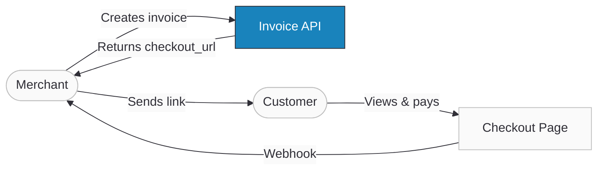

import ApiDocEmbed from "@site/src/components/ApiDocEmbed";
import FAQ, { FAQItem } from '@site/src/components/FAQ';

# Invoice API

Ottu's Invoice API automates invoice generation for both online and walk-in customers. You create an invoice with line items, taxes, and discounts — Ottu generates a payment link ([checkout_url](/developers/payments/checkout-api)) that customers can use to view the invoice, download it as PDF, and pay directly. The API integrates with the [Checkout API](/developers/payments/checkout-api) under the hood, so invoices benefit from the same payment gateway support, webhooks, and transaction tracking.

:::tip Boost Your Integration
Ottu offers SDKs and tools to speed up your integration. See [Getting Started](./getting-started/#boost-your-integration) for all available options.
:::

## When to Use

- **Issuing invoices with payment links** — create an invoice and send the `checkout_url` to customers via email, SMS, or WhatsApp.
- **E-commerce order billing** — generate itemized invoices with taxes, discounts, and shipping for online purchases.
- **Walk-in customer billing** — create invoices for in-person transactions at brick-and-mortar establishments.
- **Tax-compliant invoicing** — leverage VAL CALC fields to ensure frontend calculations match Ottu's backend precisely.

## Setup

1. **Payment Gateway** — a **Purchase** [Payment Gateway](/developers/payments/payment-methods) must be configured. The Invoice API does not support the Authorize type.

2. **Optional: `round` function** — when building a frontend for invoice creation, implement the same rounding logic Ottu uses (`ROUND_HALF_UP` per [Python decimal](https://docs.python.org/3.8/library/decimal.html#decimal.ROUND_HALF_UP)) to avoid discrepancy errors. Decimal places follow [ISO 4217](https://www.iso.org/iso-4217-currency-codes.html) currency standards.

3. **Optional: [Payment Methods API](/developers/payments/payment-methods)** — call it to discover available `pg_codes` dynamically. If you already know your `pg_code`, you can skip this step.

## Guide

### Workflow



1. **Merchant creates an invoice** via the Invoice API with line items, taxes, discounts, and shipping.
2. **Ottu returns a `checkout_url`** and `invoice_pdf_url` — the payment link and downloadable PDF.
3. **Merchant sends the link** to the customer via email, SMS, WhatsApp, or their own channels.
4. **Customer views the invoice** on Ottu's Checkout Page, downloads the PDF, and makes payment.
5. **Ottu sends a webhook** to the merchant's `webhook_url` with the transaction result.

#### Invoice Structure

Invoices have two levels of detail:

**Item level** (inside `invoice_items`):
- **Mandatory:** `sku`, `description`, `quantity`, `unit_price`
- **Optional:** `tax_rate`, `discount_amount`, `discount_percentage`
- **VAL CALC:** `total_excl_tax`, `total_incl_tax`, `tax_amount`

**Invoice level:**
- **Mandatory:** `type`, `currency_code`, `pg_codes`, `invoice_number`, `due_date`
- **Optional:** `tax_rate`, `discount_amount`, `discount_percentage`, `shipping_excl_tax`, `shipping_method`, `shipping_tax_rate`
- **VAL CALC:** `total_excl_tax`, `total_incl_tax`, `tax_amount`, `shipping_incl_tax`, `subtotal`, `amount`

:::info
VAL CALC fields are optional validators. If provided, Ottu checks them against its own calculations and rejects the request if they don't match — preventing frontend/backend discrepancies.
:::


:::warning
- Exclude optional fields entirely if not relevant — don't send `null` or `0`.
- Rate/percentage fields are limited to 2 decimal places. Monetary fields follow [ISO 4217](https://www.iso.org/iso-4217-currency-codes.html).
- Invoices are **immutable** — the API does not support `PATCH`. Create a new invoice for any updates.
:::

### Step-by-Step

#### 1. Retrieve `pg_codes` (optional)

Call the [Payment Methods API](/developers/payments/payment-methods) to get available gateway codes, or use a known `pg_code` directly.

#### 2. Create the invoice

```json
{
  "type": "e_commerce",
  "due_date": "2025-12-29",
  "currency_code": "KWD",
  "pg_codes": ["credit-card"],
  "invoice_number": "A00001",
  "invoice_items": [
    {
      "sku": "ABC111",
      "description": "Test",
      "quantity": 1.111,
      "unit_price": 5.234
    }
  ]
}
```

**Response** (key fields):

```json
{
  "amount": 5.815,
  "checkout_url": "https://sandbox.ottu.net/b/checkout/redirect/start/?session_id=...",
  "session_id": "9ba4c834f55f1e5476b9d9ea47ec7b12f61f9511",
  "invoice_pdf_url": "https://e.pay.kn/HWiDBBAQ8WBn",
  "state": "created",
  "invoice_items": [
    {
      "sku": "ABC111",
      "description": "Test",
      "quantity": 1.111,
      "unit_price": 5.234,
      "total_excl_tax": 5.815,
      "tax_amount": 0.0,
      "total_incl_tax": 5.815
    }
  ]
}
```


#### 3. Send the payment link

Share the `checkout_url` with the customer. They can view the invoice, download the PDF, and pay.

#### 4. Handle the webhook

Ottu posts the transaction result to your [webhook_url](/developers/webhooks/payment-events). Use the `session_id` to match the response to the original invoice.

### Use Cases

#### Invoice with item-level discount

Apply a `discount_percentage` at the item level:

```json
{
  "type": "e_commerce",
  "due_date": "2025-12-29",
  "currency_code": "KWD",
  "pg_codes": ["credit-card"],
  "invoice_number": "A00002",
  "invoice_items": [
    {
      "sku": "ABC111",
      "description": "Test",
      "quantity": 1.111,
      "unit_price": 5.234,
      "discount_percentage": 12
    }
  ]
}
```


You cannot provide both `discount_percentage` and `discount_amount` on the same item or invoice — the API will reject the request.

## API Reference

<ApiDocEmbed path="create-invoice.api.mdx" />

## Best Practices

#### Immutable Invoices

Invoices cannot be modified after creation. If an error is made, create a new invoice with the correct details.

#### Authentication

Use [Private API Key](/developers/getting-started/authentication#private-key-api-key) or [Basic Authentication](/developers/getting-started/authentication#basic-authentication). Rotate API keys regularly.

#### VAL CALC Fields

Include VAL CALC fields (`total_excl_tax`, `tax_amount`, `total_incl_tax`, `subtotal`, `amount`) in your requests to catch frontend/backend calculation discrepancies before they reach the customer.

#### Invoice Generation Logic

The invoice calculation uses `ROUND_HALF_UP` at both item and invoice levels:

**Item level:**
1. `quantity_price` = round(`quantity` × `unit_price`)
2. Apply discount: `total_discount` = round(`quantity_price` × `discount_percentage` / 100) or `discount_amount`
3. `total_excl_tax` = round(`quantity_price` - `total_discount`)
4. `tax_amount` = round(`total_excl_tax` × `tax_rate` / 100)
5. `total_incl_tax` = round(`total_excl_tax` + `tax_amount`)

**Invoice level:**
1. `subtotal` = round(sum of all `item.total_incl_tax`)
2. Apply invoice-level discount (same logic as item level)
3. `total_excl_tax` = round(`subtotal` - `total_discount`)
4. `tax_amount` = round(`total_excl_tax` × `tax_rate` / 100)
5. `shipping_incl_tax` = round(`shipping_excl_tax` + round(`shipping_excl_tax` × `shipping_tax_rate` / 100))
6. `total_incl_tax` = round(`total_excl_tax` + `tax_amount` + `shipping_incl_tax`)
7. `amount` = `total_incl_tax`

## FAQ

<FAQ>
  <FAQItem question="1. What is Ottu's Invoice API?">
    A tool for businesses and developers to automate invoice generation. It creates itemized invoices with payment links for both online and walk-in customers.
  </FAQItem>
  <FAQItem question="2. Why should I use it?">
    It automates invoicing, saves time, reduces errors, and provides a seamless payment experience — customers receive a link, view the invoice, and pay directly.
  </FAQItem>
  <FAQItem question="3. What are the prerequisites?">
    A **Purchase** [Payment Gateway](/developers/payments/payment-methods) and understanding of the [rounding function](#invoice-generation-logic). Optionally, the [Payment Methods API](/developers/payments/payment-methods) for dynamic `pg_codes`.
  </FAQItem>
  <FAQItem question="4. Can I skip the Payment Methods API?">
    Yes, if you know your `pg_code`. But using it ensures you stay informed about gateway changes.
  </FAQItem>
  <FAQItem question="5. How do I handle authentication?">
    Use [Private API Key](/developers/getting-started/authentication#private-key-api-key) or [Basic Authentication](/developers/getting-started/authentication#basic-authentication). See [Authentication](/developers/getting-started/authentication).
  </FAQItem>
  <FAQItem question="6. What are VAL CALC fields?">
    Optional validation fields that check your frontend calculations against Ottu's backend. Include them to catch discrepancies before invoice creation.
  </FAQItem>
  <FAQItem question="7. Can I modify an invoice after creation?">
    No. Invoices are immutable — the API does not support `PATCH`. Create a new invoice for any updates.
  </FAQItem>
  <FAQItem question="8. How does Ottu calculate totals and taxes?">
    Using `ROUND_HALF_UP` at both item and invoice levels. See [Invoice Generation Logic](#invoice-generation-logic).
  </FAQItem>
  <FAQItem question="9. Where can I find more technical details?">
    See the interactive [API Reference](#api-reference) above, or the full [API Schema Reference](/developers/apis/ottu-api).
  </FAQItem>
</FAQ>

## What's Next?

- [**Checkout API**](./payments/checkout-api.mdx) — The underlying API that Invoice API builds upon
- [**Webhooks**](./webhooks/payment-events.md) — Receive payment status notifications for invoices
- [**Operations**](./operations.md) — Refund, capture, or void invoice payments
