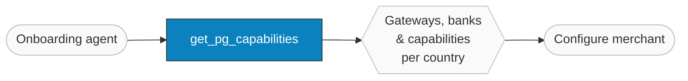

import FAQ, { FAQItem } from "@site/src/components/FAQ";

# PG Capabilities

`get_pg_capabilities` is an [MCP tool](./) on the Ottu Core server that lists the payment gateways ([PGs](/glossary/)) available in each country, the banks and providers that offer them, and what each gateway can do — funding sources, integration types, capabilities, supported wallets, and whether a paid SSL certificate is required.

It is built for **Agentic merchant onboarding**. When an agent sets up a new merchant, it first needs to know what is possible in the merchant's country: which gateways exist, which banks back them, and which features (tokenization, refunds, Apple Pay, …) they support. This tool is that discovery step — a single, static, global catalogue the agent can read before it configures anything. It returns no per-merchant data and changes nothing.

:::warning Permission required
The caller must hold the **`gateway.view_pgmid`** permission. Without it, the tool returns a permission-denied result — see [Errors](#errors).
:::

:::tip Boost Your Integration
Ottu offers SDKs and tools to speed up your integration. See [Getting Started](/developers/getting-started/#boost-your-integration) for all available options.
:::

## When to Use

- **Agentic onboarding** — let an agent discover the gateways and banks available in a merchant's country before configuring them.
- **Country availability checks** — confirm whether a specific gateway (e.g. KNET, STC Pay, Tabby) is offered in a given country.
- **Capability planning** — check up front whether a gateway supports tokenization, refunds, captures/voids, or a wallet such as Apple Pay before designing the payment flow.
- **Provider/bank discovery** — enumerate the acquiring banks behind a gateway (for example, the seven banks that offer MPGS card processing in Kuwait).

:::note Catalogue vs. live availability
This tool describes what is **possible** — a global, static catalogue of gateways, banks, and capabilities. To discover the gateways actually **active for a live checkout session** (filtered by currency, plugin, or customer), use the runtime [Payment Methods API](/developers/payments/payment-methods) instead.
:::

## Guide

### How it fits



1. **The agent calls `get_pg_capabilities`** with an optional country and gateway.
2. **Ottu returns the matching slice of the catalogue** — the list of countries, one country's gateways, or a single gateway profile.
3. **The agent uses the result** to decide what to configure for the merchant.

### Calling the tool

In practice you describe the goal and your MCP client picks the tool. A prompt such as:

```text title="Agent prompt"
Which payment gateways can I use in Kuwait, and which banks back MPGS there?
```

leads the client to issue a JSON-RPC `tools/call` over the [MCP connection](/developers/mcp-tools/#connecting):

```json title="Request — tools/call"
{
  "jsonrpc": "2.0",
  "id": 1,
  "method": "tools/call",
  "params": {
    "name": "get_pg_capabilities",
    "arguments": { "country": "kw", "pg": "mpgs" }
  }
}
```

The tool returns the [gateway profile](#response-reference) shown in [Mode 3](#mode-3) below. Both arguments are optional and drive the three usage modes; see [Parameters](#parameters).

## Parameters

Both parameters are optional strings. Inputs are trimmed and lower-cased, so `"  KW "` and `"kw"` are equivalent.

| Parameter | Type | Required | Example values | Description |
|-----------|------|----------|----------------|-------------|
| `country` | string | No | `kw`, `ksa`, `uae`, `om`, `bh` | Country code. Omit to list every supported country. See the [Countries](#countries) table. |
| `pg` | string | No | `mpgs`, `knet`, `cybersource`, `stc_pay`, `tabby`, … | Gateway code. Requires `country`. Omit to list all gateways in the country. See the [Gateway codes](#gateway-codes) table. |

The combination of the two parameters selects one of three [usage modes](#usage-modes).

## Usage modes

The tool follows a progressive-disclosure pattern: the more you pass, the narrower the result.

| You pass | You get |
|----------|---------|
| _nothing_ | The list of supported countries |
| `country` | Every gateway in that country |
| `country` + `pg` | A single gateway profile |

### Mode 1 — List supported countries {#mode-1}

Call with no arguments to discover which countries the catalogue covers.

```json title="Arguments"
{}
```

```json title="Response — supported countries"
{
  "countries": [
    { "code": "kw", "name": "Kuwait" },
    { "code": "ksa", "name": "Saudi Arabia" },
    { "code": "om", "name": "Oman" },
    { "code": "bh", "name": "Bahrain" },
    { "code": "uae", "name": "United Arab Emirates" }
  ]
}
```

### Mode 2 — List a country's gateways {#mode-2}

Pass a `country` to get every gateway available there, each as a full [profile](#response-reference). The example below is Oman, which offers a card gateway (Cybersource) and the local OmanNet debit scheme.

```json title="Arguments"
{ "country": "om" }
```

```json title="Response — one country's gateways"
{
  "country": { "code": "om", "name": "Oman" },
  "gateways": [
    {
      "code": "cybersource",
      "name": { "en": "Credit/Debit Card", "ar": "بطاقة ائتمان/خصم" },
      "providers": [
        { "identifier": "alsohar", "name": "Alsohar Bank", "type": "bank" },
        { "identifier": "bank_muscat", "name": "Bank Muscat", "type": "bank" },
        { "identifier": "nbo", "name": "National Bank of Oman", "type": "bank" }
      ],
      "funding_sources": ["credit", "debit"],
      "integration_types": ["hosted_checkout"],
      "capabilities": ["refund"],
      "supported_wallets": [
        { "code": "apple_pay", "name": { "en": "Apple Pay", "ar": "أبل باي" } }
      ],
      "require_paid_ssl": true
    },
    {
      "code": "omannet",
      "name": { "en": "OmanNet Debit Card", "ar": "بطاقة عمان نت" },
      "providers": [
        { "identifier": "nbo", "name": "National Bank of Oman", "type": "bank" },
        { "identifier": "bank_muscat", "name": "Bank Muscat", "type": "bank" },
        { "identifier": "alsohar", "name": "Alsohar Bank", "type": "bank" }
      ],
      "funding_sources": ["credit", "debit"],
      "integration_types": ["hosted_checkout"],
      "capabilities": [],
      "supported_wallets": [],
      "require_paid_ssl": false
    }
  ]
}
```

### Mode 3 — Inspect one gateway {#mode-3}

Pass both `country` and `pg` to get a single gateway profile. The example below is MPGS in Kuwait — offered by seven banks, supporting tokenization plus refund/void/capture/inquiry, both hosted and onsite integration, and both Apple Pay and Google Pay.

```json title="Arguments"
{ "country": "kw", "pg": "mpgs" }
```

```json title="Response — one gateway"
{
  "country": { "code": "kw", "name": "Kuwait" },
  "gateway": {
    "code": "mpgs",
    "name": { "en": "Credit/Debit Card", "ar": "بطاقة ائتمان/خصم" },
    "providers": [
      { "identifier": "nbk", "name": "National Bank of Kuwait", "type": "bank" },
      { "identifier": "gulf_bank", "name": "Gulf Bank", "type": "bank" },
      { "identifier": "kfh", "name": "Kuwait Finance House", "type": "bank" },
      { "identifier": "boubyan", "name": "Boubyan Bank", "type": "bank" },
      { "identifier": "burgan", "name": "Burgan Bank", "type": "bank" },
      { "identifier": "warba", "name": "Warba Bank", "type": "bank" },
      { "identifier": "cbk", "name": "Commercial Bank of Kuwait", "type": "bank" }
    ],
    "funding_sources": ["credit", "debit"],
    "integration_types": ["hosted_checkout", "onsite"],
    "capabilities": ["tokenization", "refund", "void", "capture", "inquiry"],
    "supported_wallets": [
      { "code": "apple_pay", "name": { "en": "Apple Pay", "ar": "أبل باي" } },
      { "code": "google_pay", "name": { "en": "Google Pay", "ar": "جوجل باي" } }
    ],
    "require_paid_ssl": false
  }
}
```

<details>
<summary>Example — a Buy Now, Pay Later gateway (Tabby in Saudi Arabia)</summary>

BNPL gateways look a little different: their only funding source is `post_paid_bnpl`, they integrate onsite, expose no post-payment capabilities or wallets, and `require_paid_ssl` is `null` (not applicable).

```json title="Arguments"
{ "country": "ksa", "pg": "tabby" }
```

```json title="Response — a BNPL gateway"
{
  "country": { "code": "ksa", "name": "Saudi Arabia" },
  "gateway": {
    "code": "tabby",
    "name": { "en": "Tabby", "ar": "تابي" },
    "providers": [
      { "identifier": "tabby", "name": "Tabby", "type": "bnpl" }
    ],
    "funding_sources": ["post_paid_bnpl"],
    "integration_types": ["onsite"],
    "capabilities": [],
    "supported_wallets": [],
    "require_paid_ssl": null
  }
}
```

</details>

## Response reference

Modes 2 and 3 return one or more **gateway profile** objects. A profile describes a single gateway as offered in a single country.

### Gateway profile

| Field | Type | Description |
|-------|------|-------------|
| `code` | string | Gateway code — see [Gateway codes](#gateway-codes). |
| `name` | object | Branded, customer-facing payment-method name as `{ "en": "...", "ar": "..." }`. May differ from the code — MPGS, for instance, is presented as "Credit/Debit Card". |
| `providers` | array&lt;[Provider](#provider)&gt; | The banks/providers that offer this gateway in the country. Always at least one. |
| `funding_sources` | array&lt;string&gt; | Funding sources the gateway settles — see [Funding source](#funding-source). |
| `integration_types` | array&lt;string&gt; | Supported integration styles — see [Integration type](#integration-type). |
| `capabilities` | array&lt;string&gt; | Post-payment and lifecycle capabilities — see [Capability](#capability). May be empty. |
| `supported_wallets` | array&lt;[Wallet](#wallet-object)&gt; | Wallets available through this gateway. May be empty. |
| `require_paid_ssl` | boolean \| null | Whether the merchant domain needs a paid (CA-issued) SSL certificate. `null` for BNPL gateways, where it does not apply. |

### Provider

An entry in a profile's `providers` array — a bank or provider that offers the gateway.

| Field | Type | Description |
|-------|------|-------------|
| `identifier` | string | Stable provider code (e.g. `nbk`, `bank_muscat`, `tabby`). |
| `name` | string | Display name (English proper noun), e.g. "National Bank of Kuwait". |
| `type` | string | Provider type — see [Provider type](#provider-type). |

### Wallet object

An entry in a profile's `supported_wallets` array.

| Field | Type | Description |
|-------|------|-------------|
| `code` | string | Wallet code — see [Wallet](#wallet). |
| `name` | object | Branded, bilingual wallet name as `{ "en": "...", "ar": "..." }`. |

## Enum reference

The tables below map every code the tool returns to its human label. Use the **codes** in the `country` and `pg` parameters and when matching response fields; use the **labels** when presenting results to a user.

### Countries

| Code | Name |
|------|------|
| `kw` | Kuwait |
| `ksa` | Saudi Arabia |
| `uae` | United Arab Emirates |
| `om` | Oman |
| `bh` | Bahrain |

### Gateway codes

The `pg` parameter accepts a gateway code. The catalogue currently covers the following gateways; the exact set available depends on the country.

| Code | Gateway |
|------|---------|
| `mpgs` | MPGS (Mastercard Payment Gateway Services) card processing |
| `knet` | KNET |
| `cybersource` | Cybersource |
| `ngenius` | N-Genius (Network International) |
| `stc_pay` | STC Pay |
| `moyasar` | Moyasar |
| `rajhi` | Al Rajhi |
| `omannet` | OmanNet |
| `tabby` | Tabby (Buy Now, Pay Later) |
| `tamara` | Tamara (Buy Now, Pay Later) |

### Provider type

| Code | Label |
|------|-------|
| `bank` | Bank |
| `bnpl` | Buy Now, Pay Later |
| `wallet` | Digital Wallet |

### Funding source

| Code | Label |
|------|-------|
| `credit` | Credit |
| `debit` | Debit |
| `post_paid_bnpl` | Postpaid BNPL |

### Integration type

| Code | Label |
|------|-------|
| `hosted_checkout` | Hosted Checkout |
| `onsite` | Direct |

### Capability

| Code | Label |
|------|-------|
| `tokenization` | Tokenization |
| `auto_debit` | Auto Debit |
| `capture` | Capture |
| `void` | Void |
| `refund` | Refund |
| `inquiry` | Inquiry |

### Wallet

| Code | Label |
|------|-------|
| `apple_pay` | Apple Pay |
| `google_pay` | Google Pay |
| `stc_pay` | STC Pay |

## Errors

On any error the tool returns a JSON object with a single `error` key (see the shared [error behaviour](/developers/mcp-tools/#error-responses)). The three cases specific to this tool are:

| Condition | Result |
|-----------|--------|
| Caller lacks the `gateway.view_pgmid` permission | `{ "error": "You do not have permission to view gateway capabilities." }` |
| `country` is not a supported code | `{ "error": "Unknown country: 'xx'. Supported: kw, ksa, om, bh, uae." }` |
| `pg` is not offered in the given `country` | `{ "error": "Gateway 'paypal' is not available in 'kw'. Available: mpgs, knet, cybersource, ngenius, tabby, tamara." }` |

The `Available: …` list in the last message is built from the gateways actually offered in the requested country, so it always reflects the live catalogue.

## FAQ

<FAQ>
  <FAQItem question="Is the data per-merchant or global?">
    Global. `get_pg_capabilities` reads a static, platform-wide catalogue of gateways, banks, and capabilities. It returns no merchant-specific configuration and performs no writes.
  </FAQItem>
  <FAQItem question="How is this different from the Payment Methods API?">
    This tool describes what is *possible* in a country. The [Payment Methods API](/developers/payments/payment-methods) returns the gateways actually *active* for a specific checkout session, filtered by currency, plugin, and customer. Use this tool to plan an onboarding; use Payment Methods at checkout time.
  </FAQItem>
  <FAQItem question="Why does the gateway name not match its code?">
    The `code` (e.g. `mpgs`) identifies the gateway, while `name` is the branded label a customer sees at checkout (e.g. "Credit/Debit Card"). Match on `code`; display `name`.
  </FAQItem>
  <FAQItem question="What does `require_paid_ssl: null` mean?">
    `null` marks the field as not applicable — it appears on Buy Now, Pay Later gateways, which do not carry an SSL-certificate requirement. Card gateways return `true` or `false`.
  </FAQItem>
  <FAQItem question="Can this tool create or change a gateway configuration?">
    No. It is read-only and gated on a view permission. Configuring a gateway is a separate, deliberately gated action.
  </FAQItem>
</FAQ>

## What's Next?

- [**MCP Tools overview**](./) — connect to the Ottu Core MCP server and authenticate
- [**Payment Methods**](/developers/payments/payment-methods) — discover gateways active for a live checkout session
- [**Checkout API**](/developers/payments/checkout-api) — create a payment session once the merchant's gateways are configured
- [**Operations**](/developers/operations) — refund, capture, and void payments through a configured gateway
