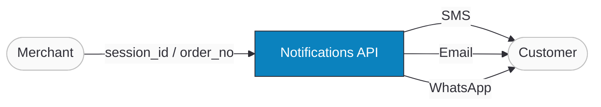

import Tabs from '@theme/Tabs';
import TabItem from '@theme/TabItem';
import ApiDocEmbed from "@site/src/components/ApiDocEmbed";
import FAQ, { FAQItem } from '@site/src/components/FAQ';

# Notifications

The Notifications API lets you manually send or resend transaction notifications (SMS, email, WhatsApp) to customers. It handles scenarios where notifications failed due to third-party service issues, or when customer contact information has been updated and you need to re-deliver the message.

**Benefits:**

- **Error recovery** — resend notifications after resolving SMS gateway, email provider, or WhatsApp service issues.
- **Contact updates** — re-notify customers when their email or phone details change.
- **Manual control** — trigger notifications on demand when automatic delivery fails or is delayed.

:::tip Boost Your Integration
Ottu offers SDKs and tools to speed up your integration. See [Getting Started](/developers/getting-started/#boost-your-integration) for all available options.
:::

## When to Use

- **Payment notification failed** — SMS gateway or email provider had an outage, and the customer didn't receive the payment link or receipt.
- **Customer updated contact info** — email or phone number changed after the transaction was created.
- **Manual resend needed** — business process requires re-sending a notification for a specific transaction state.
- **Template-based messaging** — send notifications using pre-configured templates for custom communication flows.

## Setup

1. **Checkout API integration** — create a payment transaction via the [Checkout API](/developers/payments/checkout-api) first. This captures customer data ([`customer_phone`](/developers/payments/checkout-api) for SMS/WhatsApp, [`customer_email`](/developers/payments/checkout-api) for email) and generates the `session_id`.

2. **Template configuration** — ensure notification templates (SMS, email, WhatsApp) are pre-configured. Contact the [Ottu support team](mailto:support@ottu.com) for template setup.

3. **Enable notification channels** — when creating the transaction, include the `notifications` parameter to enable channels per payment state. If creating via the dashboard, select the notification checkboxes.

4. **Optional: SMS provider** — configure an SMS provider for your account. Contact [Ottu support](mailto:support@ottu.com).

5. **Optional: WhatsApp integration** — requires a WhatsApp Business account, Meta-approved templates, and WhatsApp integration configuration via [Ottu support](mailto:support@ottu.com).

## Guide

### Workflow



1. **Merchant obtains `session_id` or `order_no`** from a transaction created via the [Checkout API](/developers/payments/checkout-api) or dashboard.
2. **Merchant sends a request** to the Notifications API with the transaction identifier and desired channels.
3. **Ottu dispatches notifications** via the specified channels (SMS, email, WhatsApp) based on the transaction's current state and configured templates.

### Step-by-Step

#### 1. Create a transaction with notification channels

Include the `notifications` parameter when creating the transaction via the [Checkout API](/developers/payments/checkout-api):

```json
{
  "type": "payment_request",
  "pg_codes": ["credit_card"],
  "amount": "22",
  "currency_code": "SAR",
  "order_no": "example_order_no",
  "customer_email": "example@example.com",
  "customer_phone": "123456789",
  "notifications": {
    "email": ["created", "paid", "canceled", "failed", "expired", "authorized", "voided", "refunded", "captured"],
    "SMS": ["created", "paid", "canceled", "failed", "expired", "authorized", "voided", "refunded", "captured"],
    "whatsapp": ["created", "paid", "canceled", "failed", "expired", "authorized"]
  }
}
```

#### 2. Send notifications

Use `session_id` or `order_no` to identify the transaction, and specify the channels:

```json
{
  "order_no": "example_order_no",
  "channels": ["sms", "email", "whatsapp"]
}
```

#### 3. Handle the response

Successful notification returns:

```json
{
  "message": "Customer notified."
}
```

#### 4. Resend as needed

You can resend notifications for the same or different payment states as many times as needed — just repeat step 2 with the same `session_id` or `order_no`.

:::info Supported states per channel
- **Email & SMS**: `created`, `paid`, `canceled`, `failed`, `expired`, `authorized`, `voided`, `refunded`, `captured`
- **WhatsApp**: `created`, `paid`, `canceled`, `failed`, `expired`, `authorized`
:::

## API Reference

<Tabs groupId="notification-api" queryString>
<TabItem value="message" label="Message Notifications">

<ApiDocEmbed path="message-notifications.api.mdx" />

</TabItem>
<TabItem value="template" label="Template Notifications">

<ApiDocEmbed path="send-notification.api.mdx" />

</TabItem>
<TabItem value="channel" label="Channel-Specific">

<ApiDocEmbed path="send-specific-notification.api.mdx" />

</TabItem>
</Tabs>

## Best Practices

#### Complete setup before sending

Confirm that notification templates are configured, channels are enabled in the transaction, and SMS/WhatsApp providers are set up before attempting to send.

#### Use `order_no` for consistency

When available, use `order_no` to identify transactions — it's consistent across your systems and easier to trace.

#### Validate payment states per channel

Only send notifications for states supported by each channel. WhatsApp has a smaller set of supported states than email/SMS.

#### Avoid redundant notifications

The API allows unlimited resends, but overuse can frustrate customers and increase SMS/email costs. Only resend when prior delivery failed.

#### Handle errors gracefully

Check the API response for failures. Build retry mechanisms or alerts for third-party service issues (SMS gateway downtime, email bounces).

#### Secure API requests

Use proper [authentication](/developers/getting-started/authentication) and HTTPS for all API calls. Notification requests contain sensitive transaction data.

#### Test before production

Test notifications across all channels with test transactions before going live. Confirm templates render correctly and messages are received.

#### Monitor third-party services

Proactively monitor SMS, email, and WhatsApp provider health. Identify outages early to trigger manual resends promptly.

## FAQ

<FAQ>
  <FAQItem question="What is the purpose of the Notifications API?">
    It lets merchants manually resend notifications for a specific transaction based on `session_id` or `order_no`, useful when automatic notifications failed.
  </FAQItem>
  <FAQItem question="What parameters are required?">
    Either `session_id` or `order_no` to identify the transaction, plus a `channels` array specifying which channels to send (email, sms, whatsapp).
  </FAQItem>
  <FAQItem question="Which payment states can notifications be sent for?">
    - **Email & SMS**: `created`, `paid`, `canceled`, `failed`, `expired`, `authorized`, `voided`, `refunded`, `captured`
    - **WhatsApp**: `created`, `paid`, `canceled`, `failed`, `expired`, `authorized`
  </FAQItem>
  <FAQItem question="How many times can I resend?">
    No limit, but avoid redundant notifications unless prior delivery failed.
  </FAQItem>
  <FAQItem question="What does a successful response look like?">
    ```json
    {
      "message": "Customer notified."
    }
    ```
  </FAQItem>
  <FAQItem question="Can I notify for transactions not created via the Checkout API?">
    Yes, as long as `session_id` or `order_no` is available and notification channels were configured during creation.
  </FAQItem>
  <FAQItem question="What if a notification doesn't get delivered?">
    Resend it using the API once the third-party provider issue is resolved. Ensure providers are correctly configured.
  </FAQItem>
  <FAQItem question="How do I configure SMS or WhatsApp providers?">
    Contact the [Ottu support team](mailto:support@ottu.com) for SMS and WhatsApp provider setup.
  </FAQItem>
  <FAQItem question="Can I send to multiple channels in one call?">
    Yes — include multiple channels in the `channels` array (e.g., `["sms", "email", "whatsapp"]`).
  </FAQItem>
</FAQ>

## What's Next?

- [**Checkout API**](./payments/checkout-api.mdx) — Configure notifications when creating payment sessions
- [**Webhooks**](./webhooks/payment-events.md) — Server-to-server payment event notifications
