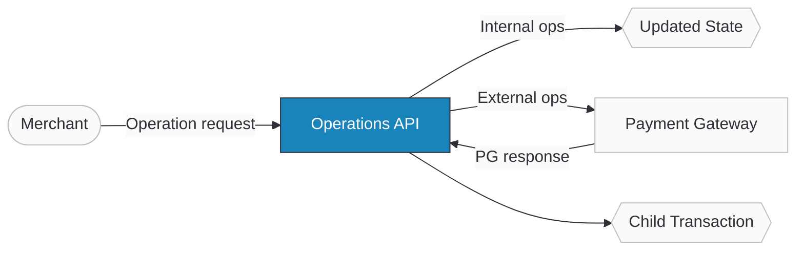

import Tabs from '@theme/Tabs';
import TabItem from '@theme/TabItem';
import ApiDocEmbed from "@site/src/components/ApiDocEmbed";
import FAQ, { FAQItem } from '@site/src/components/FAQ';

# Operations

The Operations API lets you perform subsequent actions on existing payment transactions — refund a completed payment, cancel an unpaid link, capture an authorized amount, or void an authorization. Ottu provides a **unified API**: you send the same payload structure regardless of the payment gateway, and Ottu handles the gateway-specific communication.

Ottu supports six operations. Three are **internal** (handled within Ottu's system): [cancel](#cancel), [expire](#expire), and [delete](#delete). Three are **external** (synchronized with the payment gateway): [refund](#refund), [capture](#capture), and [void](#void). When an external operation succeeds, Ottu creates a [child transaction](/developers/reference/payment-states) linked to the original, recording the new state, amount, and [gateway response](/developers/webhooks/pg-params).

:::warning
Operations via the Operations API do not work with **foreign currencies**. If the customer paid using [currency exchange](/developers/getting-started/api-fundamentals) (e.g., MID is KWD but customer paid in USD), external operations will fail. The payment currency must match the MID currency.
:::

:::tip Boost Your Integration
Ottu offers SDKs and tools to speed up your integration. See [Getting Started](./getting-started/#boost-your-integration) for all available options.
:::

## When to Use

- **Refunding a completed payment** — return funds to the customer after a paid or captured transaction.
- **Capturing an authorized payment** — settle funds for transactions in the `authorized` state (full or partial).
- **Voiding an authorization** — cancel an `authorized` transaction before capture, so the customer is not charged.
- **Cancelling an unpaid payment link** — stop a payment that's `created`, `pending`, `cod`, or `attempted`.
- **Expiring stale sessions** — automatically invalidate incomplete payment transactions.
- **Deleting transactions** — remove obsolete or test transactions (soft delete for paid, hard delete for others).

## Setup

Before performing any operation, you need an existing payment transaction with a `session_id` or `order_no`:

1. **Via the [Checkout API](/developers/payments/checkout-api)** — create a payment transaction programmatically.
2. **Via the [Ottu Dashboard](/business/payment-management)** — create a transaction manually.

Store the `session_id` securely — it's required for all operation requests. Prefer `session_id` over `order_no` as it's always present in the response.

## Guide

### Workflow



1. **Merchant sends an operation request** with `session_id`, `operation` type, and optional `amount`.
2. **For internal operations** (cancel, expire, delete) — Ottu updates the transaction state directly.
3. **For external operations** (refund, capture, void) — Ottu communicates with the payment gateway.
4. **On success** — a child transaction is created, linked to the original, recording the result.

### Step-by-Step

All operations use the same endpoint: `POST /b/pbl/v2/operation/`

1. **Send the operation request** with the `operation` type, `session_id`, and optional `amount`:

    ```json
    {
      "operation": "refund",
      "session_id": "2a956e4c9294c2c0e9253c21b1a592ceb4018c68",
      "amount": "20.00"
    }
    ```

2. **Use the `Tracking-Key` header** (recommended for external operations) to prevent duplicate operations and retrieve status:

    ```
    Tracking-Key: "unique-tracking-id"
    ```

    If you send a subsequent request with the same `Tracking-Key` and `session_id`, Ottu returns the latest status of the original operation instead of creating a new one. The key is stored in the child transaction data on success.

3. **Handle the response** — on success, the response includes the child transaction details (amount, state, gateway response). On failure, an error message indicates why the operation was rejected.

:::tip
Use the `extra` object field for additional gateway-specific parameters. For example, the Instant Fund Gratification (IFG) feature for instant refunds is configured via `extra`.
:::

### Use Cases

#### Internal Operations

**Cancel** — Halts a payment in progress. Applicable to transactions in `created`, `pending`, `cod`, or `attempted` state. The merchant stops a payment that hasn't reached completion.

**Expire** — Invalidates an incomplete payment transaction. Targets `created`, `pending`, or `attempted` states. Transitions the transaction to `expired`, from which it cannot be resumed.

**Delete** — Removes transactions no longer needed:
- `paid`, `authorized`, or `cod`/`cash` → **soft delete** (removed from reports, recoverable from Deleted Transactions)
- All other states → **hard delete** (permanent removal)

#### External Operations

**Capture** — Settles authorized funds. Only applicable to `authorized` transactions. Supports full or partial capture (cannot exceed the authorized amount). Creates a [child transaction](/developers/reference/payment-states) on success.

**Refund** — Returns funds to the customer. Applicable to `paid` or captured transactions. For authorized transactions, a capture must be completed first. Supports full or partial refund. Ottu offers an [approval feature](/business/operations/refund-void-access-control) for refunds, enabling a checker role to approve or reject requests.

**Void** — Cancels an authorization before capture. Only applicable to `authorized` transactions. The customer is not charged.

:::info
Not all payment gateways support all external operations. If a gateway doesn't support an operation, Ottu rejects the API call with an error message. See [supported operations by gateway](/developers/payments/payment-methods#activating-payment-gateway-codes).
:::

## API Reference

Select the operation to see its example payload and the full interactive API schema:

<Tabs groupId="operation-type" queryString>
<TabItem value="refund" label="Refund">

```json title="Example Request"
{
  "operation": "refund",
  "session_id": "your_session_id",
  "amount": "20.00"
}
```

<ApiDocEmbed path="public-operations.api.mdx" />

</TabItem>
<TabItem value="capture" label="Capture">

```json title="Example Request"
{
  "operation": "capture",
  "session_id": "your_session_id",
  "amount": "100.00"
}
```

<ApiDocEmbed path="public-operations.api.mdx" />

</TabItem>
<TabItem value="void" label="Void">

```json title="Example Request"
{
  "operation": "void",
  "session_id": "your_session_id"
}
```

<ApiDocEmbed path="public-operations.api.mdx" />

</TabItem>
<TabItem value="cancel" label="Cancel">

```json title="Example Request"
{
  "operation": "cancel",
  "session_id": "your_session_id"
}
```

<ApiDocEmbed path="public-operations.api.mdx" />

</TabItem>
<TabItem value="expire" label="Expire">

```json title="Example Request"
{
  "operation": "expire",
  "session_id": "your_session_id"
}
```

<ApiDocEmbed path="public-operations.api.mdx" />

</TabItem>
<TabItem value="delete" label="Delete">

```json title="Example Request"
{
  "operation": "delete",
  "session_id": "your_session_id"
}
```

<ApiDocEmbed path="public-operations.api.mdx" />

</TabItem>
</Tabs>

## FAQ

<FAQ>
  <FAQItem question="1. What happens if I try to perform an unsupported operation?">
    The operation is rejected by Ottu with an error message. See [supported operations by gateway](/developers/payments/payment-methods#activating-payment-gateway-codes).
  </FAQItem>
  <FAQItem question="2. Can I perform operations on completed transactions?">
    For [refund](#refund), yes — you can refund paid or captured transactions. For [cancel](#cancel) or [expire](#expire), only incomplete transactions are eligible.
  </FAQItem>
  <FAQItem question="3. Can I partially refund or capture?">
    Yes. Specify the `amount` in the request. If omitted, Ottu attempts the operation on the full transaction amount.
  </FAQItem>
  <FAQItem question="4. What's the difference between soft delete and hard delete?">
    **Soft delete** applies to `paid`, `authorized`, or `cod`/`cash` transactions — removed from reports but recoverable from Deleted Transactions. **Hard delete** applies to all other states — permanent removal.
  </FAQItem>
  <FAQItem question="5. What is a child transaction?">
    A sub-transaction created when external operations (refund, capture, void) succeed. It holds the operation details: new state, amount, and gateway response. Linked to the parent transaction.
  </FAQItem>
  <FAQItem question="6. How do I know which operations a gateway supports?">
    See the [operations supported by each gateway](/developers/payments/payment-methods#activating-payment-gateway-codes).
  </FAQItem>
  <FAQItem question="7. What's the difference between API-Key and Basic Authentication?">
    [API-Key](/developers/getting-started/authentication#private-key-api-key) grants superadmin privileges. [Basic Authentication](/developers/getting-started/authentication#basic-authentication) allows granular permission control per operation. Use Basic Auth for production access control.
  </FAQItem>
  <FAQItem question="8. What permissions are required?">
    Depends on the operation: `payment.capture` for capture, `payment.expire` for expire, etc. See [permission codes](#permission-codes-for-each-operation).
  </FAQItem>
  <FAQItem question="9. What happens when a refund is requested via the API?">
    The request goes directly to the payment gateway — the maker-checker approval flow is not activated for API refunds. The maker-checker flow only applies to refunds initiated via the Ottu dashboard.
  </FAQItem>
</FAQ>

## What's Next?

- [**Webhooks**](./webhooks/operation-events.md) — Receive notifications when operations complete
- [**Checkout API**](./payments/checkout-api.mdx) — Create payment sessions to operate on
- [**Payment States**](./reference/payment-states.md) — Understand how operations change transaction states
