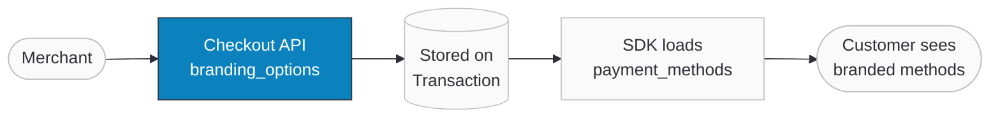

import FAQ, { FAQItem } from '@site/src/components/FAQ';

# Branding Options

The `branding_options` parameter allows merchants to attach custom display branding to individual payment methods on the checkout page. This is useful for promoting offers, highlighting preferred gateways, or providing visual cues that guide customers toward specific payment options.

Branding is configured **per transaction** through the [Checkout API](/developers/payments/checkout-api) and appears inside each payment method entry in the [`sdk_setup_preload_payload`](/developers/payments/checkout-api) response.

:::tip Boost Your Integration
Ottu offers SDKs and tools to speed up your integration. See [Getting Started](/developers/getting-started/#boost-your-integration) for all available options.
:::

## When to Use

- **Promotional campaigns** — highlight a gateway with a discount or cashback message (e.g., "30% cashback!").
- **Preferred payment methods** — visually distinguish recommended gateways with a label like "Recommended" or "Fastest checkout".
- **Dynamic per-transaction messaging** — tailor the branding text and style for each transaction based on business logic.

## Overview

| Aspect              | Detail                                                                                          |
| ------------------- | ----------------------------------------------------------------------------------------------- |
| API field           | `branding_options`                                                                              |
| Accepted in         | [POST](/developers/payments/checkout-api) (create) and [PATCH/PUT](/developers/payments/checkout-api) (update) |
| Required            | No — entirely optional                                                                          |
| Write-only          | Yes — accepted in requests, never returned in the top-level response                            |
| Where it appears    | Inside each `sdk_setup_preload_payload.payment_methods[]` entry that has branding configured     |
| Prerequisite        | [`include_sdk_setup_preload`](/developers/payments/checkout-api) must be `true` to see the branding in the response |

## Guide

### How It Works

1. **Merchant sends** `branding_options` inside the Checkout API POST or PATCH request, mapping each desired `pg_code` to a branding item.
2. **Ottu stores** the branding data on the payment transaction.
3. **When the SDK loads**, the `sdk_setup_preload_payload.payment_methods` response includes a `branding_options` object on each payment method that has branding configured. Payment methods without branding will not have the field.



### Step-by-Step

1. **Create a transaction** with `branding_options` — include `include_sdk_setup_preload: true` to see the branding in the response.

    ```json
    POST: https://sandbox.ottu.net/b/checkout/v1/pymt-txn/
    {
      "type": "payment_request",
      "amount": "50.000",
      "currency_code": "KWD",
      "pg_codes": ["kpay", "mpgs"],
      "include_sdk_setup_preload": true,
      "branding_options": {
        "payment_methods": {
          "kpay": {
            "text": "30% cashback!",
            "color": "#008000",
            "font_weight": 700
          },
          "mpgs": {
            "text": "Recommended",
            "color": "#1A73E8",
            "font_weight": 500
          }
        }
      }
    }
    ```

2. **Branding appears in the response** — each payment method in `sdk_setup_preload_payload.payment_methods` includes a `branding_options` object.

    ```json
    {
      "session_id": "abc123xyz",
      "amount": "50.000",
      "currency_code": "KWD",
      "sdk_setup_preload_payload": {
        "payment_methods": [
          {
            "code": "kpay",
            "name": "KPay",
            "amount": "50.000",
            "currency_code": "KWD",
            "branding_options": {
              "text": "30% cashback!",
              "color": "#008000",
              "font_weight": 700
            }
          },
          {
            "code": "mpgs",
            "name": "MPGS",
            "amount": "50.000",
            "currency_code": "KWD",
            "branding_options": {
              "text": "Recommended",
              "color": "#1A73E8",
              "font_weight": 500
            }
          }
        ]
      }
    }
    ```

3. **Render in your UI** — use the `text`, `color`, and `font_weight` values to display a styled label next to each payment method.

### Use Cases

#### Partial Branding

You do not need to brand every payment method. Only the gateways you include in `branding_options.payment_methods` will have branding. The rest appear normally.

```json
{
  "pg_codes": ["kpay", "mpgs", "cybersource"],
  "include_sdk_setup_preload": true,
  "branding_options": {
    "payment_methods": {
      "kpay": {
        "text": "Fastest checkout",
        "color": "#FF5722"
      }
    }
  }
}
```

**Result:** Only `kpay` includes `branding_options` in the response. `mpgs` and `cybersource` appear without branding. The `font_weight` defaults to **700** because it was not specified.

#### Update Branding on an Existing Transaction

Branding can be updated via PATCH. The branding keys are validated against the transaction's existing `pg_codes`.

```json
PATCH: https://sandbox.ottu.net/b/checkout/v1/pymt-txn/{session_id}/
{
  "branding_options": {
    "payment_methods": {
      "kpay": {
        "text": "Limited time offer!",
        "color": "#E91E63",
        "font_weight": 600
      }
    }
  }
}
```

:::info
When updating via PATCH without sending `pg_codes`, the branding keys are validated against the transaction's existing `pg_codes`. If you include a key for a `pg_code` that does not exist on the transaction, the request will be rejected.
:::

## Field Reference

### branding_options `object` `optional`

Per-payment-method branding customization provided by the merchant.

#### payment_methods `object` `required`

A dictionary where each **key** is a [`pg_code`](/developers/payments/checkout-api) and each **value** is a branding item object. Must not be empty when `branding_options` is provided.

**Constraint:** Every key must be a valid `pg_code` present in the transaction's [`pg_codes`](/developers/payments/checkout-api) list.

#### Branding Item Fields

Each branding item (the value for a `pg_code` key) contains:

| Field         | Type      | Required | Default | Description                                                     |
| ------------- | --------- | -------- | ------- | --------------------------------------------------------------- |
| `text`        | `string`  | Yes      | —       | Display text shown to the customer (e.g., "30% cashback!")       |
| `color`       | `string`  | Yes      | —       | Hex color code with `#` prefix (`#RGB` or `#RRGGBB`)            |
| `font_weight` | `integer` | No       | `700`   | CSS font-weight (400 = regular, 500 = medium, 600 = semi-bold, 700 = bold) |

**Color validation:**
- Valid: `#FF0000`, `#FFF`, `#00cc99`, `#abc`
- Invalid: `red`, `rgb(255,0,0)`, `FF0000` (missing `#`), `#FFFF` (4 digits)

## Validation Rules

| Rule                                                          | Error Message                                                                                         |
| ------------------------------------------------------------- | ----------------------------------------------------------------------------------------------------- |
| `payment_methods` is empty `{}`                               | `branding_options.payment_methods must not be empty.`                                                 |
| A key in `payment_methods` is not a valid `pg_code`           | `branding_options.payment_methods keys must be a subset of pg_codes: ['invalid_code'] are not valid.` |
| `color` is not a valid hex code                               | `Enter a valid hex color code, e.g. '#FFFF00' or '#FFF'.`                                            |
| `text` is missing                                             | `This field is required.`                                                                             |
| `color` is missing                                            | `This field is required.`                                                                             |

### Error Examples

**Unknown pg_code in branding:**

```json
// Request
{
  "pg_codes": ["kpay"],
  "branding_options": {
    "payment_methods": {
      "unknown_gateway": {
        "text": "Offer",
        "color": "#FF0000"
      }
    }
  }
}

// Response — 400 Bad Request
{
  "branding_options": [
    "branding_options.payment_methods keys must be a subset of pg_codes: ['unknown_gateway'] are not valid."
  ]
}
```

**Invalid color format:**

```json
// Request
{
  "pg_codes": ["kpay"],
  "branding_options": {
    "payment_methods": {
      "kpay": {
        "text": "Offer",
        "color": "red"
      }
    }
  }
}

// Response — 400 Bad Request
{
  "branding_options": {
    "payment_methods": {
      "kpay": {
        "color": ["Enter a valid hex color code, e.g. '#FFFF00' or '#FFF'."]
      }
    }
  }
}
```

**Empty payment_methods:**

```json
// Request
{
  "branding_options": {
    "payment_methods": {}
  }
}

// Response — 400 Bad Request
{
  "branding_options": [
    "branding_options.payment_methods must not be empty."
  ]
}
```

## FAQ

<FAQ>
  <FAQItem question="Can I set default branding at the shop level?">
    No. Branding is configured per transaction via the Checkout API. Each API call specifies its own branding. There is no shop-level default.
  </FAQItem>

  <FAQItem question="Do I need include_sdk_setup_preload to use branding?">
    The branding data is stored regardless of whether `include_sdk_setup_preload` is `true`. However, `include_sdk_setup_preload` must be set to `true` for the branding to appear in the API response. If you are using the Ottu SDK, the SDK fetches the payment methods separately, and branding will be included automatically.
  </FAQItem>

  <FAQItem question="What happens if I update pg_codes and remove a branded gateway?">
    If you send a PATCH that changes `pg_codes` and the new list no longer includes a previously branded gateway, the request will be rejected with a validation error. Update `branding_options` at the same time to remove the orphaned keys.
  </FAQItem>

  <FAQItem question="Can I remove branding from a transaction?">
    To clear branding, send a PATCH with `branding_options` containing only the gateways you want to keep branded, or omit the field entirely to leave existing branding unchanged.
  </FAQItem>
</FAQ>
