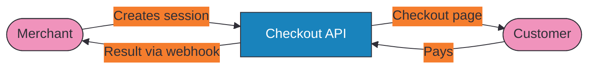

# Payments

The Payments section covers everything you need to accept payments through Ottu — from creating payment sessions to rendering checkout UIs to receiving payment results via webhooks. The [Checkout API](checkout-api.mdx) is the foundation: every payment flow starts with it, and all other components in this section extend or complement it.

## Core Components

### Checkout API (The Foundation)

Every payment starts with the Checkout API. Your server creates a payment session with the amount, currency, customer data, and gateway configuration. Ottu returns a `session_id` and `checkout_url` — from there, you choose how to present the checkout experience to your customer.

The Checkout API also handles updating transactions (amount changes, adding metadata), retrieving transaction status, and one-step checkout for server-to-server payments.

[**Go to Checkout API →**](checkout-api.mdx)

### Checkout SDK (Drop-in UI)

A pre-built checkout component you embed in your website or mobile app. Initialize it with the `session_id` from the Checkout API, and it handles everything: payment method selection, card entry, Apple Pay / Google Pay, 3-D Secure authentication, and status transitions.

[**Go to Checkout SDK →**](checkout-sdk/index.md)

### Payment Methods API (Discovery)

Dynamically fetch available payment methods for a customer based on currency, gateway, and plugin configuration. Use this when building a custom payment method selection UI, or to check which gateways are active before creating a session.

[**Go to Payment Methods →**](payment-methods.md)

### Native Payments (Direct Control)

Process payments directly when you manage your own UI — Apple Pay buttons, Google Pay buttons, or gateway tokens. Your client collects the payment payload and sends it to Ottu via Native Payments. Use this when you need full control over the checkout experience while still leveraging Ottu's gateway orchestration.

[**Go to Native Payments →**](native-payments.md)

### Sandbox & Test Cards

Test your integration with sandbox credentials and test card numbers before going live. Each gateway has its own set of test cards with specific card numbers, expiry dates, and CVV values.

[**Go to Sandbox & Test Cards →**](sandbox.md)

## How They Connect

1. **Merchant** creates a payment session via the Checkout API
2. **Customer** sees the checkout page and pays
3. **Merchant** receives the result via webhook

## Choose Your Path

| Use Case | Components | Complexity |
|----------|-----------|------------|
| Payment links (CRM, invoicing) | Checkout API only | Simplest |
| Ecommerce website | Checkout API + Checkout SDK | Recommended |
| Mobile app | Checkout API + Checkout SDK | Recommended |
| Custom Apple Pay / Google Pay buttons | Checkout API + Native Payments | Advanced |
| Server-to-server (saved cards) | Checkout API (One-Step Checkout) | Advanced |

## Prerequisites

- [**Authentication**](../getting-started/authentication.md) — API key or basic auth configured
- [**API Fundamentals**](../getting-started/api-fundamentals.md) — Base URLs, request format, error handling
- At least one active [payment gateway](payment-methods.md#activating-payment-gateway-codes) (`pg_code`)

## What's Next?

- [**Checkout API**](checkout-api.mdx) — Create your first payment session
- [**Checkout SDK**](checkout-sdk/index.md) — Embed payments in your website or app
- [**Operations**](../operations.md) — Refund, capture, or void completed payments
- [**Cards & Tokenization**](../cards-and-tokens/) — Save cards and set up recurring billing
