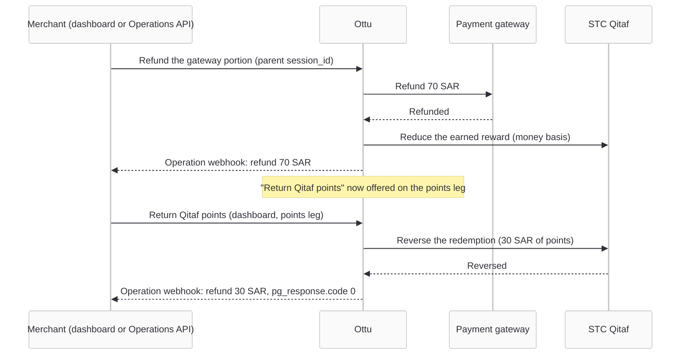

import Tabs from "@theme/Tabs";
import TabItem from "@theme/TabItem";
import CodeBlock from "@theme/CodeBlock";
import ApiDocEmbed from "@site/src/components/ApiDocEmbed";
import FAQ, { FAQItem } from "@site/src/components/FAQ";
import { OTTU_CONNECT_BASE_URL } from "@site/src/constants/api";

# Loyalty

Loyalty lets your customers **earn** points on a payment. When you opt a transaction in, Ottu issues a reward to the customer's loyalty account as soon as the payment reaches the [`paid`](../reference/payment-states.md) state — and automatically reverses that reward if you later refund. When a customer paid with **redeemed** points, a refund also returns those points to their account — see [Refunding a points-funded order](#refund-points).

Opting in takes two fields on the [Checkout API](./checkout-api.mdx) create call:

- [**`loyalty`**](#the-loyalty-object) — `{"enabled": true}` marks the transaction as rewardable. This field is identical for every provider.
- The **provider identifier** — the customer field the loyalty provider uses to locate the account (never `customer_id`). Which field this is depends on the provider — see [Supported Providers](#supported-providers). For [STC Qitaf](#supported-providers) it is [**`customer_phone`**](#the-customer_phone-field), the customer's Saudi mobile number.

You never name the provider in your payload: Ottu resolves the right loyalty backend from the gateway configuration on your [`pg_code`](./payment-methods.md), so adding future providers requires no change to your integration.

:::warning Both fields are required, and neither is validated
If `loyalty.enabled` is missing, or the provider identifier (for [STC Qitaf](#supported-providers), `customer_phone`) is absent or invalid, **no reward is issued and no error is returned**. The transaction still succeeds and still reports `paid`. A skipped reward is indistinguishable from a successful one in the API response — so send both fields on every transaction you intend to reward.
:::

:::note Base URL
Every API call in this guide targets <code>{OTTU_CONNECT_BASE_URL}</code>. Swap in your own merchant domain when you integrate.
:::

:::tip Boost Your Integration
Ottu offers SDKs and tools to speed up your integration. See [Getting Started](/developers/getting-started/#boost-your-integration) for all available options.
:::

## Supported Providers

Loyalty is **provider-agnostic**. The `loyalty` flag, the reward lifecycle, and refund reversal work the same way regardless of provider — the only thing that differs per provider is the **identifier field** the reward is keyed on and the provider's own rules. Everything provider-specific lives in this one table:

| Provider | Identifier field | Required fields | Currency | Provider rules |
| --- | --- | --- | --- | --- |
| **STC Qitaf** | [`customer_phone`](#the-customer_phone-field) — the customer's Saudi mobile number | `loyalty.enabled` + `customer_phone` | `SAR` only | Reward keyed on the Saudi mobile ([accepted formats](#the-customer_phone-field)), never on `customer_id`. Whole-currency-unit basis; sub-units do not earn. |

As new providers are enabled, this table gains a row — the rest of this guide applies unchanged. When you integrate, use the **Identifier field** column to know which customer field to send: for STC Qitaf that is `customer_phone`.

## When to Use

- **Rewarding purchases** — give customers loyalty points on every eligible payment, without building your own points ledger. Which loyalty program depends on the [provider](#supported-providers) linked to your gateway (STC Qitaf today).
- **Campaign-tagged rewards** — attach a campaign or program label to a reward for your own reporting.
- **Refund-safe loyalty** — you need rewards to unwind automatically when an order is refunded, so points liability tracks real revenue.
- **Refunding an order paid with points** — a customer redeemed Qitaf points at checkout and now wants a refund; the money goes back through the gateway and the points go back to their Qitaf account. See [Refunding a points-funded order](#refund-points).

Loyalty here covers **earning** points. Letting a customer **spend** existing loyalty points at checkout is the separate redemption flow, handled by the [Checkout SDK](./checkout-sdk/index.md) — see [Earning vs. redeeming](#earning-vs-redeeming).

## Setup

Loyalty is configured by Ottu staff, not through the API. Before your first rewarded transaction, confirm with your Ottu account manager that:

1. **A Qitaf service is active on your merchant account** — including the STC-issued credentials, client certificate, `BranchId`, and `TerminalId`.
2. **The service is linked to the specific gateway MID you pay through.** This is the step most often missed. The reward is gated on the [`pg_code`](./payment-methods.md) that *actually settles* the payment, so a transaction routed to an unlinked gateway earns nothing even with `loyalty.enabled=true`.
3. **The service currency matches your transactions.** Each Qitaf service operates in exactly one currency — `SAR` in practice. A transaction in any other currency is skipped.

## Guide

### Workflow

```mermaid
%%{init: {"theme": "base", "themeVariables": {"background": "#F4F4F4", "primaryColor": "#FAFAFA", "primaryTextColor": "#302F37", "primaryBorderColor": "#BFBFBF", "lineColor": "#302F37", "secondaryColor": "#FAFAFA", "tertiaryColor": "#FAFAFA"}}}%%
graph LR
    A([Merchant]) -->|loyalty.enabled + customer_phone| B[Checkout API]
    B --> C([Customer pays])
    C --> D{{Transaction PAID}}
    D --> E[Reward issued]
    E --> F([Points in Qitaf account])

    classDef accent fill:#0B82BE,color:#FFFFFF,stroke:#302F37
    class E accent
```



1. **Merchant creates the session** with `loyalty: {"enabled": true}` and the customer's `customer_phone`.
2. **Customer pays** through the [hosted checkout page](./checkout-api.mdx), the [Checkout SDK](./checkout-sdk/index.md), or any other route — the flow is identical.
3. **Transaction reaches `paid`.** Ottu checks the opt-in flag and the gateway's loyalty configuration.
4. **Reward is issued asynchronously** in a background job, just after the payment is acknowledged. The customer's points appear in their Qitaf account.

### Step-by-Step

#### 1. Create the payment transaction

Send `loyalty` and `customer_phone` on the standard [Checkout API](./checkout-api.mdx) create call. Everything else about the request is unchanged.

<Tabs groupId="language">
<TabItem value="curl" label="cURL">

<CodeBlock language="bash" title="Create a rewardable payment transaction">{`curl --location '${OTTU_CONNECT_BASE_URL}/b/checkout/v1/pymt-txn/' \\
  --header 'Authorization: Api-Key <YOUR_API_KEY>' \\
  --header 'Content-Type: application/json' \\
  --data '{
    "type": "e_commerce",
    "amount": "50",
    "currency_code": "SAR",
    "pg_codes": ["<YOUR_QITAF_LINKED_PG_CODE>"],
    "customer_id": "CUST-123",
    "customer_phone": "+966566089459",
    "loyalty": {"enabled": true}
  }'`}</CodeBlock>

</TabItem>
<TabItem value="python" label="Python">

<CodeBlock language="python" title="Create a rewardable payment transaction">{`import requests

response = requests.post(
    "${OTTU_CONNECT_BASE_URL}/b/checkout/v1/pymt-txn/",
    headers={
        "Authorization": "Api-Key <YOUR_API_KEY>",
        "Content-Type": "application/json",
    },
    json={
        "type": "e_commerce",
        "amount": "50",
        "currency_code": "SAR",
        "pg_codes": ["<YOUR_QITAF_LINKED_PG_CODE>"],
        "customer_id": "CUST-123",
        "customer_phone": "+966566089459",
        "loyalty": {"enabled": True},
    },
)

session = response.json()
print(session["session_id"], session["checkout_url"])`}</CodeBlock>

</TabItem>
<TabItem value="node" label="Node.js">

<CodeBlock language="javascript" title="Create a rewardable payment transaction">{`const response = await fetch(
  "${OTTU_CONNECT_BASE_URL}/b/checkout/v1/pymt-txn/",
  {
    method: "POST",
    headers: {
      Authorization: "Api-Key <YOUR_API_KEY>",
      "Content-Type": "application/json",
    },
    body: JSON.stringify({
      type: "e_commerce",
      amount: "50",
      currency_code: "SAR",
      pg_codes: ["<YOUR_QITAF_LINKED_PG_CODE>"],
      customer_id: "CUST-123",
      customer_phone: "+966566089459",
      loyalty: { enabled: true },
    }),
  },
);

const session = await response.json();
console.log(session.session_id, session.checkout_url);`}</CodeBlock>

</TabItem>
<TabItem value="php" label="PHP">

<CodeBlock language="php" title="Create a rewardable payment transaction">{`<?php
$ch = curl_init("${OTTU_CONNECT_BASE_URL}/b/checkout/v1/pymt-txn/");

curl_setopt_array($ch, [
    CURLOPT_RETURNTRANSFER => true,
    CURLOPT_POST => true,
    CURLOPT_HTTPHEADER => [
        "Authorization: Api-Key <YOUR_API_KEY>",
        "Content-Type: application/json",
    ],
    CURLOPT_POSTFIELDS => json_encode([
        "type" => "e_commerce",
        "amount" => "50",
        "currency_code" => "SAR",
        "pg_codes" => ["<YOUR_QITAF_LINKED_PG_CODE>"],
        "customer_id" => "CUST-123",
        "customer_phone" => "+966566089459",
        "loyalty" => ["enabled" => true],
    ]),
]);

$session = json_decode(curl_exec($ch), true);
echo $session["session_id"];`}</CodeBlock>

</TabItem>
</Tabs>

The response is a standard checkout session. The `loyalty` object is echoed back exactly as you sent it — this confirms Ottu **stored your intent**, not that a reward was issued.

```json title="Response (abridged)"
{
  "session_id": "8f2c1d5e9a7b4c3f6e0d2a8b1c4f7e9d",
  "checkout_url": "https://sandbox.ottu.net/b/checkout/redirect/start/?session_id=8f2c1d5e9a7b4c3f6e0d2a8b1c4f7e9d",
  "amount": "50.00",
  "currency_code": "SAR",
  "customer_phone": "+966566089459",
  "loyalty": {"enabled": true},
  "state": "created"
}
```

#### 2. Let the customer pay

Present the checkout however you normally do — redirect to `checkout_url`, or mount the [Checkout SDK](./checkout-sdk/index.md). Loyalty adds no step to the customer's experience; there is no extra screen and nothing for them to confirm.

#### 3. The reward fires automatically

Once the payment is acknowledged and the transaction reaches `paid`, Ottu issues the reward in a background job. No API call is needed from you.

Rewards are **skipped silently** in each of these cases:

| Condition | Result |
| --- | --- |
| `loyalty.enabled` missing, `false`, or misspelled | No reward |
| `customer_phone` empty, or not a valid Saudi number | No reward |
| Settling `pg_code` has no Qitaf service linked | No reward |
| Transaction currency ≠ the Qitaf service currency | No reward |
| Authorization-only transaction (not an immediate-capture purchase) | No reward |
| Payment funded entirely by redeemed loyalty points | No reward |
| A reward already exists for this transaction | No duplicate |

#### 4. Reversal on refund

When you [refund](../operations.md) a rewarded transaction, Ottu automatically reverses the reward. The reversal is **amount-matched** to the refund, not a flat percentage: refund 20 SAR of a 50 SAR order and 20 SAR of reward basis is reversed. Repeated partial refunds accumulate, and a reversal that would exceed the original reward is rejected rather than over-reversing.

Only **money** refunds reduce the reward. If the order was also paid with redeemed points, returning those points to the customer leaves the reward untouched — the points never earned anything in the first place. How that return works is covered in [Refunding a points-funded order](#refund-points).

### The `loyalty` object

| Field | Type | Required | Description |
| --- | --- | --- | --- |
| `enabled` | boolean | **Yes** | `true` opts the transaction into loyalty rewards. `false` — or omitting the whole object — sends no reward request. |
| `reference` | string (≤128) | No | Your own campaign or program label. Defaults to the transaction's `order_no`. |
| `metadata` | object | No | Opaque key/value pairs stored on the transaction and echoed back in the response. |

:::note `reference` and `metadata` stay inside Ottu
Neither field reaches STC Qitaf. The Qitaf earn API has no general-purpose reference slot, and no provider reads `metadata`. Both are recorded against the transaction for **your** reconciliation — useful for correlating a reward back to a campaign in your own system, but invisible to the loyalty provider.
:::

```json title="Full loyalty object"
{
  "loyalty": {
    "enabled": true,
    "reference": "LOY-CAMP-SPRING-9182",
    "metadata": {
      "campaign_id": "spring2026",
      "segment": "vip"
    }
  }
}
```

### The `customer_phone` field

Qitaf identifies a loyalty account by **mobile number**. It does not use `customer_id`, which is your own identifier and is routinely non-numeric — so `customer_phone` is what determines who gets the points.

Ottu normalizes the number before sending it, stripping an international Saudi prefix along with spaces, hyphens, and parentheses. All of these forms are accepted and resolve to the same account:

| You send | Interpreted as | Valid |
| --- | --- | --- |
| `0566089459` | Saudi mobile, local form | ✅ |
| `566089459` | Saudi mobile, no leading zero | ✅ |
| `+966566089459` | International, `+966` prefix | ✅ |
| `00966566089459` | International, `00966` prefix | ✅ |
| `966566089459` | International, bare `966` prefix | ✅ |
| `+966 56 608-9459` | Separators are stripped | ✅ |
| `0766089459` | `07` is not a Saudi mobile prefix | ❌ |
| `+40721234567` | Not a Saudi number | ❌ |
| `056.608.9459` | Dots are **not** stripped | ❌ |
| `CUST-123` | Not a phone number | ❌ |

A valid Saudi mobile is `05XXXXXXXX` or `5XXXXXXXX` — 9 digits after any prefix, starting with `5`. Saudi landlines (`01XXXXXXX` / `1XXXXXXX`) also pass validation, though loyalty accounts are mobile-based in practice.

:::tip Store phone numbers in a canonical form
Because an invalid number fails silently, normalize on **your** side before you call the API. Storing customers' numbers in a single canonical form — `+9665XXXXXXXX` is a good choice — removes an entire class of "the reward never arrived" reports.
:::

The `customer_phone` field caps at 16 characters, which comfortably fits every accepted format. Sending a heavily spaced number close to that limit is the only realistic way to hit it.

### Use Cases

#### What the reward is calculated on

The reward is based on the **money actually paid** — the gateway portion plus any real-money wallet credit. Value funded by redeemed loyalty points is excluded, so points never earn more points.

Amounts are sent to Qitaf as whole currency units: a basis of `10.99 SAR` is transmitted as `10`. Sub-unit value does not earn. STC applies its own accrual rate to that figure, so the number of points a customer receives is determined by your Qitaf contract, not by anything in the API payload.

#### Earning vs. redeeming {#earning-vs-redeeming}

These are two independent flows and are documented separately:

- **Earning** (this page) — a server-side opt-in on the Checkout API. No customer interaction.
- **Redeeming** — the customer spends existing Qitaf points at checkout, entering their mobile number and confirming a one-time password. This runs through the [Checkout SDK](./checkout-sdk/index.md) as a wallet-style payment method and is SAR-only.

A single transaction can do both: redeem points toward the balance, then earn on the money portion that remains.

## Refunding a Points-Funded Order {#refund-points}

When a customer **redeemed** Qitaf points at checkout, the payment is recorded as a parent transaction with a child transaction per funding source: one child for the points (the *points leg*) and, on a split payment, the gateway payment itself. Refunding such an order has two halves, and they run in a fixed order:

1. **The money first.** The gateway portion is refunded exactly like any other refund — from the dashboard or through the [Operations API](../operations.md) with the parent's `session_id`. The refundable amount is capped at what the gateway actually settled; the points are never part of it.
2. **Then the points.** Once the gateway portion is fully refunded (or immediately, when the order was paid with points only), the dashboard offers **Return Qitaf points** on the points leg. It returns the **whole** redeemed amount to the customer's Qitaf account in one step. There is no partial return and no amount to enter.



:::note Points are returned from the dashboard, not the API
The **Return Qitaf points** action is a dashboard operation, governed by the same refund permission and the same [maker-checker approval](/business/operations/two-step-authorization) as a gateway refund. The public [Operations API](../operations.md) does not return loyalty points: a `refund` with `destination: "wallet"` is rejected on a points-funded order, exactly as before. What your integration *does* see is the outcome, through the webhooks below.
:::

### What the rules are

| Rule | Behaviour |
| --- | --- |
| **Order** | Gateway money first, points second. Until the gateway portion is fully refunded, the points action is not offered and a request for it is refused with the remaining gateway amount. A refund that is still pending approval counts as outstanding. |
| **Amount** | Always the full redeemed amount. Nothing to enter, nothing partial. |
| **Once** | A second return is refused; two simultaneous requests book exactly one. Retrying after a timeout is safe. |
| **Recoverable** | If Qitaf times out or answers with a retryable error, nothing is booked and the action stays available. If Qitaf answers that the redemption can no longer be reversed (for example the reversal window has passed, or the redemption is unknown to it), the action is withdrawn and the operator is told to refund the customer another way. |
| **Reward** | Returning the points does **not** reduce the earned reward — the money refund already did that. |
| **Records** | A successful return books a `refunded` child transaction for the points amount under the parent, so the parent's `refunded_amount` reaches the order total. |

### What your webhooks receive

The points return emits the **same two notifications** as a gateway refund, so nothing new has to be parsed.

**1. The operation webhook** (your `operations_webhook_url`, see [Operation events](../webhooks/operation-events.md)). `amount` is the points value, `result` is `success`, and `pg_response` carries Qitaf's own answer — `code: 0` and the reversal reference in `operation_id`:

```json title="Operation webhook after the points were returned (abridged)"
{
  "operation": "refund",
  "result": "success",
  "success": true,
  "amount": "30.00",
  "order_no": "ORD-10042",
  "session_id": "00656aba4360da24a5fbb64ea60687eec6707888",
  "reference_number": "qitaf-RKJ8U",
  "pg_code": "<YOUR_QITAF_LINKED_PG_CODE>",
  "pg_response": {
    "code": 0,
    "description": "Success",
    "operation_id": "a7049ee7-9abc-4b0c-9629-efcd43aec5c8",
    "request_date": "2026-09-10T17:52:11"
  },
  "txn": {
    "amount": "30.00",
    "currency_code": "SAR",
    "session_id": "fee4615c97bf456dab7829039e66098431d959b1",
    "state": "refunded"
  },
  "initiator": {"username": "ops.user", "first_name": "Ops", "last_name": "User"},
  "timestamp_utc": "2026-09-10 14:52:12",
  "signature": "<HMAC>"
}
```

**2. The parent's payment webhook** (see [Payment events](../webhooks/payment-events.md)), whose `transactions[]` lists every child. After both halves of the refund it shows the original points leg, the gateway refund, and the points return — the last one is the record you are looking for: `state: refunded` with the points amount.

```json title="Parent payment webhook after a full refund of a 100 SAR split order (abridged)"
{
  "session_id": "00656aba4360da24a5fbb64ea60687eec6707888",
  "order_no": "ORD-10042",
  "state": "paid",
  "amount": "100.00",
  "paid_amount": "70.000",
  "refunded_amount": "100.000",
  "currency_code": "SAR",
  "transactions": [
    {"amount": "30.00", "currency_code": "SAR", "session_id": "fee4615c97bf456dab7829039e66098431d959b1", "state": "refunded"},
    {"amount": "70.00", "currency_code": "SAR", "session_id": "ee430d081612bef7d9bbd30ba0efeb314f3087b9", "state": "refunded"},
    {"amount": "30.00", "currency_code": "SAR", "session_id": "d6947c0b5244fbb3ce4da992be4f69195ab82ae5", "state": "paid"}
  ]
}
```

:::warning `paid_amount` is the gateway money, not the order total
On a points-funded order `paid_amount` reports what the gateway settled (`70.000` above); the points leg is the `paid` child of `30.00`. Once everything is refunded, `refunded_amount` reaches the full `100.000` while `paid_amount` stays at `70.000`. Reconcile on `refunded_amount` and the `transactions[]` list, not on `paid_amount` alone.
:::

Both webhooks are signed the usual way — verify them exactly as described in [Verify signatures](../webhooks/verify-signatures.md).

### Outcomes the operator sees

Every outcome comes back as one merchant-facing message, in the dashboard user's language. Your support team will quote these to you:

| Outcome | Message (English) | Message (Arabic) |
| --- | --- | --- |
| Returned | `30.000 SAR in Qitaf points returned to the customer.` | `تمت إعادة 30.000 SAR من نقاط Qitaf إلى العميل.` |
| Gateway money still refundable | `Refund the remaining 70.000 SAR paid through the payment gateway before returning the Qitaf points.` | `قم باسترداد المبلغ المتبقي 70.000 SAR المدفوع عبر بوابة الدفع قبل إعادة نقاط Qitaf.` |
| Amount edited | `Qitaf points are always returned in full (30.000 SAR); a partial amount cannot be entered.` | `تتم إعادة نقاط Qitaf بالكامل دائمًا (30.000 SAR)؛ لا يمكن إدخال مبلغ جزئي.` |
| Already returned | `The Qitaf points for this transaction have already been returned to the customer.` | `تمت إعادة نقاط Qitaf لهذه المعاملة إلى العميل بالفعل.` |
| Qitaf refused, retry possible | `Qitaf did not confirm the reversal ([2311] Technical error has occurred while processing this transaction, please try again). No points were returned; you can retry.` | `لم يؤكد Qitaf عملية الإلغاء (...). لم تتم إعادة أي نقاط؛ يمكنك المحاولة مرة أخرى.` |
| Qitaf unreachable | `Qitaf could not be reached to confirm the reversal. No points were returned; you can retry.` | `تعذر الوصول إلى Qitaf لتأكيد عملية الإلغاء. لم تتم إعادة أي نقاط؛ يمكنك المحاولة مرة أخرى.` |
| Qitaf can no longer reverse it | `Qitaf can no longer return these points ([1041] Refund period has expired). Refund the customer by another means.` | `لم يعد بإمكان Qitaf إعادة هذه النقاط (...). يرجى استرداد المبلغ للعميل بوسيلة أخرى.` |

The bracketed code and text inside the Qitaf messages are STC's own error code and description, passed through unchanged so they can be quoted to STC support. The dashboard side of this workflow, with the exact steps, is in [Refunding Orders Paid with Qitaf Points](/business/operations/qitaf-points-refund).

## API Reference

`loyalty` and `customer_phone` are fields on the standard Checkout API create call. The full request and response schema — with every field, type, and constraint — is below.

<ApiDocEmbed path="create-payment-transaction-checkout.api.mdx" />

## Best Practices

- **Send both fields together, every time.** Treat `loyalty.enabled` and a canonical `customer_phone` as a pair. Neither is validated, so a missing one costs a reward with no signal.
- **Validate the phone number before you call Ottu.** A regex check for `^(\+966|00966|966|0)?5\d{8}$` on your side catches the failure while you can still fix it.
- **Confirm the gateway linkage during onboarding.** Send one test transaction per `pg_code` you intend to reward through and verify with Ottu that the reward landed. A gateway missing its Qitaf link is silent in production.
- **Reconcile out of band.** Because the API exposes no reward outcome, periodically reconcile your rewarded orders against STC's own reporting rather than assuming success.
- **Use `reference` deliberately.** Set it to something you can resolve in your own system — a campaign ID or internal batch key. It defaults to `order_no`, which is usually the sensible choice.

## FAQ

<FAQ>
  <FAQItem question="How do I know whether the reward actually succeeded?">
    You cannot determine this through the API today. The reward outcome is not returned in the checkout response, is not exposed on the payment object, and does not appear in any webhook. The `loyalty` object echoed back in the response reflects only what you sent. If you need programmatic confirmation, raise it with your Ottu account manager — reconcile against STC reporting in the meantime.
  </FAQItem>
  <FAQItem question="What happens if I send loyalty.enabled but no customer_phone?">
    The payment completes normally and reaches `paid`, but no reward request is sent. Nothing in the API response indicates this. It is the single most common cause of "rewards stopped arriving" — always send both fields.
  </FAQItem>
  <FAQItem question="Does a wrong phone number reward the wrong person?">
    Only if it is a valid Saudi mobile belonging to someone else. An invalid or non-Saudi number is rejected during normalization and the reward is skipped entirely rather than misdirected.
  </FAQItem>
  <FAQItem question="Can I add or change loyalty after creating the transaction?">
    Yes. The flag and phone number are read when the transaction reaches `paid`, not when it is created — so a [PATCH](./checkout-api.mdx) before payment is honoured. Once the transaction is paid, the reward has already been issued and changes have no effect.
  </FAQItem>
  <FAQItem question="Do authorization-only payments earn points?">
    No. Only immediate-capture purchases reward. An authorization that is captured later does not trigger the reward.
  </FAQItem>
  <FAQItem question="Is the reward retried if Qitaf is temporarily unavailable?">
    No. A transient failure at the provider means the reward for that transaction is not issued, and there is no automatic retry or recovery sweep. This is another reason to reconcile periodically.
  </FAQItem>
  <FAQItem question="Which currencies are supported?">
    A Qitaf service operates in exactly one currency, configured by Ottu — `SAR` in practice. Transactions in any other currency are skipped.
  </FAQItem>
  <FAQItem question="Does the customer see anything different at checkout?">
    No. Earning is entirely server-side. The customer sees a normal checkout and their points appear in their Qitaf account afterwards.
  </FAQItem>
  <FAQItem question="What happens to points when I refund?">
    Two different things, depending on which points you mean. Points the customer **earned** on the order are reversed automatically, amount-matched to the money you refund — see [Reversal on refund](#4-reversal-on-refund). Points the customer **redeemed** to pay are returned to their Qitaf account when an operator uses **Return Qitaf points** on the points leg, after the gateway portion is refunded — see [Refunding a points-funded order](#refund-points).
  </FAQItem>
  <FAQItem question="Can I return redeemed points through the API?">
    Not today. The return is a dashboard operation on the points leg, under the same refund permission and maker-checker approval as a gateway refund. Your integration is told about it through the same operation and payment webhooks a gateway refund emits. Sending `destination: "wallet"` to the Operations API on a points-funded order is rejected.
  </FAQItem>
  <FAQItem question="Why is the points action missing on a refunded order?">
    Either the gateway portion is not fully refunded yet (a refund waiting for approval still counts), the points were already returned, or Qitaf answered that the redemption can no longer be reversed — in which case the customer has to be refunded another way. The operator sees the exact reason as a message when they try.
  </FAQItem>
</FAQ>

## What's Next?

- [Checkout API](./checkout-api.mdx) — the create call that carries `loyalty` and `customer_phone`.
- [Payment Methods API](./payment-methods.md) — discovering the `pg_codes` your loyalty service is linked to.
- [Operations](../operations.md) — refunds, and how they trigger reward reversal.
- [Refunding Orders Paid with Qitaf Points](/business/operations/qitaf-points-refund) — the dashboard workflow for returning redeemed points.
- [Operation events](../webhooks/operation-events.md) — the webhook that reports a points return.
- [Checkout SDK](./checkout-sdk/index.md) — where customers redeem existing Qitaf points.
- [M-Wallet](./wallet/index.mdx) — the related wallet-credit flow, including multi-wallet stacking with Qitaf.
