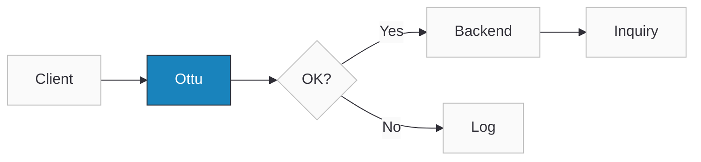
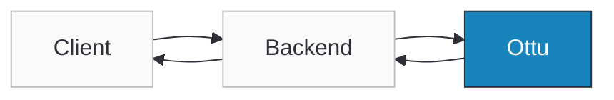

import Tabs from '@theme/Tabs';
import TabItem from '@theme/TabItem';
import ApiDocEmbed from "@site/src/components/ApiDocEmbed";

# Native Payments

Use Native Payments when you want full control of the client experience (web or mobile) and prefer not to use the [Checkout SDK](./checkout-sdk/index.md). Your client or backend collects a payment payload and sends it to Ottu to process the payment for a given [session_id](checkout-api#response-CheckoutPOSTResponse-session_id).

A payment payload can be:

- Wallet payment data (e.g., Apple Pay paymentData, Google Pay paymentMethodData) — typically encrypted by the wallet.
- Gateway token / network token (card-on-file or one-click use cases) — not necessarily encrypted.

Ottu processes the payload with the configured gateway and returns a normalized callback result.

:::tip Boost Your Integration
Ottu offers SDKs and tools to speed up your integration. See [Getting Started](../getting-started/#boost-your-integration) for all available options.
:::

## When to Use

- Apple Pay or Google Pay buttons are rendered and managed by you.
- Existing tokenization has already been implemented and needs to be used to charge with a gateway token.
- Granular, SDK-less control of the UX is required, while Ottu's orchestration and gateway integrations are still leveraged.

## Setup

- A valid [session_id](./checkout-api) obtained from the [Checkout API](./checkout-api).
- A Merchant Gateway ID (MID) with the payment service activated and properly configured in Ottu.

If multiple gateways are configured, always include the [pg_code](./checkout-api) corresponding to the MID that has the target payment service enabled.\
**Example:**\
If a transaction has `knet` and `mpgs` `pg_code` but only `knet` supports Apple Pay, you must send \
`pg_code`: `knet` when calling the Apple Pay endpoint.

#### Checklist

- [x] Created a valid [session_id](./checkout-api).
- [x] Completed Apple Pay / Google Pay setup (if applicable).
- [x] Selected the correct invocation model (client or backend).
- [x] Used the appropriate API key type ([Public API Key](../getting-started/authentication.md#public-key) vs. [Private API Key](../getting-started/authentication.md#private-key-api-key)).
- [x] Sent wallet payment payload or gateway token (no raw card data).
- [x] Implemented backend sync logic.

## Guide

### Workflow

#### Client → Ottu

1. The client collects the wallet or tokenized payment payload and calls the Native Payments endpoint directly.
2. The client receives the API callback response.

:::danger Never expose private keys on the client side
Never embed [Private API Keys](../getting-started/authentication.md#private-key-api-key) in client-side code — they grant full API access and will be compromised if exposed. Use a [Public API Key](../getting-started/authentication.md#public-key) for client-side calls.
:::

If the call is made from the client side, the backend must be synchronized with the payment result by ensuring that one of the following actions is performed:

- The API response is forwarded to the backend, **or**
- The [Payment Status Query API](./psq) is called by the backend after the client confirms that the payment has been completed.



#### Client → Backend → Ottu (Recommended)

1. The client sends the payment payload to the backend.
2. The backend calls the Ottu Native Payments endpoint.
3. The backend receives the payment response callback.
4. The backend processes the callback response and notifies the client side with the payment status.



### Step-by-Step

<Tabs groupId="native-payment-provider" queryString>
<TabItem value="apple-pay" label="Apple Pay">

```bash
curl -X POST "https://sandbox.ottu.net/b/pbl/v2/payment/apple-pay/" \
  -H "Authorization: Api-Key your_api_key" \
  -H "Content-Type: application/json" \
  -d '{
    "session_id": "your_session_id",
    "pg_code": "apple-pay-gateway",
    "payload": {
      "paymentData": {
        "data": "base64_encrypted_payment_data...",
        "signature": "base64_signature...",
        "header": {
          "publicKeyHash": "hash...",
          "ephemeralPublicKey": "key..."
        },
        "version": "EC_v1"
      },
      "paymentMethod": {
        "displayName": "Visa 5766",
        "network": "Visa",
        "type": "debit"
      },
      "transactionIdentifier": "transaction_id..."
    }
  }'
```

</TabItem>
<TabItem value="google-pay" label="Google Pay">

```bash
curl -X POST "https://sandbox.ottu.net/b/pbl/v2/payment/google-pay/" \
  -H "Authorization: Api-Key your_api_key" \
  -H "Content-Type: application/json" \
  -d '{
    "session_id": "your_session_id",
    "pg_code": "google-pay-gateway",
    "payload": {
      "apiVersion": 2,
      "apiVersionMinor": 0,
      "paymentMethodData": {
        "type": "CARD",
        "tokenizationData": {
          "type": "PAYMENT_GATEWAY",
          "token": "encrypted_token..."
        }
      }
    }
  }'
```

</TabItem>
<TabItem value="auto-debit" label="Auto-Debit">

```bash
curl -X POST "https://sandbox.ottu.net/b/pbl/v2/payment/auto-debit/" \
  -H "Authorization: Api-Key your_api_key" \
  -H "Content-Type: application/json" \
  -d '{
    "session_id": "your_session_id",
    "token": "saved_card_token"
  }'
```

</TabItem>
</Tabs>

**Response** (all endpoints return the same structure):

```json
{
  "result": "success",
  "message": "successful payment",
  "pg_response": {}
}
```

Use the response values to reconcile the payment in your backend and update your order state.

### Use Cases

The general [Setup](#setup) prerequisites and [checklist](#checklist) apply to all providers below.

:::danger
Never modify wallet payloads (Apple Pay, Google Pay) — any change invalidates token decryption. Always include [pg_code](./checkout-api) if multiple gateways are configured.
:::

<Tabs groupId="native-payment-provider" queryString>
<TabItem value="apple-pay" label="Apple Pay">

1. Configure Apple Pay on the client side (iOS / web).
2. Collect the encrypted `paymentData` object from Apple Pay.
3. Send the payload with the [session_id](./checkout-api) to `POST /b/pbl/v2/payment/apple-pay/`.
4. Ottu processes via the configured Apple Pay gateway and returns a unified result (`succeeded`, `failed`).

</TabItem>
<TabItem value="google-pay" label="Google Pay">

1. Configure Google Pay on the client side (Android / web).
2. Collect the wallet payment payload (`paymentMethodData`, `email`, `addresses`, etc.).
3. Send the payload with the [session_id](./checkout-api) to `POST /b/pbl/v2/payment/google-pay/`.
4. Ottu processes through the configured gateway and returns a normalized response.

:::warning
If the response contains `type: "iframe"`, render it for 3D Secure authentication.
:::

</TabItem>
<TabItem value="auto-debit" label="Auto-Debit">

1. Ensure the token is active and usable for the merchant.
2. Use an existing [session_id](./checkout-api) created via the [Checkout API](./checkout-api).
3. Send the token in the `token` field to `POST /b/pbl/v2/payment/auto-debit/`.
4. Ottu processes the payment with the configured gateway and returns the callback result.

Supports CIT ([Cardholder Initiated](../cards-and-tokens/recurring-payments)) and MIT ([Merchant Initiated](../cards-and-tokens/recurring-payments)) transactions.

</TabItem>
</Tabs>

## API Reference

Select the payment provider to see its full interactive API schema:

<Tabs groupId="native-payment-provider" queryString>
<TabItem value="apple-pay" label="Apple Pay">

<ApiDocEmbed path="apple-direct-payment.api.mdx" />

</TabItem>
<TabItem value="google-pay" label="Google Pay">

<ApiDocEmbed path="google-direct-payment.api.mdx" />

</TabItem>
<TabItem value="auto-debit" label="Auto-Debit">

<ApiDocEmbed path="auto-debit.api.mdx" />

</TabItem>
</Tabs>

## FAQ

#### 1. Can I call Native Payments directly from the client?

Yes, but only with the [Public Key,](../getting-started/authentication.md#public-key) and your backend must remain synchronized.

#### 2. Which model should I use in production?

Always prefer Client → Backend → Ottu using the [Private Key.](../getting-started/authentication.md#private-key-api-key)

#### 3. How do I verify the payment result?

Use the [Payment Status Query API](./psq).

#### 4. What if my transaction has multiple gateway codes?

Include the `pg_code` for the MID that has the corresponding payment service enabled (e.g., Apple Pay, Google Pay).

#### 5. What happens if I modify wallet data?

The payment will fail — wallet tokens must be sent unmodified.

#### 6. Can I charge saved tokens automatically?

Yes, use **Native Payments** for tokenized or recurring payments.

## What's Next?

- [**Checkout API**](./checkout-api.mdx) — Create sessions with `payment_instrument` for one-step checkout
- [**Recurring Payments**](../cards-and-tokens/recurring-payments.md) — Use tokens for auto-debit payments
- [**Webhooks**](../webhooks/payment-events.md) — Receive payment result notifications
