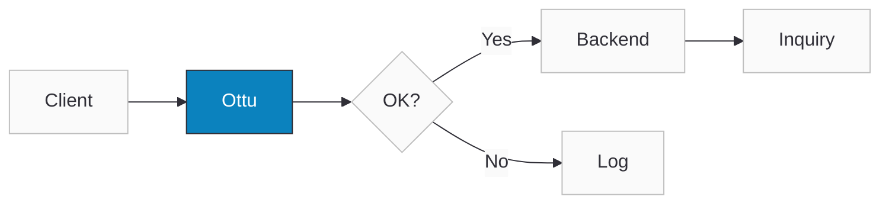

import Tabs from '@theme/Tabs';
import TabItem from '@theme/TabItem';
import CodeBlock from "@theme/CodeBlock";
import ApiDocEmbed from "@site/src/components/ApiDocEmbed";
import FAQ, { FAQItem } from '@site/src/components/FAQ';
import { OTTU_CONNECT_BASE_URL } from "@site/src/constants/api";

# Native Payments

Use Native Payments when you want full control of the client experience (web or mobile) and prefer not to use the [Checkout SDK](./checkout-sdk/index.md). Your client or backend collects a payment payload and sends it to Ottu to process the payment for a given [session_id](/developers/payments/checkout-api/).

A payment payload can be:

- Wallet payment data (e.g., Apple Pay paymentData, Google Pay paymentMethodData) — typically encrypted by the wallet.
- Gateway token / network token (card-on-file or one-click use cases) — not necessarily encrypted.

Ottu processes the payload with the configured gateway and returns a normalized callback result.

:::tip[Boost Your Integration]
Ottu offers SDKs and tools to speed up your integration. See [Getting Started](/developers/getting-started/#boost-your-integration) for all available options.
:::

## When to Use

- Apple Pay or Google Pay buttons are rendered and managed by you.
- Existing tokenization has already been implemented and needs to be used to charge with a gateway token.
- Granular, SDK-less control of the UX is required, while Ottu's orchestration and gateway integrations are still leveraged.

## Setup

- A valid [session_id](/developers/payments/checkout-api/) obtained from the [Checkout API](/developers/payments/checkout-api/).
- A Merchant Gateway ID (MID) with the payment service activated and properly configured in Ottu.

If multiple gateways are configured, always include the [pg_code](/developers/payments/checkout-api/) corresponding to the MID that has the target payment service enabled.\
**Example:**\
If a transaction has `knet` and `mpgs` `pg_code` but only `knet` supports Apple Pay, you must send \
`pg_code`: `knet` when calling the Apple Pay endpoint.

#### Checklist

- [x] Created a valid [session_id](/developers/payments/checkout-api/).
- [x] Completed Apple Pay / Google Pay setup (if applicable).
- [x] Selected the correct invocation model (client or backend).
- [x] Used the appropriate API key type ([Public API Key](../getting-started/authentication.md#public-key) vs. [Private API Key](../getting-started/authentication.md#api-key-auth)).
- [x] Implemented backend sync logic.

### Configuring your native wallet from the session response

Before you can render an Apple Pay or Google Pay button, you have to build the wallet's payment request. Several of those values — the gateway identifier, the gateway merchant ID, your wallet merchant ID — **must come from Ottu, not from your own configuration**. Ottu already returns them per transaction in the session response, so you never have to hardcode them.

:::warning[`gateway_merchant_id` is not your wallet `merchant_id`]
These are two different values and they are **not interchangeable**:

- **`gateway_merchant_id`** — the **payment gateway's** merchant identifier (for example, your MPGS merchant ID). This is what goes into the wallet's gateway tokenization setting (`gatewayMerchantId` for Google Pay).
- **`merchant_id`** — your **wallet** (Google / Apple) merchant identifier (for example, a Google Pay `BCR2DN…` ID). It is used only for the wallet's own merchant info.

Putting the wallet `merchant_id` where the gateway expects `gateway_merchant_id` is a common, hard-to-diagnose mistake: the wallet sheet renders and produces a token, but the gateway rejects that token at the payment step (MPGS, for example, returns *"not authorized to use this Google Pay payment token"*). Always read both values from the session response per transaction — never hardcode them.
:::

#### Where the fields live

The wallet configuration is returned under `sdk_setup_preload_payload.payment_services[]` — **one object per configured wallet**. Request it by setting `include_sdk_setup_preload=true` when you [create or retrieve the session](/developers/payments/checkout-api/).

These values are **not** in the top-level `payment_methods` array (which can be empty for native flows). Read each wallet's config from `payment_services[]`, matched by its `flow` discriminator (`"google_pay"` or `"apple_pay"`) and its `pg_code`.

#### Google Pay

Map each `payment_services[]` field to its [Google Pay](https://developers.google.com/pay/api/web/reference/request-objects) request setting:

| `payment_services[]` field | Google Pay setting | Notes |
|---|---|---|
| `gateway` | tokenization `gateway` | e.g. `mpgs` |
| `gateway_merchant_id` | tokenization `gatewayMerchantId` | the **gateway's** merchant ID — *not* your Google merchant ID |
| `merchant_id` | `merchantInfo.merchantId` | your Google Pay (`BCR2DN…`) merchant ID |
| `merchant_name` | `merchantInfo.merchantName` | display name |
| `environment` | Google Pay environment | `PRODUCTION` / `TEST` |
| `currency_code` | transaction currency | |
| `country_code` | transaction country | |
| `total_price` | transaction total | |

After Google Pay returns the token, POST it to the native endpoint (`payment_url`, i.e. `POST /pbl/v2/payment/google-pay/`) with `session_id`, `pg_code`, and the payload — as shown in [Step-by-Step](#step-by-step) below.

#### Apple Pay

Apple Pay's `payment_services[]` entry has a **different field set** — verified against the live SDK response, it does *not* mirror Google Pay:

| `payment_services[]` field | Apple Pay payment request use | Notes |
|---|---|---|
| `merchant_id` | Apple Pay merchant identifier | the `merchantIdentifier` used when validating the merchant session |
| `domain` | merchant domain | the registered domain used for Apple Pay merchant/session validation |
| `shop_name` | display name | shown on the Apple Pay sheet |
| `currency_code` | payment request currency | |
| `country_code` | payment request country | |
| `amount` | payment request total | Apple Pay uses `amount` here, not `total_price` |
| `session_id` | Ottu session | used for the merchant-session validation step |
| `validation_url` | Ottu validation endpoint | your client calls this to validate the Apple Pay merchant session before showing the sheet |

:::note Apple Pay does not expose gateway tokenization fields
Unlike Google Pay, the Apple Pay entry does **not** contain `gateway` or `gateway_merchant_id`, and there is **no `environment` field**:

- The gateway tokenization (the equivalent of Google Pay's `gatewayMerchantId`) is handled by Ottu server-side during the merchant-session validation (`validation_url`) and decryption — you do not set it in the client payment request.
- The Apple Pay environment (sandbox vs. production) is determined by the Apple account and device, not by a value in the response.
:::

After Apple Pay returns the encrypted `paymentData`, POST it to the native endpoint (`payment_url`, i.e. `POST /pbl/v2/payment/apple-pay/`) with `session_id`, `pg_code`, and the payload — as shown in [Step-by-Step](#step-by-step) below.

## Guide

### Workflow

#### Client → Ottu

1. The client collects the wallet or tokenized payment payload and calls the Native Payments endpoint directly.
2. The client receives the API callback response.

:::danger[Never expose private keys on the client side]
Never embed [Private API Keys](../getting-started/authentication.md#api-key-auth) in client-side code — they grant full API access and will be compromised if exposed. Use a [Public API Key](../getting-started/authentication.md#public-key) for client-side calls.
:::

If the call is made from the client side, the backend must be synchronized with the payment result by ensuring that one of the following actions is performed:

- The API response is forwarded to the backend, **or**
- The [Payment Status Query API](/developers/payments/psq/) is called by the backend after the client confirms that the payment has been completed.



#### Client → Backend → Ottu (Recommended)

1. The client sends the payment payload to the backend.
2. The backend calls the Ottu Native Payments endpoint.
3. The backend receives the payment response callback.
4. The backend processes the callback response and notifies the client side with the payment status.


### Step-by-Step

<Tabs groupId="native-payment-provider" queryString>
<TabItem value="apple-pay" label="Apple Pay">

<CodeBlock language="bash" title="Apple Pay native payment">{`curl -X POST "${OTTU_CONNECT_BASE_URL}/b/pbl/v2/payment/apple-pay/" \\
  -H "Authorization: Api-Key your_api_key" \\
  -H "Content-Type: application/json" \\
  -d '{
    "session_id": "your_session_id",
    "pg_code": "apple-pay-gateway",
    "payload": {
      "paymentData": {
        "data": "base64_encrypted_payment_data...",
        "signature": "base64_signature...",
        "header": {
          "publicKeyHash": "hash...",
          "ephemeralPublicKey": "key..."
        },
        "version": "EC_v1"
      },
      "paymentMethod": {
        "displayName": "Visa 5766",
        "network": "Visa",
        "type": "debit"
      },
      "transactionIdentifier": "transaction_id..."
    }
  }'`}</CodeBlock>

</TabItem>
<TabItem value="google-pay" label="Google Pay">

<CodeBlock language="bash" title="Google Pay native payment">{`curl -X POST "${OTTU_CONNECT_BASE_URL}/b/pbl/v2/payment/google-pay/" \\
  -H "Authorization: Api-Key your_api_key" \\
  -H "Content-Type: application/json" \\
  -d '{
    "session_id": "your_session_id",
    "pg_code": "google-pay-gateway",
    "payload": {
      "apiVersion": 2,
      "apiVersionMinor": 0,
      "paymentMethodData": {
        "type": "CARD",
        "tokenizationData": {
          "type": "PAYMENT_GATEWAY",
          "token": "encrypted_token..."
        }
      }
    }
  }'`}</CodeBlock>

</TabItem>
<TabItem value="auto-debit" label="Auto-Debit">

<CodeBlock language="bash" title="Auto-debit native payment">{`curl -X POST "${OTTU_CONNECT_BASE_URL}/b/pbl/v2/payment/auto-debit/" \\
  -H "Authorization: Api-Key your_api_key" \\
  -H "Content-Type: application/json" \\
  -d '{
    "session_id": "your_session_id",
    "token": "saved_card_token"
  }'`}</CodeBlock>

</TabItem>
</Tabs>

**Response** (all endpoints return the same structure):

```json
{
  "result": "success",
  "message": "successful payment",
  "pg_response": {}
}
```

Use the response values to reconcile the payment in your backend and update your order state.

### Idempotency

Native Payments are **direct-charge** endpoints: one request charges the customer immediately, so a flaky network or an over-eager retry can charge twice. To make a charge safe to retry, send an **`Idempotency-Key`** request header. Generate one value per charge attempt — a UUID works well — and send that *same* value on every retry of that attempt; a fresh value for the same charge would defeat the protection:

<CodeBlock language="bash" title="Apple Pay native payment with Idempotency-Key">{`curl -X POST "${OTTU_CONNECT_BASE_URL}/b/pbl/v2/payment/apple-pay/" \\
  -H "Authorization: Api-Key your_api_key" \\
  -H "Content-Type: application/json" \\
  -H "Idempotency-Key: 5f3b9c2a-1e4d-4a7b-9c8e-2d6f0a1b3c4d" \\
  -d '{ "session_id": "your_session_id", "pg_code": "apple-pay-gateway", "payload": { } }'`}</CodeBlock>

The key is scoped to the transaction (its [`session_id`](/developers/payments/checkout-api/)) and recorded **only after a successful charge**. That single rule produces three behaviors:

| Scenario | What happens |
|---|---|
| Replaying a key from a **successful** charge | Rejected with `409 Conflict` **before any charge** — the customer is never double-charged |
| Reusing a key after a **failed** charge | The charge proceeds — failed payments stay retryable, because the key was never recorded |
| Sending **no** `Idempotency-Key` header | No replay protection — unchanged behavior, existing integrations unaffected |

A blocked replay returns `409 Conflict`:

```json title="409 Conflict — replayed Idempotency-Key"
{
  "detail": "Duplicate request detected. Idempotency-Key already used.",
  "result": "failed"
}
```

The contract applies to every direct-charge endpoint:

| Endpoint | Charge |
|---|---|
| `POST /b/pbl/v2/payment/apple-pay/` | Apple Pay |
| `POST /b/pbl/v2/payment/google-pay/` | Google Pay |
| `POST /b/pbl/v2/payment/auto-debit/` | Saved-token / recurring |
| `POST /b/pbl/v2/payment/wallet/` | [M-Wallet](/developers/payments/wallet/) balance |
| `POST /b/pbl/v2/payment/cash/` | Cash acknowledgement |

:::note Idempotency-Key vs. Tracking-Key
This is distinct from the [`Tracking-Key`](/developers/operations#guide) header used by the [Operations API](/developers/operations) (refund, capture, void). A replayed `Tracking-Key` *returns the latest status* of the original operation, whereas a replayed `Idempotency-Key` on a direct charge is *rejected with 409*. Use `Idempotency-Key` for charges, `Tracking-Key` for operations.
:::

:::warning Concurrent duplicates
Two identical requests sent at the same instant are serialized internally — the first to claim the charge proceeds, the other gets `409 Conflict`. Prefer sequential retries (wait for a response or timeout before retrying) over firing duplicates in parallel.
:::

### Use Cases

The general [Setup](#setup) prerequisites and [checklist](#checklist) apply to all providers below.

:::danger
Never modify wallet payloads (Apple Pay, Google Pay) — any change invalidates token decryption. Always include [pg_code](/developers/payments/checkout-api/) if multiple gateways are configured.
:::

<Tabs groupId="native-payment-provider" queryString>
<TabItem value="apple-pay" label="Apple Pay">

1. Configure Apple Pay on the client side (iOS / web).
2. Collect the encrypted `paymentData` object from Apple Pay.
3. Send the payload with the [session_id](/developers/payments/checkout-api/) to `POST /b/pbl/v2/payment/apple-pay/`.
4. Ottu processes via the configured Apple Pay gateway and returns a unified result (`succeeded`, `failed`).

</TabItem>
<TabItem value="google-pay" label="Google Pay">

1. Configure Google Pay on the client side (Android / web).
2. Collect the wallet payment payload (`paymentMethodData`, `email`, `addresses`, etc.).
3. Send the payload with the [session_id](/developers/payments/checkout-api/) to `POST /b/pbl/v2/payment/google-pay/`.
4. Ottu processes through the configured gateway and returns a normalized response.

:::warning
If the response contains `type: "iframe"`, render it for 3D Secure authentication.
:::

</TabItem>
<TabItem value="auto-debit" label="Auto-Debit">

1. Ensure the token is active and usable for the merchant.
2. Use an existing [session_id](/developers/payments/checkout-api/) created via the [Checkout API](/developers/payments/checkout-api/).
3. Send the token in the `token` field to `POST /b/pbl/v2/payment/auto-debit/`.
4. Ottu processes the payment with the configured gateway and returns the callback result.

Supports CIT ([Cardholder Initiated](/developers/cards-and-tokens/recurring-payments/)) and MIT ([Merchant Initiated](/developers/cards-and-tokens/recurring-payments/)) transactions.

</TabItem>
</Tabs>

## API Reference

Select the payment provider to see its full interactive API schema:

<Tabs groupId="native-payment-provider" queryString>
<TabItem value="apple-pay" label="Apple Pay">

<ApiDocEmbed path="apple-native-payment.api.mdx" />

</TabItem>
<TabItem value="google-pay" label="Google Pay">

<ApiDocEmbed path="google-native-payment.api.mdx" />

</TabItem>
<TabItem value="auto-debit" label="Auto-Debit">

<ApiDocEmbed path="auto-debit.api.mdx" />

</TabItem>
</Tabs>

## FAQ

<FAQ>
  <FAQItem question="Can I call Native Payments directly from the client?">
    Yes, but only with the [Public Key,](../getting-started/authentication.md#public-key) and your backend must remain synchronized.
  </FAQItem>

  <FAQItem question="Which model should I use in production?">
    Always prefer Client → Backend → Ottu using the [Private Key.](../getting-started/authentication.md#api-key-auth)
  </FAQItem>

  <FAQItem question="How do I verify the payment result?">
    Use the [Payment Status Query API](/developers/payments/psq/).
  </FAQItem>

  <FAQItem question="What if my transaction has multiple gateway codes?">
    Include the `pg_code` for the MID that has the corresponding payment service enabled (e.g., Apple Pay, Google Pay).
  </FAQItem>

  <FAQItem question="What happens if I modify wallet data?">
    The payment will fail — wallet tokens must be sent unmodified.
  </FAQItem>

  <FAQItem question="Can I charge saved tokens automatically?">
    Yes, use **Native Payments** for tokenized or recurring payments.
  </FAQItem>

  <FAQItem question="How do I stop a retry from charging the customer twice?">
    Send an [`Idempotency-Key`](#idempotency) header with a value unique to that charge attempt. A replay of a key from a previous **successful** charge is rejected with `409 Conflict` before any charge happens. The key is stored only after success, so retrying a **failed** charge with the same key still works.
  </FAQItem>
</FAQ>

## What's Next?

- [**Checkout API**](./checkout-api.mdx) — Create sessions with `payment_instrument` for one-step checkout
- [**Recurring Payments**](../cards-and-tokens/recurring-payments.mdx) — Use tokens for auto-debit payments
- [**Webhooks**](../webhooks/payment-events.md) — Receive payment result notifications
