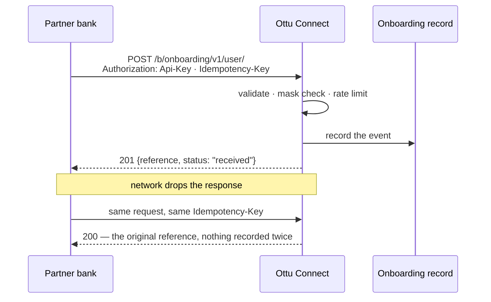

import Tabs from "@theme/Tabs";
import TabItem from "@theme/TabItem";
import CodeBlock from "@theme/CodeBlock";
import { OTTU_CONNECT_BASE_URL } from "@site/src/constants/api";

# Partner Onboarding

The **Partner Onboarding API** lets an issuing bank push a customer onboarding event to Ottu — for example, when a cardholder is enrolled in a co-branded card programme and granted a welcome reward. Ottu **records the event and returns a reference**. Nothing is charged, no wallet is credited, and no message is sent to the cardholder: the endpoint is a receipt, and what happens next (reward issuance, redemption) is handled by the programme it feeds — see [Loyalty](/developers/payments/loyalty).

It is a **server-to-server** call, authenticated with a [private API key](/developers/getting-started/authentication#api-key-auth). The customer never calls it, and it must never be called from a browser.



## When to Use

Use this endpoint when a partner — typically a bank — needs Ottu to know that a customer has been onboarded, so that a downstream programme can act on it. The canonical case is a co-branded card with a welcome voucher: the bank enrols the cardholder, then tells Ottu who was enrolled and which reward they were granted.

Do **not** use it to:

- Take a payment or hold funds — use the [Checkout API](/developers/payments/checkout-api).
- Credit a customer wallet — see [M-Wallet](/developers/payments/wallet/).
- Store a card for later charging — see [Tokenization](/developers/cards-and-tokens/).
- Send the customer a notification — the endpoint does not message anyone.

## Setup

1. **Get a private API key** for the Ottu installation the partner will call. Keys are created in the Ottu admin (**API keys → Add**) and shown once. Share the key with the partner over a secure channel — never in a ticket, an email, or a chat.
2. **Give the partner the endpoint** — `POST /b/onboarding/v1/user/` on your installation host, over HTTPS only.
3. **Agree the `reward_type` codes.** The endpoint accepts any well-formed code the partner sends (lowercase letters, digits, `.`, `_`, `-`); the codes Ottu already recognises get a display name in the dashboard. Today that is `welcome_voucher` → **Welcome Voucher** / **قسيمة ترحيبية**.

:::danger The private key is the only credential that opens this endpoint
The **public** (SDK) key, HTTP Basic credentials and dashboard sessions are all refused with `401`. Treat the private key as a secret: it authorises writes to your installation.
:::

## Guide

### Record an onboarding event

The minimal call. Replace `<PRIVATE_API_KEY>` and the body with the partner's data.

<Tabs groupId="language">
<TabItem value="curl" label="cURL">

<CodeBlock language="bash" title="Record a customer onboarding">{`curl --location '${OTTU_CONNECT_BASE_URL}/b/onboarding/v1/user/' \\
  --header 'Authorization: Api-Key <PRIVATE_API_KEY>' \\
  --header 'Content-Type: application/json' \\
  --header 'Idempotency-Key: 3f2a9c1e-4b7d-8e6f-0a1b-2c3d4e5f6071' \\
  --data '{
    "customer_first_name": "Saifuddin",
    "customer_last_name": "Tahir",
    "customer_phone": "+96597117060",
    "cardholder_masked_pan": "316516xxxxxxxx1556",
    "reward_type": "welcome_voucher"
  }'`}</CodeBlock>

</TabItem>
<TabItem value="python" label="Python">

<CodeBlock language="python" title="Record a customer onboarding">{`import uuid
import requests

response = requests.post(
    "${OTTU_CONNECT_BASE_URL}/b/onboarding/v1/user/",
    headers={
        "Authorization": "Api-Key <PRIVATE_API_KEY>",
        "Content-Type": "application/json",
        "Idempotency-Key": str(uuid.uuid4()),
    },
    json={
        "customer_first_name": "Saifuddin",
        "customer_last_name": "Tahir",
        "customer_phone": "+96597117060",
        "cardholder_masked_pan": "316516xxxxxxxx1556",
        "reward_type": "welcome_voucher",
    },
    timeout=15,
)
response.raise_for_status()
print(response.status_code, response.json())
# 201 {'reference': '9b1c...e2f0', 'status': 'received'}`}</CodeBlock>

</TabItem>
<TabItem value="nodejs" label="Node.js">

<CodeBlock language="javascript" title="Record a customer onboarding">{`import { randomUUID } from "node:crypto";

const response = await fetch("${OTTU_CONNECT_BASE_URL}/b/onboarding/v1/user/", {
  method: "POST",
  headers: {
    Authorization: "Api-Key <PRIVATE_API_KEY>",
    "Content-Type": "application/json",
    "Idempotency-Key": randomUUID(),
  },
  body: JSON.stringify({
    customer_first_name: "Saifuddin",
    customer_last_name: "Tahir",
    customer_phone: "+96597117060",
    cardholder_masked_pan: "316516xxxxxxxx1556",
    reward_type: "welcome_voucher",
  }),
});

console.log(response.status, await response.json());
// 201 { reference: '9b1c...e2f0', status: 'received' }`}</CodeBlock>

</TabItem>
<TabItem value="php" label="PHP">

<CodeBlock language="php" title="Record a customer onboarding">{`<?php
$payload = [
    "customer_first_name"   => "Saifuddin",
    "customer_last_name"    => "Tahir",
    "customer_phone"        => "+96597117060",
    "cardholder_masked_pan" => "316516xxxxxxxx1556",
    "reward_type"           => "welcome_voucher",
];

$ch = curl_init("${OTTU_CONNECT_BASE_URL}/b/onboarding/v1/user/");
curl_setopt_array($ch, [
    CURLOPT_POST           => true,
    CURLOPT_RETURNTRANSFER => true,
    CURLOPT_HTTPHEADER     => [
        "Authorization: Api-Key <PRIVATE_API_KEY>",
        "Content-Type: application/json",
        "Idempotency-Key: " . bin2hex(random_bytes(16)),
    ],
    CURLOPT_POSTFIELDS     => json_encode($payload),
]);
$body = curl_exec($ch);
$status = curl_getinfo($ch, CURLINFO_HTTP_CODE);
curl_close($ch);

echo $status, " ", $body;
// 201 {"reference": "9b1c...e2f0", "status": "received"}`}</CodeBlock>

</TabItem>
</Tabs>

A successful first call answers **`201 Created`**:

```json
{
  "reference": "9b1c2d3e-4f50-4a6b-8c7d-8e9f0a1b2c3d",
  "status": "received"
}
```

`reference` is Ottu's identifier for the recorded event — store it against the customer on your side. `status` is always `received`.

:::note The card number is never returned
The response carries only the reference and the status. `cardholder_masked_pan` — even masked — is not echoed back, and it is redacted from Ottu's logs.
:::

### Make the call safe to retry

Networks drop responses. If the partner resends a request after a timeout without any protection, Ottu would record the same customer twice. Send an **`Idempotency-Key`** header — an opaque id you generate, such as a UUID — and the endpoint behaves like this:

| The partner sends | Ottu answers |
| --- | --- |
| A key for the first time | **`201`** — recorded; a new `reference` |
| The **same key, same body** again | **`200`** — the **original** `reference`; nothing recorded again |
| The **same key, different body** | **`409`** — refused, so a recycled key cannot silently discard a customer |

Without the header, every call records a new event.

<CodeBlock language="bash" title="A retry with the same key returns the original reference">{`# first attempt (response lost in transit)
curl -s -X POST '${OTTU_CONNECT_BASE_URL}/b/onboarding/v1/user/' \\
  -H 'Authorization: Api-Key <PRIVATE_API_KEY>' -H 'Content-Type: application/json' \\
  -H 'Idempotency-Key: 3f2a9c1e-4b7d-8e6f-0a1b-2c3d4e5f6071' \\
  -d '{"customer_first_name":"Saifuddin","customer_last_name":"Tahir","customer_phone":"+96597117060","reward_type":"welcome_voucher"}'
# -> 201 {"reference": "9b1c...2c3d", "status": "received"}

# the retry
curl -s -X POST '${OTTU_CONNECT_BASE_URL}/b/onboarding/v1/user/' \\
  -H 'Authorization: Api-Key <PRIVATE_API_KEY>' -H 'Content-Type: application/json' \\
  -H 'Idempotency-Key: 3f2a9c1e-4b7d-8e6f-0a1b-2c3d4e5f6071' \\
  -d '{"customer_first_name":"Saifuddin","customer_last_name":"Tahir","customer_phone":"+96597117060","reward_type":"welcome_voucher"}'
# -> 200 {"reference": "9b1c...2c3d", "status": "received"}   (same reference)`}</CodeBlock>

:::warning The key must not contain a card number
The `Idempotency-Key` is stored and searchable, so a value that contains a 13–19 digit card number is refused with `400` — `Must not contain a card number. Use an opaque id such as a UUID.` Generate the key; never derive it from the PAN.
:::

### Send only a masked card number

`cardholder_masked_pan` is optional. When you send it, it must be the card number **masked to its first six and last four digits** — the [PCI DSS](/glossary/#term-pci-dss) display form. The mask character can be `x`, `X`, `*` or `#`:

```text
316516xxxxxxxx1556   ✓
411111******1111     ✓
411111######1111     ✓
4111111111111111     ✗  a full card number — refused
4111111xxxxxxxx1     ✗  seven digits in a row — refused
```

:::danger A full card number is refused, by design
Ottu does not store full card numbers on this endpoint. Any value with a run of **seven or more** digits, or more than **ten** visible digits in total, is rejected with `400` and the message `Must be a masked card number showing at most the first six and last four digits.` — even if the partner sent it by mistake. Mask before you send.
:::

## API Reference

### Endpoint

| | |
| --- | --- |
| Method | `POST` |
| Path | `/b/onboarding/v1/user/` |
| Auth | `Authorization: Api-Key <PRIVATE_API_KEY>` — [private key only](/developers/getting-started/authentication#api-key-auth) |
| Content type | `application/json` (request and response) |
| Rate limit | 60 requests per minute **per API key**; `429` when exceeded |

### Headers

| Header | Required | Description |
| --- | --- | --- |
| `Authorization` | **Yes** | `Api-Key <PRIVATE_API_KEY>`. The public key, HTTP Basic and sessions are refused. |
| `Content-Type` | **Yes** | Must be `application/json`; anything else is `415`. |
| `Idempotency-Key` | No | Your opaque id for the request — letters, digits and `. _ : -`, up to 64 characters. Same key + same body → `200` with the original reference; same key + different body → `409`. Must not contain a card number. |

### Request body

| Field | Type | Required | Description |
| --- | --- | --- | --- |
| `customer_first_name` | string (≤64) | **Yes** | The cardholder's first name. Control characters are not allowed. |
| `customer_last_name` | string (≤64) | **Yes** | The cardholder's last name. Control characters are not allowed. |
| `customer_phone` | string (≤20) | **Yes** | Mobile number in international format, e.g. `+96597117060`. Stored normalised to E.164, so `+965 9711 7060` is accepted and stored as `+96597117060`. |
| `cardholder_masked_pan` | string (≤25) | No | The card number masked to its first six and last four digits, e.g. `316516xxxxxxxx1556`. Digits and the mask characters `x * #` only. A full card number is refused. Never returned. |
| `reward_type` | string (≤64) | **Yes** | The reward code, e.g. `welcome_voucher` — letters, digits and `. _ -`. Any well-formed code is accepted and stored as sent; known codes get a display name in the dashboard (`welcome_voucher` → **Welcome Voucher** / **قسيمة ترحيبية**). |

Unknown fields in the body are ignored.

### Response body

| Key | Type | Description |
| --- | --- | --- |
| `reference` | string (UUID) | Ottu's identifier for the recorded event. Store it. |
| `status` | string | Always `received`. |

### Status codes

| Status | Meaning | What to do |
| --- | --- | --- |
| `201 Created` | The event was recorded. | Store `reference`. |
| `200 OK` | The same `Idempotency-Key` was sent before with the same body. | Treat as success; `reference` is the original one. |
| `400 Bad Request` | A field is missing or invalid, or the card number is not properly masked. | Fix the request — the body names the field. See the error table below. |
| `401 Unauthorized` | The API key is missing, wrong, revoked, or is the public key. | Check the `Authorization` header and the key. |
| `405 Method Not Allowed` | Anything but `POST`. | Use `POST`. |
| `409 Conflict` | The same `Idempotency-Key` was sent before with **different** data. | Send a new key, or resend the original body unchanged. |
| `415 Unsupported Media Type` | The body was not `application/json`. | Set `Content-Type: application/json`. |
| `423 Locked` | The installation is paused for maintenance. | Retry later; nothing was recorded. |
| `429 Too Many Requests` | More than 60 requests in a minute for this key. | Honour `Retry-After` and back off. |

### Error messages

Validation errors are keyed by the field (or header) that failed, in the standard Ottu shape:

```json
{ "cardholder_masked_pan": ["Must be a masked card number showing at most the first six and last four digits."] }
```

| Field / header | Message | Cause |
| --- | --- | --- |
| any required field | `This field is required.` | The field is missing. |
| any string field | `This field may not be blank.` | The field was sent empty. Omit an optional field rather than sending `""`. |
| `customer_first_name`, `customer_last_name`, `reward_type` | `Control characters are not allowed.` | The value contains a control byte. |
| `customer_phone` | `The phone number entered is not valid.` | Not a valid international number — include the country code. |
| `cardholder_masked_pan` | `Only digits and the mask characters x * # are allowed.` | Spaces, dashes or letters other than `x`/`X` in the value. |
| `cardholder_masked_pan` | `Must be a masked card number showing at most the first six and last four digits.` | A full or under-masked card number. |
| `reward_type` | `Only letters, digits and the characters . _ - are allowed.` | A display name (`Welcome Voucher`) or other non-code value; send the lowercase code. |
| `Idempotency-Key` | `Only letters, digits and the characters . _ : - are allowed.` | Spaces or other characters in the key. |
| `Idempotency-Key` | `Must not contain a card number. Use an opaque id such as a UUID.` | The key contains a 13–19 digit card number. |
| `detail` | `This Idempotency-Key was already used for a different onboarding. Send a new key, or resend the original data unchanged.` | `409` — key reuse with different data. |
| `detail` | `Null characters are not allowed.` | `400` — a NUL byte anywhere in the request. |

## Best Practices

- **Always send an `Idempotency-Key`**, generated per onboarding event (a UUID is ideal). It is the only thing that makes a retry after a timeout safe.
- **Mask the card number before it leaves the partner's system.** The endpoint refuses a full PAN, but the right place to mask is at the source — the value should never travel unmasked.
- **Treat `200` as success.** It means the event was already recorded from an earlier attempt; the `reference` is the same one.
- **On `409`, stop and look.** It means a key was reused for a different customer — usually a bug in key generation on the partner side, not something to retry.
- **Back off on `429` and `423`.** Both are temporary; both carry nothing recorded. Retry with the same `Idempotency-Key`.
- **Keep names and phone in the partner's canonical form.** Ottu normalises the phone number to E.164 but stores names exactly as sent.

## FAQ

**Does this endpoint issue the reward, credit points, or notify the customer?**
No. It records that the onboarding happened and returns a reference. Reward redemption is part of the [Loyalty](/developers/payments/loyalty) programme it feeds.

**Can the customer call this from the checkout page or an app?**
No. It is server-to-server only and requires the private API key, which must never be shipped to a browser or a mobile app.

**What if the bank does not have an idempotency key?**
The header is optional. Without it, each call records a new event — the partner is then responsible for not resending.

**Can the same card be onboarded more than once?**
Yes. A masked card number is not an identity (a re-issued card, or two cards sharing the first six and last four digits, produce the same value), so it is stored as data, not used to deduplicate. Use `Idempotency-Key` for that.

**Why was my numeric reference id refused as the `Idempotency-Key`?**
Any 13–19 digit run that passes the card-number checksum is refused, because Ottu cannot tell it apart from a real card number. Use an opaque id such as a UUID, or a prefixed value like `NBK-2026-09-11-000123`.

**Is the endpoint in the interactive API reference?**
It is published in the public OpenAPI schema of your installation; the interactive reference on this site is regenerated periodically and will include it on the next update.

## What's Next?

- [Authentication](/developers/getting-started/authentication#api-key-auth) — how private API keys work and how to keep them safe
- [Loyalty](/developers/payments/loyalty) — the reward programme an onboarding event feeds
- [Error codes](/developers/reference/error-codes) — the platform-wide error reference
- [Checkout API](/developers/payments/checkout-api) — when the customer actually pays
- [Webhooks](/developers/webhooks/) — how Ottu tells your server about payment outcomes
