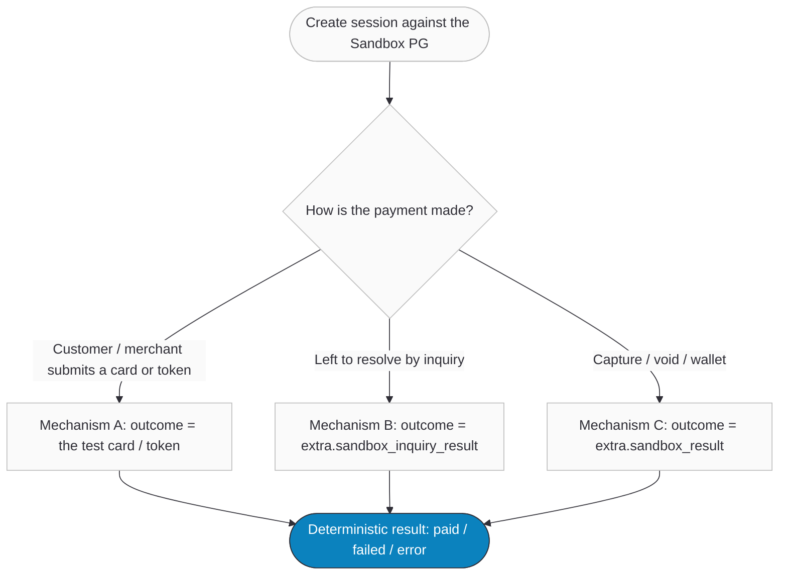

import Tabs from '@theme/Tabs';
import TabItem from '@theme/TabItem';
import CodeBlock from "@theme/CodeBlock";
import ApiDocEmbed from "@site/src/components/ApiDocEmbed";
import FAQ, { FAQItem } from "@site/src/components/FAQ";
import { OTTU_CONNECT_BASE_URL } from "@site/src/constants/api";

# Ottu Sandbox

The **Ottu Sandbox** is a built-in, simulated payment gateway. It lets you run every payment scenario end-to-end — success, failure, refunds, tokens, recurring charges, authorizations, captures, voids, and wallet payments (Apple / Google / Samsung Pay) — **without touching a live gateway, a real bank, or real money**. You configure it like any other gateway (it gets its own `pg_code`), create transactions against it through the standard [Checkout API](/developers/payments/checkout-api/), and the outcome is **deterministic**: you decide it in advance.

:::tip[Boost Your Integration]
Ottu offers SDKs and tools to speed up your integration. See [Getting Started](/developers/getting-started/#boost-your-integration) for all available options.
:::

:::tip[For business stakeholders]
Think of the Ottu Sandbox as a flight simulator for payments. Your team can rehearse a customer paying, a card being declined, a refund being issued, or a subscription renewing — repeatedly and safely — before a single real transaction is processed. It is the fastest way to validate an integration, demo a flow, or reproduce a support issue.
:::

:::note[What this page covers]
This page documents the **Ottu Sandbox simulator gateway** specifically. For the catalog of test card numbers used with *real* gateways' own sandboxes (KNET, MPGS, Checkout.com, etc.), see [Sandbox & Test Cards](/developers/payments/sandbox).
:::

## When to Use

- **Integration testing** — validate your Checkout API calls, webhook handling, and order reconciliation before going live.
- **Reproducing outcomes on demand** — deterministically trigger a success, a decline, or a gateway error to test each of your code paths.
- **Demos and UAT** — walk a stakeholder through a complete payment, refund, or recurring flow with no financial risk.
- **CI / automated tests** — drive predictable payment results from an automated test suite (the asynchronous `extra` mechanism is designed for exactly this).
- **Recurring / tokenization rehearsals** — practice the full CIT → MIT lifecycle (save a card, then auto-debit it) end-to-end.
- **Realistic response-shape testing** — mimic a real gateway's response payload (KNET, MPGS, CyberSource, …) to validate your webhook parsing and reconciliation without calling the live gateway.

## Setup

You need three things before running any scenario:

1. **An Ottu Sandbox gateway (MID) [configured](/developers/payments/payment-methods#activating-payment-gateway-codes)** on a **non-production** environment (e.g. your `*.ottu.dev` / sandbox subdomain). It is set up in the Ottu Dashboard like any other gateway. The Sandbox is intended for dev/UAT servers — see [Best Practices](#best-practices).
2. **The MID's `pg_code`** — pass it in `pg_codes` when creating a session, exactly as you would for any real gateway.
3. **A valid API key** for the [Checkout API](/developers/payments/checkout-api/). Examples below use `Authorization: Api-Key <YOUR_API_KEY>`.

### MID configuration prerequisites

A freshly created Ottu Sandbox MID has the advanced capabilities **switched off by default**. Enable the ones your scenario needs in the Ottu Dashboard (Payment Gateway settings) — otherwise the corresponding API calls are rejected at validation:

| Capability you want to test | MID setting to enable | Default |
| --- | --- | --- |
| **Tokenization / save card** | `Tokenizable` (`is_tokenizable`) | Off |
| **Auto-debit (recurring / MIT)** | `Auto debit enabled` (`auto_debit_enabled`) | Off |
| **Refund** | add `refund` to the MID's **Operations** | Off (empty) |
| **Authorization & capture** | set **Operation** to `authorize` | `purchase` |
| **Void** | add `void` to the MID's **Operations** | Off (empty) |
| **Apple / Google / Samsung Pay** | add the wallet's service configuration to the MID | Off |

:::danger[If you skip this, "nothing works"]
With a vanilla Sandbox MID, refund returns *"refund operation is not enabled for this MID"*, auto-debit is rejected, and authorize never happens (every payment settles as `paid`). Always enable the capability for the scenario you are testing first.
:::

#### Checklist

- [x] Ottu Sandbox MID created on a non-production environment.
- [x] Captured the MID's `pg_code`.
- [x] Enabled `is_tokenizable` (for saved-card / auto-debit scenarios).
- [x] Enabled `auto_debit_enabled` (for MIT scenarios).
- [x] Added `refund` to Operations (for refund scenarios).
- [x] Set Operation to `authorize` (for the authorize / capture scenario).
- [x] Added `void` to Operations (for the void scenario).
- [x] Configured the relevant wallet service (for Apple / Google / Samsung Pay scenarios).
- [x] A `webhook_url` endpoint ready to receive results (recommended).

### Test Cards

On the hosted Sandbox page (and as token values), these cards drive the outcome. They are not real PANs and never reach a bank.

:::note[These are 15-digit test identifiers]
The Sandbox cards are **15 digits** (e.g. `411111111111111`) — one digit shorter than a standard 16-digit Visa PAN. They are fixed test identifiers, **not real card numbers and not subject to Luhn validation**, so the length is expected. Each number maps to a fixed outcome, below.
:::

| Card number | Outcome | Payment attempt result |
| --- | --- | --- |
| `411111111111111` | **Success** | Payment succeeds |
| `411111111111112` | **Failed** | Payment declined |
| `411111111111113` | **Error** | Gateway error (message: *"Simulated error"*) |
| any other value | **Rejected** | Treated as an unknown card (canceled) |

Three further cards **enroll and tokenize successfully** on the first (CIT) payment but **decline when later charged as a saved token** (MIT) — purpose-built to rehearse failed recurring charges without server-side changes (see [Scenario 5](#scenario-5--auto-debit-with-a-saved-token-mit)):

| Card number | First payment (CIT) | Saved-token charge (MIT) | Decline reason surfaced |
| --- | --- | --- | --- |
| `411111111111114` | succeeds, card saved | **declined** | *Transaction declined by the issuing bank.* |
| `411111111111115` | succeeds, card saved | **declined** | *Card expired.* |
| `411111111111116` | succeeds, card saved | **declined** | *Insufficient funds.* |

:::info[The Sandbox token *is* the card number]
When you save a Sandbox card, its **token is the card number itself** (e.g. `411111111111111`). This is what makes recurring testing predictable: charging the token `411111111111111` always succeeds, `411111111111112` always declines. Real gateways issue opaque tokens; the Sandbox keeps it simple on purpose.
:::

## Guide

### Workflow

The single most important concept: **with the Ottu Sandbox you choose the result of a payment in advance.** There are **three independent ways** to do that — pick the one that matches how the payment is initiated.

| Mechanism | You control the outcome with… | Applies to | When the outcome is applied |
| --- | --- | --- | --- |
| **A — Card / token driven** *(synchronous)* | the **test card number** the customer enters, or the **token** you charge | Hosted checkout, tokenization, auto-debit (CIT & MIT) | Immediately, at the moment of payment |
| **B — `sandbox_inquiry_result`** *(asynchronous)* | the `sandbox_inquiry_result` value in the Checkout `extra` object | Any flow resolved by a status **inquiry** (e.g. unattended / timed-out sessions) | Later, by a background inquiry — no customer interaction needed |
| **C — `sandbox_result`** *(card-less surfaces)* | a `sandbox_result` value (`success` · `failed` · `error`) in the **operation request's `extra`** (capture / void) or the **transaction's `extra`** (wallets) | Capture, void, and Apple / Google / Samsung Pay — surfaces with no card to pick | At the moment the operation or wallet payment runs |



:::warning[`extra` is consulted only on the non-interactive paths]
The Sandbox is often described as "the merchant sets the outcome in `extra`." That is precise for **Mechanism B** (the asynchronous inquiry path, `sandbox_inquiry_result`) and **Mechanism C** (capture / void / wallets, `sandbox_result`). For interactive checkout, tokenization, and auto-debit (**Mechanism A**), the outcome is decided by the **test card number / token** that is submitted — `extra` is not consulted on those paths. The two keys are distinct and never overlap: `sandbox_inquiry_result` drives inquiries; `sandbox_result` drives capture, void, and wallet payments. Any unrecognized value (or an absent key) defaults to **`success`**.
:::

Each scenario below lists its **prerequisites**, the **exact request**, and the **expected result**. All examples are copy-pasteable — replace the API key, `pg_code`, and `session_id` with your own.

### Scenario 1 — Hosted Checkout (full redirect flow)

The customer is redirected to Ottu's hosted Sandbox page, picks a test card, and the result flows back to you via webhook — exactly like a real hosted gateway.

**Prerequisites:** a Sandbox MID (`pg_code`). For UX testing, a `webhook_url` to receive the result.

**Step 1 — Create the session** ([Checkout API](/developers/payments/checkout-api/)):

<CodeBlock language="bash" title="Create a hosted-checkout session against the Sandbox PG">{`curl --location '${OTTU_CONNECT_BASE_URL}/b/checkout/v1/pymt-txn/' \\
  --header 'Authorization: Api-Key <YOUR_API_KEY>' \\
  --header 'Content-Type: application/json' \\
  --data-raw '{
    "type": "e_commerce",
    "pg_codes": ["ottu-sandbox"],
    "amount": "10.000",
    "currency_code": "KWD",
    "order_no": "SANDBOX-0001",
    "webhook_url": "https://yourwebsite.com/webhook"
  }'`}</CodeBlock>

**Response (abridged):**

```json title="Checkout response"
{
  "session_id": "037ad20c32615e7bc2f9620fd0aec912423e06c4",
  "checkout_url": "https://<your-subdomain>.ottu.dev/b/checkout/redirect/start/?session_id=037ad20c...",
  "state": "created"
}
```

**Step 2 — Send the customer to `checkout_url`.** They land on the hosted Ottu Sandbox page, which shows the amount, transaction details, and the three test cards. The customer clicks a test card (or types its number) and submits.


**Step 3 — Outcome.** The submitted card decides the result, the transaction transitions accordingly, and (if you supplied a `webhook_url`) Ottu posts a [payment notification](/developers/webhooks/payment-events) to your server:

| Card entered | Payment attempt | Transaction state |
| --- | --- | --- |
| `411111111111111` | `success` | **`paid`** |
| `411111111111112` | `failed` | `attempted` → retryable, or **`failed`** when retries are disabled |
| `411111111111113` | `error` (*"Simulated error"*) | `attempted` → retryable, or **`failed`** when retries are disabled |
| any other value | `canceled` (unknown card) | `attempted`, or **`canceled`** when retries are disabled |

:::note[Why a decline may show `attempted`, not `failed`]
Sessions created via the Checkout API support **multiple attempts** by default, so a single decline moves the transaction to `attempted` (the customer can retry) rather than to the terminal `failed`. It only goes straight to `failed`/`canceled` when multi-attempt is disabled on the MID. See [Payment States](/developers/reference/payment-states#multi-attempt-logic).
:::

### Scenario 2 — Mimic a Real Gateway's Response Shape

By default the Sandbox stores a minimal stub (`{"card_number": "…"}`) as the gateway response. When you need your integration to handle a **real gateway's response shape** — the exact JSON that **KNET, MPGS, CyberSource, or MyFatoorah** returns — the hosted pay page can **mimic** it. This lets you exercise your webhook parsing, reconciliation, and gateway-specific handling against production-shaped payloads without ever calling the live gateway.

:::info[What "mimic" changes — and what it does not]
The mimic selector only changes the **shape of the stored `gateway_response`**. It does **not** change the result: the **test card still decides** success / failed / error. Picking **KNET + the Failed card** produces a KNET-shaped *decline*; **KNET + the Success card** produces a KNET-shaped *capture*. The payload is realistic (with freshly randomized identifiers each run) and is stored **verbatim** — Ottu does not re-interpret it, so the transaction state always matches the card.
:::

**Applies to:** the hosted checkout pay page only (Scenario 1). It is a manual QA aid — the asynchronous `extra` path ([Scenario 3](#scenario-3--predefined-outcome-via-extra-asynchronous)) and token charges ([Scenario 5](#scenario-5--auto-debit-with-a-saved-token-mit)) do not use it.

**Prerequisites:** same as Scenario 1 — a Sandbox MID (`pg_code`) and, to see the result delivered, a `webhook_url`.

**Steps:**

1. Create a hosted-checkout session exactly as in [Scenario 1](#scenario-1--hosted-checkout-full-redirect-flow) and send the customer to `checkout_url`.
2. On the Sandbox pay page, under **"Mimic PG Response" (optional)**, click the logo of the gateway you want to imitate — **KNET, MPGS, CyberSource, or MyFatoorah**. (Click the active logo again to clear the selection and fall back to the default stub.)
3. Click a **test card** to choose the outcome, then press **Pay**.

**Result.** The transaction settles per the card, and the stored response — surfaced in the **`gateway_response`** field of your [payment webhook](/developers/webhooks/payment-events) (and in the dashboard transaction details) — matches the chosen gateway's real shape:

<Tabs groupId="sandbox-mimic" queryString>
<TabItem value="knet" label="KNET (Success card)">

KNET + the **Success** card → a `CAPTURED` response, the same shape your KNET integration parses:

```json title="webhook → gateway_response (KNET)"
{
  "result": "CAPTURED",
  "auth": "B65880",
  "ref": "461580512345",
  "authRespCode": "00",
  "avr": "N",
  "paymentid": "100202412345678901",
  "tranid": "987654321012345",
  "trackid": "<your reference_number>",
  "postdate": "0623",
  "amt": "10.000"
}
```

</TabItem>
<TabItem value="mpgs" label="MPGS (Failed card)">

MPGS + the **Failed** card → a `FAILURE` / `DECLINED` response:

```json title="webhook → gateway_response (MPGS)"
{
  "result": "FAILURE",
  "status": "FAILED",
  "order": { "id": "A1B2C3D4E5F6", "status": "FAILED" },
  "transaction": [
    { "id": "1234567890_0_pay", "response": { "gatewayCode": "DECLINED" } }
  ]
}
```

</TabItem>
<TabItem value="cybersource" label="CyberSource (Success card)">

CyberSource + the **Success** card → an `ACCEPT` decision:

```json title="webhook → gateway_response (CyberSource)"
{
  "decision": "ACCEPT",
  "reason_code": "100",
  "message": "Request was processed successfully.",
  "transaction_id": "1234567890123456789012",
  "auth_code": "831000",
  "req_reference_number": "<your reference_number>",
  "req_amount": "10.000",
  "req_currency": "KWD",
  "req_transaction_type": "sale",
  "req_payment_method": "card"
}
```

</TabItem>
</Tabs>

:::note[Identifiers are randomized; outcome fields are fixed]
Every mimic run generates fresh identifiers (`paymentid`, `tranid`, `order.id`, `transaction_id`, …) so repeated tests never collide. Only the **shape** and the **outcome-specific fields** (`result`, `gatewayCode`, `decision`, …) are deterministic; amounts and currency echo your session. MyFatoorah follows the same principle in its own response shape.
:::

:::tip[When to use mimic vs. the default stub]
Use mimic when you are validating code that **reads the raw gateway response** — reconciliation jobs, response-shape assertions, or gateway-specific webhook handling. For ordinary outcome testing (paid / failed / error) you don't need it; the default stub is enough.
:::

### Scenario 3 — Predefined Outcome via `extra` (asynchronous)

This is **Mechanism B**: pin the outcome at creation time and let a background **inquiry** apply it later — no customer, no pay page. Ideal for automated tests and unattended flows.

The Sandbox reads two keys from the Checkout `extra` object:

| `extra` key | Values | Meaning |
| --- | --- | --- |
| `sandbox_inquiry_result` | `success` · `failed` · `error` | The outcome the inquiry will apply. Defaults to `success` when omitted or invalid. |
| `expires_in_minutes` | integer (minutes) | Arms the auto-inquiry: schedules the outcome to be applied after this delay. |

**Prerequisites:** a Sandbox MID on a **non-production** environment (the auto-scheduler is disabled in production — see [Best Practices](#best-practices)).

**Request** — create the session with both keys in `extra`:

<Tabs groupId="sandbox-extra-outcome" queryString>
<TabItem value="success" label="Success">

```json title="POST /b/checkout/v1/pymt-txn/ — body"
{
  "type": "e_commerce",
  "pg_codes": ["ottu-sandbox"],
  "amount": "10.000",
  "currency_code": "KWD",
  "webhook_url": "https://yourwebsite.com/webhook",
  "extra": {
    "sandbox_inquiry_result": "success",
    "expires_in_minutes": 5
  }
}
```

After ~5 minutes a background inquiry settles the transaction to **`paid`** and your webhook fires.

</TabItem>
<TabItem value="failed" label="Failed">

```json title="POST /b/checkout/v1/pymt-txn/ — body"
{
  "type": "e_commerce",
  "pg_codes": ["ottu-sandbox"],
  "amount": "10.000",
  "currency_code": "KWD",
  "webhook_url": "https://yourwebsite.com/webhook",
  "extra": {
    "sandbox_inquiry_result": "failed",
    "expires_in_minutes": 5
  }
}
```

The inquiry settles the transaction to **`failed`**.

</TabItem>
<TabItem value="error" label="Error">

```json title="POST /b/checkout/v1/pymt-txn/ — body"
{
  "type": "e_commerce",
  "pg_codes": ["ottu-sandbox"],
  "amount": "10.000",
  "currency_code": "KWD",
  "webhook_url": "https://yourwebsite.com/webhook",
  "extra": {
    "sandbox_inquiry_result": "error",
    "expires_in_minutes": 5
  }
}
```

The inquiry records a gateway **error** (*"Simulated error"*).

</TabItem>
</Tabs>

:::tip[How it works]
On a non-production server, creating a session that carries **both** `sandbox_inquiry_result` and `expires_in_minutes` schedules a one-time background job. When it runs, it asks the Sandbox for the transaction status, and the Sandbox returns whatever you put in `sandbox_inquiry_result`. If the customer already completed the same session interactively (Scenario 1) before the timer fires, the scheduled job is a no-op — the real, card-driven result stands.
:::

:::info[`sandbox_inquiry_result` also applies to manual inquiries]
The same `extra` value is honored by **any** status inquiry on the transaction — for example a [Payment Status Query](/developers/payments/psq/) — not just the scheduled one. The `expires_in_minutes` key only controls the *automatic* scheduling.
:::

### Scenario 4 — Tokenization & Saving a Card (CIT)

A **CIT (Cardholder-Initiated Transaction)** is the first, customer-present payment that saves a card for future use. On the Sandbox this is a hosted checkout where the customer ticks **"Save card"** (or where the transaction is `auto_debit`, which saves the card automatically).

**Prerequisites:** MID with `is_tokenizable` enabled; the session must include a `customer_id`.

**Request** — create a session with `customer_id` and (for recurring) `payment_type: auto_debit` + an `agreement`:

<CodeBlock language="bash" title="Create a CIT session that saves a card">{`curl --location '${OTTU_CONNECT_BASE_URL}/b/checkout/v1/pymt-txn/' \\
  --header 'Authorization: Api-Key <YOUR_API_KEY>' \\
  --header 'Content-Type: application/json' \\
  --data-raw '{
    "type": "e_commerce",
    "payment_type": "auto_debit",
    "pg_codes": ["ottu-sandbox"],
    "amount": "10.000",
    "currency_code": "KWD",
    "customer_id": "cust-123",
    "webhook_url": "https://yourwebsite.com/webhook",
    "agreement": {
      "id": "agr-001",
      "type": "recurring",
      "amount_variability": "fixed",
      "frequency": "monthly"
    }
  }'`}</CodeBlock>

**Outcome.** Send the customer to `checkout_url`, have them pay with the **Success** card `411111111111111` and tick **Save card**. The transaction becomes `paid`, a saved card is created for `cust-123`, and the webhook delivers the token:

```json title="Webhook (token delivered)"
{
  "session_id": "4a462681df6aab64e27cedc9bbf733cd6442578b",
  "result": "success",
  "state": "paid",
  "payment_type": "auto_debit",
  "customer_id": "cust-123",
  "agreement": { "id": "agr-001", "type": "recurring" },
  "token": {
    "token": "411111111111111",
    "customer_id": "cust-123",
    "brand": "VISA",
    "number": "**** 1111",
    "pg_code": "ottu-sandbox",
    "agreements": ["agr-001"]
  }
}
```

:::note[The outcome is set by the card, not by `extra`]
For tokenization the result is decided by the card used: `411111111111111` saves successfully, `411111111111112` declines, `411111111111113` errors. Save `token.token` and `token.pg_code` — you will use them in Scenario 5. See [Recurring Payments](/developers/cards-and-tokens/recurring-payments/) for the full token lifecycle.
:::

### Scenario 5 — Auto-Debit with a Saved Token (MIT)

A **MIT (Merchant-Initiated Transaction)** charges a previously saved token with the customer absent — the basis of subscriptions and recurring billing.

**Prerequisites:**

- MID with `auto_debit_enabled` enabled.
- A **prior successful CIT** for the same `customer_id`, on the **same MID**, under the **same `agreement.id`** (Scenario 4). The Sandbox enforces this — an MIT without a matching CIT is rejected with *"No Cardholder Initiated Transaction (CIT) found."*
- A new `auto_debit` session for the same customer/agreement, and its `session_id`.

You can charge the token two ways:

<Tabs groupId="sandbox-mit" queryString>
<TabItem value="two-step" label="Two-Step (Auto-Debit API)">

Create a new `auto_debit` session, then charge the saved token:

<CodeBlock language="bash" title="Charge a saved token (MIT)">{`curl --location '${OTTU_CONNECT_BASE_URL}/b/pbl/v2/auto-debit/' \\
  --header 'Authorization: Api-Key <YOUR_API_KEY>' \\
  --header 'Content-Type: application/json' \\
  --header 'Idempotency-Key: <unique-uuid>' \\
  --data-raw '{
    "session_id": "<new_auto_debit_session_id>",
    "token": "411111111111111"
  }'`}</CodeBlock>

</TabItem>
<TabItem value="one-step" label="One-Step (payment_instrument)">

Create and charge in a single call using [`payment_instrument`](/developers/payments/checkout-api#one-step-checkout):

```json title="POST /b/checkout/v1/pymt-txn/ — body"
{
  "type": "e_commerce",
  "payment_type": "auto_debit",
  "pg_codes": ["ottu-sandbox"],
  "amount": "10.000",
  "currency_code": "KWD",
  "customer_id": "cust-123",
  "webhook_url": "https://yourwebsite.com/webhook",
  "agreement": { "id": "agr-001", "type": "recurring" },
  "payment_instrument": {
    "instrument_type": "token",
    "payload": { "token": "411111111111111" }
  }
}
```

</TabItem>
</Tabs>

**Outcome.** The result is decided by the **token** charged, and is returned **directly in the API response** (MIT charges do not produce a separate webhook):

| Saved token charged | Result | HTTP |
| --- | --- | --- |
| `411111111111111` | `success` → transaction `paid` | `200` |
| `411111111111114` | `failed` — *Transaction declined by the issuing bank.* | `400` |
| `411111111111115` | `failed` — *Card expired.* | `400` |
| `411111111111116` | `failed` — *Insufficient funds.* | `400` |
| any other token | `error` (*"Simulated error"*) | `400` |

Only cards that **enroll successfully at CIT** can become saved tokens — the Success card and the three MIT-failure cards. (The `…112`/`…113` cards fail at CIT, so they can never be saved.)

On success the response is the **full payment object** (the same shape as a [payment webhook](/developers/webhooks/payment-events)); a decline returns an error envelope:

```json title="Auto-debit response — success (HTTP 200, abridged)"
{
  "session_id": "4a462681df6aab64e27cedc9bbf733cd6442578b",
  "result": "success",
  "state": "paid",
  "amount": "10.000",
  "currency_code": "KWD",
  "payment_type": "auto_debit",
  "customer_id": "cust-123",
  "agreement": { "id": "agr-001", "type": "recurring" },
  "gateway_response": {}
}
```

```json title="Auto-debit response — decline (HTTP 400)"
{
  "detail": "Card expired.",
  "result": "failed"
}
```

:::tip[Simulating a failed recurring charge]
Run the CIT ([Scenario 4](#scenario-4--tokenization--saving-a-card-cit)) with one of the **MIT-failure cards** (`411111111111114` / `411111111111115` / `411111111111116`) — they enroll and save exactly like the Success card — then charge the resulting saved token. The MIT then **declines** with the matching reason (issuer decline / expired card / insufficient funds), so you can exercise your dunning and retry logic end-to-end.
:::

:::tip[Idempotency]
The Auto-Debit API honors the `Idempotency-Key` header — retrying with the same key returns the original result instead of double-charging. See the [API Reference](#api-reference).
:::

### Scenario 6 — Refund (full & partial)

Refund a settled Sandbox payment through the unified [Operations API](/developers/operations/).

**Prerequisites:** a transaction in `paid` state on a MID that has **`refund` enabled** in its Operations.

<Tabs groupId="sandbox-refund" queryString>
<TabItem value="full" label="Full refund">

Omit `amount` to refund the full remaining balance:

```json title="POST /b/pbl/v2/operation/ — body"
{
  "operation": "refund",
  "session_id": "<paid_session_id>"
}
```

</TabItem>
<TabItem value="partial" label="Partial refund">

Pass a smaller `amount` to refund part of it. You can repeat partial refunds until the original amount is exhausted:

```json title="POST /b/pbl/v2/operation/ — body"
{
  "operation": "refund",
  "session_id": "<paid_session_id>",
  "amount": "4.000"
}
```

</TabItem>
</Tabs>

**Outcome.** Every **eligible** refund on the Sandbox **succeeds** and creates a [child transaction](/developers/reference/payment-states#child-payment-transactions) in the `refunded` state for the refunded amount. The parent's refunded balance is updated.

:::warning[Sandbox refund rules]
- **Over-refunding is rejected**, not clamped: *"The amount specified is greater than the amount available for refund."*
- Multiple partial refunds are allowed, cumulatively bounded by the original amount.
- The Sandbox refund **always succeeds** — it cannot simulate a declined/rejected refund.
- Include a [`Tracking-Key`](/developers/operations#guide) header to make refunds idempotent.
:::

### Scenario 7 — Authorize, Capture & Void

An **authorization** reserves funds without collecting them; a **capture** settles them later; a **void** releases the hold without charging. The Sandbox simulates the **full lifecycle**, including failed captures and voids.

**Prerequisites:**

- A Sandbox MID with **Operation = `authorize`** — required for both the authorization and the capture.
- To void, also add **`void`** to the MID's **Operations**.

#### Step 1 — Authorize

Create and pay a session as in [Scenario 1](#scenario-1--hosted-checkout-full-redirect-flow) with the **Success** card `411111111111111`. Instead of `paid`, the transaction settles in the **`authorized`** state — funds reserved, awaiting capture or void.

```json title="Webhook / status"
{
  "session_id": "9a1c...",
  "result": "success",
  "state": "authorized"
}
```

#### Step 2 — Capture

Capture settles an authorized transaction through the [Operations API](/developers/operations/). Omit `amount` to capture the full authorized amount, or pass a smaller `amount` for a **partial capture** (repeatable until the authorized amount is exhausted).

<Tabs groupId="sandbox-capture" queryString>
<TabItem value="full" label="Full capture">

```json title="POST /b/pbl/v2/operation/ — body"
{
  "operation": "capture",
  "session_id": "<authorized_session_id>"
}
```

</TabItem>
<TabItem value="partial" label="Partial capture">

```json title="POST /b/pbl/v2/operation/ — body"
{
  "operation": "capture",
  "session_id": "<authorized_session_id>",
  "amount": "4.000"
}
```

</TabItem>
</Tabs>

A successful capture creates a [child transaction](/developers/reference/payment-states#child-payment-transactions) in the **`paid`** state for the captured amount and returns a `Processed amount - <amount>` message; the parent's captured balance is updated.

**Simulating a failed capture.** Add `sandbox_result` to the operation's `extra` ([Mechanism C](#workflow)). On `failed`/`error` the capture is rejected, **no child transaction is created**, and the parent stays `authorized`:

```json title="POST /b/pbl/v2/operation/ — simulate a declined capture"
{
  "operation": "capture",
  "session_id": "<authorized_session_id>",
  "extra": { "sandbox_result": "failed" }
}
```

| `extra.sandbox_result` | Capture result | Parent state after |
| --- | --- | --- |
| omitted / `success` | child `paid` created | `paid` (full) or still `authorized` (partial) |
| `failed` | rejected — *"Simulated decline"* | stays `authorized` |
| `error` | rejected — *"Simulated error"* | stays `authorized` |

#### Step 3 — Void

Void releases an authorization **in full** (the `amount` field is ignored). It requires `void` in the MID's Operations and is only available **before** any capture.

```json title="POST /b/pbl/v2/operation/ — body"
{
  "operation": "void",
  "session_id": "<authorized_session_id>"
}
```

A successful void creates a child transaction in the **`voided`** state for the full authorized amount. As with capture, `extra.sandbox_result: "failed"` (or `"error"`) simulates a rejected void that leaves the transaction `authorized`.

:::note[Capture *or* void — not both]
A transaction can be **either** captured **or** voided. Void is rejected once any capture child exists (*"This transaction is not eligible for void."*), and capture is rejected once the transaction is voided. Both operations also require the MID's default currency to match the transaction currency.
:::

### Scenario 8 — Testing a Failed Webhook Delivery

The ticket lists "failed to post webhook" as an outcome to validate. To set expectations clearly: **this is not a Sandbox-controlled outcome** (there is no `extra` switch for it). Webhook delivery is a **platform-wide** behavior, and the Sandbox is simply a convenient, free way to trigger it.

**How to reproduce it:**

1. Create a session whose `webhook_url` points at an endpoint that **fails** — unreachable host, or one that returns a non-`2xx` status, or one that times out.
2. Pay with the **Success** card `411111111111111` so a result exists to disclose, which makes Ottu attempt the webhook.

**What you will observe:**

- The payment itself still succeeds (`paid`) — webhook delivery is independent of the payment result.
- The failure is recorded on the payment attempt (`disclosure_url_error`); `disclosed_to_merchant` stays `false`.
- **Retries happen only on timeouts** (governed by your Webhook settings); a non-`2xx` or connection error is **not** retried.
- If enabled, Ottu emails a webhook-error alert to the configured address.

:::note[No `webhook_url`, no webhook]
If you don't supply a `webhook_url` on the Checkout request, **no payment webhook is sent at all** — Ottu just redirects the customer to the result page. Always set `webhook_url` when testing delivery.
:::

### Scenario 9 — Wallet Payments (Apple Pay, Google Pay & Samsung Pay)

The Sandbox simulates all three device wallets. They are initiated the usual way (via the Ottu SDK / native wallet sheet); the Sandbox ignores the wallet payload contents and decides the outcome from the transaction's `extra`.

**Prerequisites:** the wallet you want to test must be **enabled on the Sandbox MID** — add the corresponding Apple Pay / Google Pay / Samsung Pay service configuration in the Dashboard, exactly as you would for a real gateway. (The Sandbox already wires the handlers for all three; the service configuration is what makes a wallet appear as a payment option.)

**Default outcome.** Every wallet payment **succeeds** — the transaction becomes `paid` (or `authorized` if the MID Operation is `authorize`).

**Simulating failure / error.** Wallet payments carry no card and no per-call `extra`, so the outcome is read from the **transaction's `extra`** ([Mechanism C](#workflow)) — set it when you create the session:

```json title="POST /b/checkout/v1/pymt-txn/ — body (simulate a declined wallet payment)"
{
  "type": "e_commerce",
  "pg_codes": ["ottu-sandbox"],
  "amount": "10.000",
  "currency_code": "KWD",
  "webhook_url": "https://yourwebsite.com/webhook",
  "extra": { "sandbox_result": "failed" }
}
```

| `extra.sandbox_result` | Wallet result | Final state |
| --- | --- | --- |
| omitted / `success` | payment succeeds | `paid` (or `authorized`) |
| `failed` | declined — *"Simulated decline"* | `attempted` / `failed` |
| `error` | gateway error — *"Simulated error"* | `attempted` / `failed` |

:::note[All three wallets behave identically]
Apple Pay, Google Pay and Samsung Pay share the same simulator logic — only the configured service differs. The same `sandbox_result` value drives whichever wallet the customer uses, and it is read from the transaction's `extra`, not from the wallet payload.
:::

### Outcome Reference

A consolidated map of every Sandbox trigger and its result.

| Surface | Trigger | Result | Final state |
| --- | --- | --- | --- |
| Hosted pay page | card `411111111111111` | success | `paid` (or `authorized` if Operation = authorize) |
| Hosted pay page | card `411111111111112` | failed | `attempted` / `failed` |
| Hosted pay page | card `411111111111113` | error (*Simulated error*) | `attempted` / `failed` |
| Hosted pay page | any other card | rejected (unknown card) | `attempted` / `canceled` |
| Tokenization (save card) | card `411111111111111` or `…114/115/116` | success | card saved |
| Tokenization (save card) | card `411111111111112` / `…113` | failed / error | not saved |
| Auto-debit / token charge | token `411111111111111` | success | `paid` |
| Auto-debit / token charge | token `…114` / `…115` / `…116` | failed (issuer decline / expired / insufficient) | `400` |
| Auto-debit / token charge | any other token | error (*Simulated error*) | `400` |
| Inquiry | `extra.sandbox_inquiry_result: success` (default) | success | `paid` |
| Inquiry | `extra.sandbox_inquiry_result: failed` | failed | `failed` |
| Inquiry | `extra.sandbox_inquiry_result: error` | error | error |
| Capture | default / `extra.sandbox_result: success` | success | child `paid` |
| Capture | `extra.sandbox_result: failed` / `error` | rejected (*Simulated decline / error*) | stays `authorized` |
| Void | default / `extra.sandbox_result: success` | success | child `voided` |
| Void | `extra.sandbox_result: failed` / `error` | rejected (*Simulated decline / error*) | stays `authorized` |
| Apple / Google / Samsung Pay | default / `extra.sandbox_result: success` | success | `paid` (or `authorized`) |
| Apple / Google / Samsung Pay | `extra.sandbox_result: failed` / `error` | declined / error | `attempted` / `failed` |
| Refund | any eligible refund | always success | child `refunded` |

## API Reference

The Sandbox uses the same APIs as any gateway. The interactive schemas:

<Tabs groupId="sandbox-api" queryString>
<TabItem value="checkout" label="Create Session">

<ApiDocEmbed path="create-payment-transaction-checkout.api.mdx" />

</TabItem>
<TabItem value="auto-debit" label="Auto-Debit">

<ApiDocEmbed path="auto-debit.api.mdx" />

</TabItem>
<TabItem value="operations" label="Operations (Refund)">

<ApiDocEmbed path="public-operations.api.mdx" />

</TabItem>
</Tabs>

## Best Practices

Get repeatable results from the Sandbox — and know where its simulation stops, so you don't plan production behavior around something it cannot model.

- **Enable a capability before you test it.** A fresh Sandbox MID ships with tokenization, auto-debit, refund, authorize, void, and wallets switched off. Turn on the one your scenario needs first (see [Setup](#setup)) — otherwise the call is rejected at validation, not simulated.
- **Keep `extra`-driven async tests on non-production.** The `sandbox_inquiry_result` + `expires_in_minutes` scheduler runs on dev/UAT servers only. On a production-flagged server those sessions never auto-resolve — use a `*.ottu.dev` / sandbox subdomain.
- **Drive interactive outcomes with the card, not `extra`.** For hosted checkout, tokenization, and auto-debit the result is set by the test card / token. `extra` (`sandbox_inquiry_result`, `sandbox_result`) only governs the inquiry, capture, void, and wallet paths — it is ignored on the interactive card paths.
- **Don't rely on the Sandbox for declined refunds or 3DS.** Refund always succeeds — it cannot simulate a declined or rejected refund (capture, void, and wallets *can* be failed via `sandbox_result`). There is also no 3-D Secure challenge or redirect; the outcome is decided directly by the card / token / `sandbox_result`. Test those flows against a real gateway's sandbox.
- **Treat mimic as a response-shape tool only.** Selecting a gateway under [Mimic PG Response](#scenario-2--mimic-a-real-gateways-response-shape) changes the stored payload's *shape*, never the outcome — the card still decides — and the payload is stored verbatim, not re-processed.

## FAQ

<FAQ>
  <FAQItem question="Is the Ottu Sandbox the same as the test cards page?">
    No. This page is about the **Ottu Sandbox simulator gateway** — a built-in gateway that fakes payment outcomes. The [Sandbox & Test Cards](/developers/payments/sandbox) page lists test card numbers for *real* gateways' own sandboxes (KNET, MPGS, etc.).
  </FAQItem>
  <FAQItem question="Does the Sandbox charge real money?">
    Never. It processes nothing externally — all outcomes are simulated inside Ottu. The card numbers are not real PANs.
  </FAQItem>
  <FAQItem question="How do I get a successful payment versus a decline?">
    Use the **test card / token**: `411111111111111` succeeds, `411111111111112` declines, `411111111111113` errors. For unattended flows, set `sandbox_inquiry_result` in `extra` instead.
  </FAQItem>
  <FAQItem question="Why does my Sandbox refund / auto-debit get rejected?">
    The capability is probably disabled on the MID. Enable `refund` in Operations for refunds, `auto_debit_enabled` for auto-debit, and `is_tokenizable` for saving cards. See [Setup](#setup).
  </FAQItem>
  <FAQItem question="How do I mimic a real gateway's response (e.g. KNET or MPGS) on the Sandbox?">
    On the hosted Sandbox pay page, pick a gateway under **"Mimic PG Response"** before choosing a test card. The Sandbox then stores a `gateway_response` shaped exactly like that gateway (KNET, MPGS, CyberSource, or MyFatoorah) returns — surfaced in your webhook's `gateway_response` field — while the **test card still decides** success / failed / error. See [Scenario 2](#scenario-2--mimic-a-real-gateways-response-shape).
  </FAQItem>
  <FAQItem question="Can I test capture and void on the Sandbox?">
    Yes — the full authorize → capture → void lifecycle is simulated. Set the MID Operation to `authorize` (and add `void` to Operations for void), authorize a payment, then capture or void it. To simulate a *declined* capture/void, add `{"sandbox_result": "failed"}` (or `"error"`) to the operation request's `extra`. See [Scenario 7](#scenario-7--authorize-capture--void).
  </FAQItem>
  <FAQItem question="How do I test Apple Pay, Google Pay or Samsung Pay (and make one fail)?">
    Enable the wallet's service on the Sandbox MID (as for any gateway) and pay through it — it succeeds by default. To simulate a decline/error, create the session with `{"sandbox_result": "failed"}` (or `"error"`) in the transaction's `extra`. See [Scenario 9](#scenario-9--wallet-payments-apple-pay-google-pay--samsung-pay).
  </FAQItem>
  <FAQItem question="My predefined `extra` outcome never applied. Why?">
    The automatic inquiry scheduler runs on **non-production** environments only, and the session must carry **both** `sandbox_inquiry_result` and `expires_in_minutes`. On a production-flagged server it does nothing. (Note: capture/void/wallet failures use a different key, `sandbox_result`, which has no scheduler and is not environment-gated.)
  </FAQItem>
  <FAQItem question="Can I simulate a failed recurring (MIT) charge?">
    Yes. Run the first (CIT) payment with one of the **MIT-failure cards** — `411111111111114` (issuer decline), `411111111111115` (expired), or `411111111111116` (insufficient funds). They enroll and save like the Success card, but the saved token **declines** when later charged. See [Scenario 5](#scenario-5--auto-debit-with-a-saved-token-mit).
  </FAQItem>
</FAQ>

## What's Next?

- [**Checkout API**](/developers/payments/checkout-api/) — Create the sessions every scenario starts from
- [**Recurring Payments**](/developers/cards-and-tokens/recurring-payments/) — The full CIT → MIT token lifecycle
- [**Operations**](/developers/operations/) — Refund, capture, and void in depth
- [**Payment States**](/developers/reference/payment-states/) — How outcomes map to transaction states
- [**Webhooks**](/developers/webhooks/payment-events/) — Receive and verify payment results
- [**Sandbox & Test Cards**](/developers/payments/sandbox) — Test cards for real gateways' sandboxes
