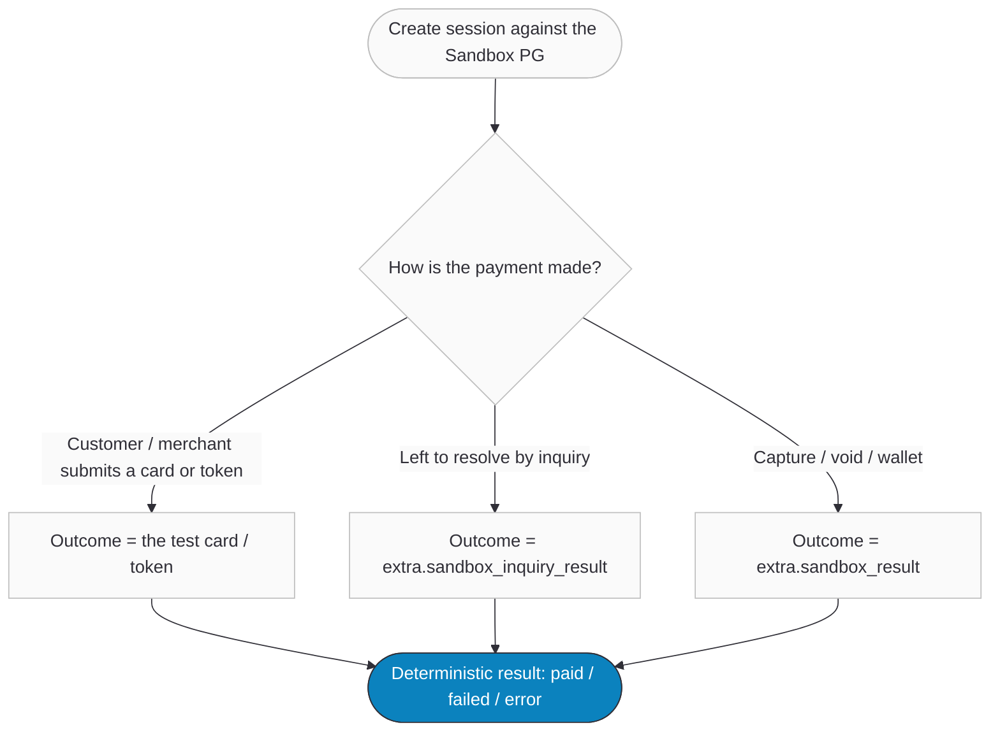

import CodeBlock from "@theme/CodeBlock";
import FAQ, { FAQItem } from "@site/src/components/FAQ";
import { OTTU_CONNECT_BASE_URL } from "@site/src/constants/api";
import TestCardsTable from "@site/src/components/TestCardsTable";

# Ottu Sandbox

The **Ottu Sandbox** is a built-in, simulated payment gateway. It lets you run every payment scenario end-to-end — success, failure, refunds, tokens, recurring charges, authorizations, captures, voids, and wallet payments (Apple / Google / Samsung Pay) — **without touching a live gateway, a real bank, or real money**. It gets its own `pg_code`, you create transactions against it through the standard [Checkout API](/developers/payments/checkout-api/), and the outcome is **deterministic**: you decide it in advance.

:::tip[Boost Your Integration]
Ottu offers SDKs and tools to speed up your integration. See [Getting Started](/developers/getting-started/#boost-your-integration) for all available options.
:::

:::tip[For business stakeholders]
Think of the Ottu Sandbox as a flight simulator for payments. Your team can rehearse a customer paying, a card being declined, a refund being issued, or a subscription renewing — repeatedly and safely — before a single real transaction is processed. It is the fastest way to validate an integration, demo a flow, or reproduce a support issue.
:::

:::note[What this page covers]
This page documents the **Ottu Sandbox simulator gateway** specifically. For the catalog of test card numbers used with *real* gateways' own sandboxes (KNET, MPGS, Checkout.com, etc.), see [Sandbox & Test Cards](/developers/payments/sandbox).
:::

## When to Use

- **Integration testing** — validate your Checkout API calls, webhook handling, and order reconciliation before going live.
- **Reproducing outcomes on demand** — deterministically trigger a success, a decline, or a gateway error to test each of your code paths.
- **Demos and UAT** — walk a stakeholder through a complete payment, refund, or recurring flow with no financial risk.
- **CI / automated tests** — drive predictable payment results from an automated test suite (the asynchronous [`extra`](#the-extra-object) mechanism is designed for exactly this).
- **Recurring / tokenization rehearsals** — practice the full CIT → MIT lifecycle (save a card, then auto-debit it) end-to-end.
- **Realistic response-shape testing** — mimic a real gateway's response payload (KNET, MPGS, CyberSource, …) to validate your webhook parsing and reconciliation without calling the live gateway.

## Setup

You need only two things:

1. **An Ottu Sandbox gateway (MID)** configured on a **non-production** environment — a dev, UAT, or sandbox subdomain on **your own Connect server**. You test the Sandbox exactly the way you'd test KNET or MPGS on your own installation: it gets its own `pg_code`. It is intended for non-production servers only — production disables the Sandbox's asynchronous inquiry scheduler (see [Best Practices](#best-practices)).
2. **A valid API key** for the [Checkout API](/developers/payments/checkout-api/). Examples below use `Authorization: Api-Key <YOUR_API_KEY>`.

Then pass the Sandbox `pg_code` in `pg_codes` when you create a session — that is the entire setup.

:::note[Capabilities are provisioned for you]
Advanced capabilities — tokenization, auto-debit, refund, authorize/void, and wallets — are enabled on your Sandbox MID by Ottu. A self-serve API for merchants to create Sandbox MIDs and toggle these flags on the fly is on the way; see [API Reference](#api-reference). Until it ships, ask Ottu to enable the capability your scenario needs — otherwise the corresponding call is rejected at validation.
:::

## Guide

### Workflow

The single most important concept: **with the Ottu Sandbox you choose the result of a payment in advance.** Every test starts by creating a session against your Sandbox `pg_code`:

<CodeBlock language="bash" title="Create a session against your Sandbox gateway">{`curl --location '${OTTU_CONNECT_BASE_URL}/b/checkout/v1/pymt-txn/' \\
  --header 'Authorization: Api-Key <YOUR_API_KEY>' \\
  --header 'Content-Type: application/json' \\
  --data-raw '{
    "type": "e_commerce",
    "pg_codes": ["<your-sandbox-pg_code>"],
    "amount": "10.000",
    "currency_code": "KWD",
    "order_no": "SANDBOX-0001",
    "webhook_url": "https://yourwebsite.com/webhook"
  }'`}</CodeBlock>

From there, there are **three independent ways** to set the outcome — pick the one that matches how the payment is initiated:

| Mechanism | You control the outcome with… | Applies to |
| --- | --- | --- |
| **Test card / token** *(synchronous)* | the **test card number** the customer enters, or the **token** you charge | Hosted checkout, tokenization, auto-debit (CIT & MIT) |
| **[`sandbox_inquiry_result`](#the-extra-object)** *(asynchronous)* | a value in the Checkout `extra` object | Any flow resolved by a status **inquiry** (e.g. unattended / timed-out sessions) |
| **[`sandbox_result`](#the-extra-object)** *(card-less surfaces)* | a value in the operation's or transaction's `extra` | Capture, void, and Apple / Google / Samsung Pay — surfaces with no card to pick |


```mermaid
%%{init: {"theme": "base", "themeVariables": {"background": "#F4F4F4", "primaryColor": "#FAFAFA", "primaryTextColor": "#302F37", "primaryBorderColor": "#BFBFBF", "lineColor": "#302F37", "secondaryColor": "#FAFAFA", "tertiaryColor": "#FAFAFA"}}}%%
graph TD
    A([Create session against the Sandbox PG]) --> B{How is the payment made?}
    B -->|Customer / merchant submits a card or token| C[Outcome = the test card / token]
    B -->|Left to resolve by inquiry| D[Outcome = extra.sandbox_inquiry_result]
    B -->|Capture / void / wallet| F[Outcome = extra.sandbox_result]
    C --> E([Deterministic result: paid / failed / error])
    D --> E
    F --> E

    classDef accent fill:#0B82BE,color:#FFFFFF,stroke:#302F37
    class E accent
```

### Test Cards

On the hosted Sandbox page (and as token values), these cards drive the outcome. They are not real PANs, are not subject to Luhn validation, and never reach a bank.

<TestCardsTable
  notes="The Sandbox cards are 15 digits (one shorter than a standard 16-digit Visa PAN) — they are fixed test identifiers, not real card numbers. Expiry and CVV are ignored. Any value other than the cards below is treated as an unknown card and canceled."
  cards={[
    { cardNumber: "411111111111111", expiry: "Any", cvv: "Any", brand: "Visa (test)", status: "success", statusLabel: "Success", note: "Payment succeeds" },
    { cardNumber: "411111111111112", expiry: "Any", cvv: "Any", brand: "Visa (test)", status: "declined", statusLabel: "Failed", note: "Payment declined" },
    { cardNumber: "411111111111113", expiry: "Any", cvv: "Any", brand: "Visa (test)", status: "declined", statusLabel: "Error", note: "Gateway error — 'Simulated error'" },
  ]}
/>

Three further cards **enroll and tokenize successfully** on the first (CIT) payment but **decline when later charged as a saved token** (MIT) — purpose-built to rehearse failed recurring charges without any server-side changes:

<TestCardsTable
  cards={[
    { cardNumber: "411111111111114", expiry: "Any", cvv: "Any", brand: "Visa (test)", status: "declined", statusLabel: "MIT decline", note: "Saves at CIT; declined when charged — issuing bank" },
    { cardNumber: "411111111111115", expiry: "Any", cvv: "Any", brand: "Visa (test)", status: "declined", statusLabel: "MIT decline", note: "Saves at CIT; declined when charged — card expired" },
    { cardNumber: "411111111111116", expiry: "Any", cvv: "Any", brand: "Visa (test)", status: "declined", statusLabel: "MIT decline", note: "Saves at CIT; declined when charged — insufficient funds" },
  ]}
/>

:::info[The Sandbox token *is* the card number]
When you save a Sandbox card, its **token is the card number itself** (e.g. `411111111111111`). This is what makes recurring testing predictable: charging the token `411111111111111` always succeeds, `411111111111112` always declines. Real gateways issue opaque tokens; the Sandbox keeps it simple on purpose.
:::

### The `extra` object

For flows with **no card to pick** — background inquiries, captures, voids, and wallet payments — you set the outcome by adding a key to the Checkout `extra` object when you create the session (or to an operation request's `extra`):

| `extra` key | Values | Applies to | Effect |
| --- | --- | --- | --- |
| `sandbox_inquiry_result` | `success` · `failed` · `error` | Any flow resolved by a status **inquiry** (unattended / timed-out sessions) | The outcome a background or manual inquiry applies. Defaults to `success`. |
| `sandbox_result` | `success` · `failed` · `error` | **Capture**, **void**, and **wallet** payments | The outcome of that operation or wallet payment. Defaults to `success`. |
| `expires_in_minutes` | integer | Pairs with `sandbox_inquiry_result` | Arms an auto-inquiry to apply the outcome after N minutes (**non-production only**). |

```json title="POST /b/checkout/v1/pymt-txn/ — pin an unattended session to fail after 5 minutes"
{
  "type": "e_commerce",
  "pg_codes": ["<your-sandbox-pg_code>"],
  "amount": "10.000",
  "currency_code": "KWD",
  "webhook_url": "https://yourwebsite.com/webhook",
  "extra": {
    "sandbox_inquiry_result": "failed",
    "expires_in_minutes": 5
  }
}
```

The same `sandbox_inquiry_result` value is also honored by **any** manual status inquiry on the transaction (e.g. a [Payment Status Query](/developers/payments/psq/)) — `expires_in_minutes` only controls the *automatic* scheduling.

:::info[`extra` is consulted only on the non-interactive paths]
On the interactive paths — hosted checkout, tokenization, and auto-debit — the outcome is decided by the **test card / token** that is submitted; `extra` is not consulted there. The two keys never overlap: `sandbox_inquiry_result` drives inquiries, and `sandbox_result` drives capture, void, and wallet payments. Any unrecognized value (or an absent key) defaults to **`success`**.
:::

### What You Can Test

The Sandbox exercises the **same APIs as production**, so anything you build with Ottu you can test here. The reference docs cover each flow in full — this matrix just shows how to trigger it against the Sandbox, so you don't have to re-read the whole guide.

| What you can test | How to trigger it on the Sandbox | Learn more |
| --- | --- | --- |
| **Success / failure / error** | Pay with `411111111111111` (success), `411111111111112` (failed), or `411111111111113` (error) on the hosted page. For unattended flows, set [`extra.sandbox_inquiry_result`](#the-extra-object) instead of using a card. | [Checkout API](/developers/payments/checkout-api/) |
| **Save a card (tokenization / CIT)** | Create a session with a `customer_id` and pay with a Success card, ticking **Save card**. The saved token equals the card number. | [Tokenization](/developers/cards-and-tokens/tokenization/) |
| **Recurring / auto-debit (MIT)** | Charge a saved token via the Auto-Debit API. Use `…114` / `…115` / `…116` to rehearse a **declined** recurring charge. | [Recurring Payments](/developers/cards-and-tokens/recurring-payments/) |
| **Refund (full & partial)** | Run the `refund` operation on a `paid` transaction. Sandbox refunds always succeed; over-refunding is rejected, not clamped. | [Operations](/developers/operations/) |
| **Authorize, capture & void** | Use a MID whose Operation is `authorize`, then capture or void via Operations. Simulate a declined capture/void with [`extra.sandbox_result`](#the-extra-object). | [Operations](/developers/operations/) |
| **Wallet payments (Apple / Google / Samsung Pay)** | Pay through the wallet — succeeds by default. Simulate a decline/error with [`extra.sandbox_result`](#the-extra-object) on the session. | [Native Payments](/developers/payments/native-payments/) |
| **Mimic a real gateway's response shape** | On the hosted pay page, pick **KNET / MPGS / CyberSource / MyFatoorah** under **"Mimic PG Response"**. The stored `gateway_response` takes that gateway's shape while the test card still decides the outcome. | — |
| **Failed webhook delivery** | Point `webhook_url` at an endpoint that returns a non-`2xx` status or times out; the payment still succeeds and the delivery failure is recorded in `disclosure_url_error`. | [Webhooks](/developers/webhooks/payment-events) |

:::note[Why a decline may show `attempted`, not `failed`]
Sessions created via the Checkout API support **multiple attempts** by default, so a single decline moves the transaction to `attempted` (the customer can retry) rather than to the terminal `failed`. It only goes straight to `failed`/`canceled` when multi-attempt is disabled on the MID. See [Payment States](/developers/reference/payment-states#multi-attempt-logic).
:::

## API Reference

The Sandbox is driven entirely through the standard Ottu APIs you already use — there is **no Sandbox-specific request format**. The full interactive schemas live with each API:

- [**Checkout API**](/developers/payments/checkout-api/) — create sessions (`pg_codes: ["<your-sandbox-pg_code>"]`)
- [**Auto-Debit API**](/developers/cards-and-tokens/recurring-payments/) — charge saved tokens (MIT)
- [**Operations API**](/developers/operations/) — refund, capture, and void

:::note[Managing Sandbox MIDs & capabilities — coming soon]
A dedicated API for merchants to **create Sandbox MIDs** and toggle their capability flags (enable refund, tokenization, auto-debit, authorize/void, wallets) on the fly is in development. Until it ships, Ottu provisions these for you. This section will link the full API reference once it is available.
:::

## Best Practices

Get repeatable results from the Sandbox — and know where its simulation stops, so you don't plan production behavior around something it cannot model.

- **Test on a non-production environment.** The Sandbox — and especially the `extra`-driven async inquiry scheduler (`sandbox_inquiry_result` + `expires_in_minutes`) — is meant for dev/UAT servers. On a production-flagged server those sessions never auto-resolve.
- **Drive interactive outcomes with the card, not `extra`.** For hosted checkout, tokenization, and auto-debit the result is set by the test card / token. `extra` (`sandbox_inquiry_result`, `sandbox_result`) only governs the inquiry, capture, void, and wallet paths — it is ignored on the interactive card paths.
- **Enable the capability you're testing.** Refund, tokenization, auto-debit, authorize/void, and wallets must be enabled on the Sandbox MID (provisioned by Ottu today; self-serve [API](#api-reference) coming). Otherwise the call is rejected at validation, not simulated.
- **Don't rely on the Sandbox for declined refunds or 3DS.** Refund always succeeds — it cannot simulate a declined or rejected refund (capture, void, and wallets *can* be failed via `sandbox_result`). There is also no 3-D Secure challenge or redirect. Test those flows against a real gateway's sandbox.

## FAQ

<FAQ>
  <FAQItem question="Is the Ottu Sandbox the same as the test cards page?">
    No. This page is about the **Ottu Sandbox simulator gateway** — a built-in gateway that fakes payment outcomes. The [Sandbox & Test Cards](/developers/payments/sandbox) page lists test card numbers for *real* gateways' own sandboxes (KNET, MPGS, etc.).
  </FAQItem>
  <FAQItem question="Does the Sandbox charge real money?">
    Never. It processes nothing externally — all outcomes are simulated inside Ottu. The card numbers are not real PANs.
  </FAQItem>
  <FAQItem question="How do I get a successful payment versus a decline?">
    Use the **test card / token**: `411111111111111` succeeds, `411111111111112` declines, `411111111111113` errors (see [Test Cards](#test-cards)). For unattended flows, set `sandbox_inquiry_result` in [`extra`](#the-extra-object) instead.
  </FAQItem>
  <FAQItem question="Why does my Sandbox refund / auto-debit get rejected?">
    The capability is probably not enabled on the MID. Refund needs `refund` in Operations, auto-debit needs auto-debit enabled, and saving cards needs tokenization enabled. Ottu provisions these on your Sandbox MID (a self-serve API is coming) — see [Setup](#setup).
  </FAQItem>
  <FAQItem question="Can I simulate a failed recurring (MIT) charge?">
    Yes. Run the first (CIT) payment with one of the **MIT-failure cards** — `411111111111114` (issuer decline), `411111111111115` (expired), or `411111111111116` (insufficient funds). They enroll and save like the Success card, but the saved token **declines** when later charged. See [Test Cards](#test-cards) and [Recurring Payments](/developers/cards-and-tokens/recurring-payments/).
  </FAQItem>
</FAQ>

## What's Next?

- [**Checkout API**](/developers/payments/checkout-api/) — Create the sessions every test starts from
- [**Recurring Payments**](/developers/cards-and-tokens/recurring-payments/) — The full CIT → MIT token lifecycle
- [**Operations**](/developers/operations/) — Refund, capture, and void in depth
- [**Payment States**](/developers/reference/payment-states/) — How outcomes map to transaction states
- [**Webhooks**](/developers/webhooks/payment-events/) — Receive and verify payment results
- [**Sandbox & Test Cards**](/developers/payments/sandbox) — Test cards for real gateways' sandboxes
