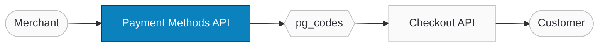

import ApiDocEmbed from "@site/src/components/ApiDocEmbed";
import FAQ, { FAQItem } from '@site/src/components/FAQ';

# Payment Methods

The Payment Methods API lets you discover which payment gateways and methods are available for a given transaction. Instead of hardcoding payment options, you call this API to get the current list of active gateways — filtered by currency, plugin, tokenization support, or customer. The response includes each gateway's supported operations ([refunds](../operations.md), voids, captures), wallet integrations (Apple Pay, Google Pay), currencies, and tokenization capabilities. This ensures your checkout always shows up-to-date payment options, even when gateway configurations change.

:::tip Boost Your Integration
Ottu offers SDKs and tools to speed up your integration. See [Getting Started](/developers/getting-started/#boost-your-integration) for all available options. For environment setup (plugins, gateway codes, sandbox vs production), see [Configure Your Environment](/developers/getting-started/#configure-your-environment).
:::

## When to Use

- **Before creating a payment session** — discover available `pg_codes` to pass to the [Checkout API](./checkout-api.mdx).
- **Currency-specific payments** — filter by `currencies`=[`"USD"`] to show only gateways that support a specific currency.
- **Recurring payments** — filter with `tokenizable`=`true` to find gateways that support [tokenization](/developers/cards-and-tokens/) for saved cards and auto-debit.
- **Customized checkout** — tailor payment options per customer based on their history or preferences.
- **Dynamic updates** — when gateway settings or MID configurations change in the dashboard, the API automatically reflects the updates. No code changes needed.

## Guide

The Payment Methods API is a foundation for other Ottu APIs. It returns detailed information about each available payment method — supported operations, wallet integrations, currencies, and tokenization capabilities — giving you the data needed to create payment sessions with the right gateways.

### Workflow



1. **Merchant calls the Payment Methods API** with filters (`customer_id`, `currency`, `plugin`, `tokenizable`, etc.).
2. **Ottu returns available `pg_codes`** — the active gateways matching the filters.
3. **Merchant passes `pg_codes` to the Checkout API** to create a payment session with the right gateways.
4. **Customer sees current payment options** — only active, relevant methods. No manual updates needed.

### Step-by-Step {#activating-payment-gateway-codes}

1. **Call the Payment Methods API** — retrieve available payment methods based on your filters.

    ```json
    POST: https://sandbox.ottu.net/b/pbl/v2/payment-methods/
    {
        "plugin": "e_commerce",
        "operation": "purchase",
        "tokenizable": "true",
        "currencies": ["USD"]
    }
    ```

    This returns `"pg_codes": ["kpay"]`, which can then be used in subsequent API calls.

2. **Pass the results to the Checkout API** — use the returned `pg_codes` when creating a payment session. For example, if the API returns `"pg_codes": ["PG001"]`, include that code in your [Checkout API](./checkout-api.mdx) call.

3. **Customer sees current payment options** — the checkout page displays only the active, relevant payment methods. When gateway configurations change, the API automatically reflects the updates — no code changes needed.

### Use Cases

#### Expanding Payment Options

**Scenario:** A merchant wants to offer a broad range of payment options for e-commerce customers.

1. Call the Payment Methods API to retrieve all available payment methods.
2. Use the `plugin` filter to get only `e_commerce` payment methods.
3. Customers see a broader range of options at checkout, increasing successful transactions.

#### Dynamic Payment Updates

**Scenario:** The merchant's gateway settings or MID configuration has changed, and they want updates reflected automatically.

Once integrated with the Payment Methods API, any change in gateway settings or MID configuration is auto-reflected. Merchants don't have to initiate manual updates — the API handles seamless integration.

#### Subscription Payments with Tokenization Filter

**Scenario:** An online subscription service wants to offer automatic recurring payments.

1. Call the Payment Methods API with `tokenizable`=`true` to get only gateways that support tokenization.
2. Integrate these gateways into the checkout process.
3. Customers choosing a subscription see only payment methods that support tokenization. The selected method is set to automatically debit at specified intervals.

#### Managing Subsequent Charges with Tokenized Cards

**Scenario:** An e-commerce platform wants to charge only cards that are tokenization-enabled by the customer.

1. Call the Payment Methods API to retrieve tokenization-supported `pg_codes`.
2. Pass these `pg_codes` to the [User Cards API](/developers/cards-and-tokens/user-cards/). It returns only saved cards that have tokenization enabled.
3. For [subsequent transactions](/developers/cards-and-tokens/recurring-payments/), the system only charges approved, tokenization-enabled cards.

## API Reference

<ApiDocEmbed path="get-payment-methods.api.mdx" />

## Best Practices

#### Caching API Call Responses

Given the infrequent changes in values — primarily when new MIDs are issued — it's prudent to cache the API call response. This minimizes unnecessary and redundant calls to the API.

- Cache the API call response for an extended period, ranging from 24 hours to 1 week.

#### Individual Caching for Filters

Always cache responses based on the specific filters you apply during API calls. If you're employing the API with diverse filters based on various scenarios, cache each response separately.

If you cache all responses under a single key regardless of filters, you risk retrieving incorrect or irrelevant data, leading to inaccurate payment processing or transaction failures.

#### On-Demand Cache Clear Mechanism

Implement a mechanism to clear the cache on demand. When a MID change is made in the Ottu admin panel, trigger a cache clear to force-update with the latest data.

## FAQ

<FAQ>
  <FAQItem question="What is the main purpose of the Payment Methods API?">
    The Payment Methods API discovers which payment gateways and methods are available for a given transaction, based on filters like currency, plugin, and tokenization support.
  </FAQItem>
  <FAQItem question="Do I need to make changes to my existing environment when integrating?">
    No. You only need to call the API with the relevant filters (`operation`, `customer_id`, `currencies`, `plugin`). Any changes to gateway settings are automatically reflected in the API response.
  </FAQItem>
</FAQ>

## What's Next?

- [**Checkout API**](./checkout-api.mdx) — Create payment sessions using the discovered payment methods
- [**Native Payments**](./native-payments.md) — Direct Apple Pay and Google Pay payments
- [**Checkout SDK**](/developers/payments/checkout-sdk/) — Drop-in UI that automatically uses available payment methods
