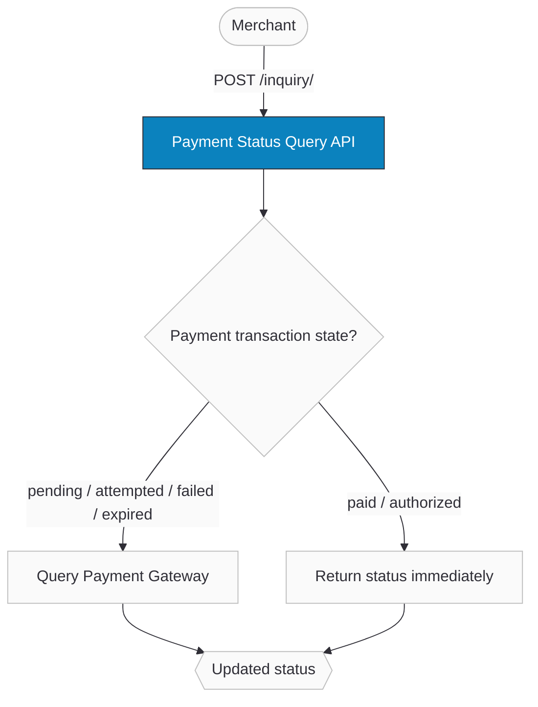

import ApiDocEmbed from "@site/src/components/ApiDocEmbed";
import GatewayTimingChart from "@site/src/components/GatewayTimingChart";
import FAQ, { FAQItem } from '@site/src/components/FAQ';
import StepGuide from "@site/src/components/StepGuide";

# Payment Status Query

The Payment Status Query API lets you manually check the status of a payment transaction. It acts as a confirmation mechanism when your system hasn't received a [webhook notification](/developers/webhooks/payment-events) about a status change — due to network issues, temporary downtime, or third-party service failures.

The response mirrors the structure of a [payment webhook payload](/developers/webhooks/payment-events). For payment transactions in `pending`, `attempted`, `failed`, or `expired` states, Ottu queries the payment gateway for the latest status. For `paid` or `authorized` states, the current status is returned immediately without re-confirming with the gateway.

When multiple payment methods were attempted using different gateways, all gateways supporting status checks are queried — ensuring you receive the most up-to-date status.

:::tip Boost Your Integration
Ottu offers SDKs and tools to speed up your integration. See [Getting Started](../getting-started/#boost-your-integration) for all available options.
:::

## When to Use

- **Webhook not received** — network issues, temporary downtime, or third-party failures prevented delivery.
- **Manual verification** — a customer reports the payment was completed but your system shows `pending` or `failed`.
- **Reconciliation** — periodic checks to ensure your records match the gateway's state.
- **Fallback for automatic inquiry** — when Ottu's built-in [automatic inquiry](#automatic-inquiry) hasn't resolved the status yet.

:::warning
If you've configured [webhook notifications](/developers/webhooks/payment-events), rely on those as the primary mechanism. Use the Payment Status Query API only when webhooks haven't arrived or you need manual confirmation.
:::

## Setup

- **Payment gateway** — at least one gateway that supports status checks must be configured. See [Payment Methods](/developers/payments/payment-methods) for available gateways and their capabilities.
- **Webhook familiarity** — the Payment Status Query API response matches the [payment webhook payload](/developers/webhooks/payment-events). Understand the response format before integrating.

#### Gateway Inquiry Timing

Each payment gateway has a different session expiration time. Schedule your PSQ calls **after** the gateway's inquiry window closes — calling too early means the gateway may not have finalized the status yet.

<GatewayTimingChart />

## Guide

### Workflow

1. **Merchant sends an inquiry request** with `session_id` or `order_no`.
2. **Ottu checks the payment transaction state:**
   - If `pending`, `attempted`, `failed`, or `expired` → Ottu queries the payment gateway for the latest status.
   - If `paid` or `authorized` → Ottu returns the current status immediately (no gateway call needed).
3. **Response** mirrors the [webhook payload](/developers/webhooks/payment-events) — same structure, same fields.

### Automatic Inquiry

Ottu includes a built-in automatic inquiry feature that runs without any merchant action. It's enabled by default for every payment gateway.

**How it works:**

1. **Scheduled inquiry job** — for every gateway that supports inquiry, Ottu schedules an automatic check after the gateway's session expiration time. The timing varies per gateway.
2. **Retries** — the job queries the gateway **3 times** to ensure accurate reconciliation. If a successful response is received during any call, the remaining retries are skipped.
3. **Webhook delivery** — once the automatic inquiry resolves the status, Ottu sends a [webhook notification](/developers/webhooks/payment-events) to the merchant.

**Aggregator handling (e.g., MyFatoorah):**

Some aggregator integrations may return a `pending` status even after the customer is redirected back. This happens when the underlying gateway hasn't provided a definitive response yet. In these cases:

- Ottu does **not** send a webhook for the `pending` status.
- Instead, Ottu schedules additional inquiry jobs to monitor the status.
- Once a definitive state is reached (`paid` or `failed`), Ottu sends the webhook notification.

This ensures merchants only receive webhooks with final, actionable payment statuses.

### Step-by-Step

<StepGuide steps={[
  {
    title: "Send an inquiry request",
    description: <>Provide at least one identifier — <code>session_id</code> or <code>order_no</code>:  <pre><code>{`curl -X POST "https://sandbox.ottu.net/b/pbl/v2/inquiry/" \\
  -H "Authorization: Api-Key your_private_api_key" \\
  -H "Content-Type: application/json" \\
  -d '{"session_id": "your_session_id"}'`}</code></pre></>,
  },
  {
    title: "Handle the response",
    description: <>The response matches the <a href="/developers/webhooks/payment-events">webhook payload</a> structure. Check the <code>state</code> field for the current payment transaction status:  • <code>paid</code> / <code>authorized</code> / <code>cod</code> → payment succeeded • <code>pending</code> / <code>attempted</code> → payment still in progress • <code>failed</code> / <code>expired</code> / <code>canceled</code> → payment did not complete</>,
  },
  {
    title: "Optionally trigger a webhook",
    description: <>Include <code>"notify_webhook_url": true</code> in the request to have Ottu send a webhook notification with the inquiry result to your configured <code>webhook_url</code>:  <pre><code>{`{
    "session_id": "your_session_id",
    "notify_webhook_url": true
}`}</code></pre>You can also specify an alternate <code>webhook_url</code> to receive the result at a different endpoint.</>,
  },
]} nextSectionId="throttling-rules" />

### Throttling Rules

The Payment Status Query API implements throttling to prevent system abuse. Rules are **per payment transaction**:

1. **Initial grace period (10 minutes)** — requests within 10 minutes of payment transaction creation are throttled.
2. **First request** — after the grace period, the first request is allowed. Subsequent requests for the same payment transaction within the next 30 minutes are throttled.
3. **Second request** — after the first 30-minute throttle period, a second request is allowed. Further requests within another 30 minutes are throttled.
4. **Subsequent requests** — if requests for the same payment transaction exceed 3 in a single day, further requests are denied.

:::info
Additionally, the endpoint allows a maximum of **30 requests per minute** across all payment transactions (global rate limit).
:::

## API Reference

<ApiDocEmbed path="inquiry.api.mdx" />

## Best Practices

#### Stay within request limits

Respect the [throttling rules](#throttling-rules). Schedule inquiry calls based on gateway timing, not on arbitrary intervals.

#### Understand the webhook response

The Payment Status Query API response mirrors the [payment webhook payload](/developers/webhooks/payment-events). Familiarize yourself with the response structure before integrating.

#### Use the correct identifier

Provide `session_id` (preferred — always present) or `order_no`. At least one is required.

#### Consider the payment transaction state

`paid` and `authorized` payment transactions return status immediately. For other states, Ottu queries the gateway — factor in the gateway's session expiration time when scheduling your inquiry.

## FAQ

<FAQ>
  <FAQItem question="What are the prerequisites?">
    At least one payment gateway that supports status checks, and familiarity with the [payment webhook response](/developers/webhooks/payment-events) format.
  </FAQItem>
  <FAQItem question="What authentication does the Payment Status Query API support?">
    Both [API Key](/developers/getting-started/authentication#private-key-api-key) and [Basic Authentication](/developers/getting-started/authentication#basic-authentication). No special permissions required for Basic Auth beyond `payment.inquiry`.
  </FAQItem>
  <FAQItem question="Which payment transaction states can I inquire?">
    You can trigger the inquiry for `pending`, `attempted`, `failed`, or `expired` states. For `paid` or `authorized`, the status is returned immediately without querying the gateway. See [Payment States](/developers/reference/payment-states).
  </FAQItem>
  <FAQItem question="How does Ottu handle payment transactions with outdated states?">
    If a payment transaction is still in `pending`, `attempted`, `failed`, or `expired`, Ottu queries the payment gateway for the latest status and updates accordingly.
  </FAQItem>
  <FAQItem question="What if multiple gateways were attempted?">
    All gateways that support status checks are queried, ensuring you receive the most up-to-date status regardless of which gateway the customer used.
  </FAQItem>
  <FAQItem question="Are there throttling limits?">
    Yes. See [Throttling Rules](#throttling-rules) — per-transaction limits (grace period, 30-min intervals, max 3/day) plus a global rate limit of 30 requests/minute.
  </FAQItem>
  <FAQItem question="What identifiers do I need?">
    At least one of `session_id` or `order_no`. Prefer `session_id` as it's always available in the [Checkout API](/developers/payments/checkout-api) response.
  </FAQItem>
</FAQ>

## What's Next?

- [**Payment Events**](/developers/webhooks/payment-events) — Webhook notifications triggered by payment state changes
- [**Payment States**](/developers/reference/payment-states) — Complete state machine reference
- [**Operations**](/developers/operations) — Refund, capture, void, cancel payment transactions
- [**Checkout API**](/developers/payments/checkout-api) — Create payment transactions to inquire about
