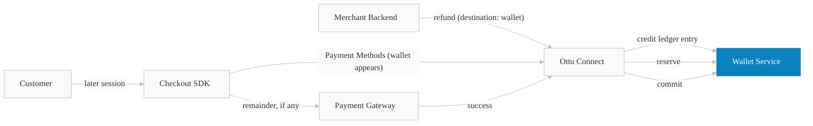

import Tabs from "@theme/Tabs";
import TabItem from "@theme/TabItem";
import ApiDocEmbed from "@site/src/components/ApiDocEmbed";

# Wallet

Wallet lets you refund customer payments to a stored balance keyed by merchant, customer, and currency, then let the customer spend that credit at any future Ottu checkout in the same currency. No PII is stored on the wallet service.

Authentication for merchant-facing endpoints follows the standard [Ottu API key](/developers/getting-started/authentication) flow — the same key you use for the [Checkout API](../checkout-api). Service-to-service auth between Ottu Connect and the wallet service uses OAuth 2.0 internally and is invisible to merchants.

:::tip Boost Your Integration
Ottu offers SDKs and tools to speed up your integration. See [Getting Started](../../getting-started/#boost-your-integration) for all available options.
:::

## When to Use

- Refunding without returning funds to the original card or gateway — loyalty, goodwill, or voucher use cases.
- Letting customers carry over balance between sessions.
- Reducing payment-gateway fees by spending wallet credit before charging a card.
- Multi-currency merchants — each currency maintains its own wallet account.

## Guide

### Workflow



1. **Merchant refunds to wallet** — the refund operation accepts `destination: "wallet"`, which credits the customer's wallet instead of reversing through the gateway.
2. **Customer returns** — at the next checkout, the wallet service confirms positive balance in the order currency.
3. **Wallet appears as a method** — the SDK renders "Wallet (X.XXX CCC)" alongside other payment options.
4. **Reservation on submit** — when the customer pays, the required amount is reserved. Any shortfall is collected from a second method.
5. **Commit or release** — on success the reservation commits to a debit entry; on abandon, cancel, or failure it auto-releases after about four hours.

### Live Demo

The interactive demo seeds a wallet on the fly for a fresh customer, then launches the Checkout SDK with wallet enabled. It will be wired in once the demo component is implemented — see [Wallet for merchants](/business/wallet/) for screenshots of the flow.

{/* <WalletDemo /> — added in Task 20 */}

### Step-by-Step

#### 1. Discover wallet availability for a customer

Call the [Payment Methods API](../payment-methods) with the `customer_id` for the session. When the customer has positive balance in the session currency, a payment method with `type: "wallet"` appears in the response.

<Tabs groupId="language">
<TabItem value="curl" label="cURL">

```bash title="Discover wallet availability"
curl -X POST https://yourdomain.ottu.com/b/checkout/v1/pymt-txn/payment-methods/ \
  -H "Authorization: Api-Key YOUR_API_KEY" \
  -H "Content-Type: application/json" \
  -d '{
    "customer_id": "cust_abc123",
    "currency_code": "KWD",
    "amount": "15.000"
  }'
```

</TabItem>
<TabItem value="python" label="Python">

```python title="Discover wallet availability"
import requests

response = requests.post(
    "https://yourdomain.ottu.com/b/checkout/v1/pymt-txn/payment-methods/",
    headers={
        "Authorization": "Api-Key YOUR_API_KEY",
        "Content-Type": "application/json",
    },
    json={
        "customer_id": "cust_abc123",
        "currency_code": "KWD",
        "amount": "15.000",
    },
)
methods = response.json()
```

</TabItem>
<TabItem value="node" label="Node.js">

```javascript title="Discover wallet availability"
const response = await fetch(
  "https://yourdomain.ottu.com/b/checkout/v1/pymt-txn/payment-methods/",
  {
    method: "POST",
    headers: {
      Authorization: "Api-Key YOUR_API_KEY",
      "Content-Type": "application/json",
    },
    body: JSON.stringify({
      customer_id: "cust_abc123",
      currency_code: "KWD",
      amount: "15.000",
    }),
  }
);
const methods = await response.json();
```

</TabItem>
<TabItem value="php" label="PHP">

```php title="Discover wallet availability"
$response = file_get_contents(
    'https://yourdomain.ottu.com/b/checkout/v1/pymt-txn/payment-methods/',
    false,
    stream_context_create([
        'http' => [
            'method' => 'POST',
            'header' => "Authorization: Api-Key YOUR_API_KEY\r\nContent-Type: application/json\r\n",
            'content' => json_encode([
                'customer_id' => 'cust_abc123',
                'currency_code' => 'KWD',
                'amount' => '15.000',
            ]),
        ],
    ])
);
$methods = json_decode($response, true);
```

</TabItem>
</Tabs>

#### 2. Initialize Checkout with wallet enabled

Pass the `customer_id` when creating the session. On the SDK side, wallet appears automatically when the customer has positive balance — no extra init config is required beyond including `'wallet'` in `formsOfPayment` (or omitting `formsOfPayment` to show all methods).

```javascript title="Checkout SDK init with wallet enabled"
Checkout.init({
  selector: "checkout",
  merchant_id: "yourdomain.ottu.com",
  apiKey: "YOUR_API_PUBLIC_KEY",
  session_id: "sess_9f8e7d6c5b4a",
  formsOfPayment: ["wallet", "ottu_sandbox"], // or omit to show all
});
```

#### 3. Customer applies wallet credit at checkout

The SDK reserves the required amount (or the full balance, whichever is lower). If the session amount exceeds the wallet balance, the customer is prompted to pick a second method for the remainder. On submit, all reservations confirm together. On success the wallet entry commits; on cancel, error, or four-hour timeout it auto-releases.

#### 4. Read wallet state from your backend

Use the three read APIs (see [API Reference](#api-reference)) to display balance, transaction history, or specific operations in your own UI.

### Use Cases

#### Partial payments (wallet plus another method)

Three balance-versus-amount cases:

| Wallet balance vs amount | Behavior |
|---|---|
| Balance ≥ amount | Only `amount` is deducted. Surplus stays in the wallet. |
| Balance == amount | Wallet fully covers; balance becomes 0. |
| Balance &lt; amount | Full balance is consumed; customer pays the difference with another method. |

Customers cannot choose how much wallet credit to apply — Ottu computes it automatically.

#### Reservation lifecycle

- **Reserved** when the customer submits payment.
- **Committed** on payment success.
- **Released automatically** about four hours after an abandoned, cancelled, or failed payment. No human intervention.

#### Wallet hidden for authorize-only sessions

When the session is configured for authorization-only (no immediate capture), wallet is not offered as a payment method. Wallet supports immediate-capture flows only.

#### Refunding to wallet

See [Refund to Wallet](../../operations#refund-to-wallet) on the Operations page for the full API and behavior. The refund endpoint accepts `destination: "wallet"` to credit the wallet instead of reversing through the gateway.

:::warning Cross-currency wallet payments are not supported
A KWD wallet cannot be used to pay a SAR order, and vice versa. Each currency maintains a separate wallet account.
:::

## API Reference

Three read APIs let you query wallet state from your backend. All three accept the standard Ottu API key authentication.

<Tabs>
  <TabItem value="accounts" label="List Wallet Accounts">
    <ApiDocEmbed path="developers/apis/wallet-accounts-list" />
  </TabItem>
  <TabItem value="ledger" label="List Ledger Entries">
    <ApiDocEmbed path="developers/apis/wallet-ledger-list" />
  </TabItem>
  <TabItem value="operation" label="Get Operation by ID">
    <ApiDocEmbed path="developers/apis/wallet-operation-retrieve" />
  </TabItem>
</Tabs>

## Best Practices

- **Discover per session.** Always call [Payment Methods API](../payment-methods) per session — don't assume balance from a prior call.
- **Display balance fresh.** Call List Accounts on page load if you show balance in your own UI. Cache only briefly; balance changes on every payment.
- **Append-only ledger.** Never derive balance client-side from history — rely on the Accounts endpoint for authoritative balance.
- **Match the currency.** For multi-currency merchants, present the wallet matching the session currency only.

## FAQ

#### Can a customer choose how much wallet credit to apply?

No. Ottu computes the amount automatically based on session amount versus balance.

#### What happens to a reservation if the customer abandons checkout?

It is automatically released about four hours after the abandoned, cancelled, or failed payment. No human intervention is required.

#### Is wallet available for authorization-only payments?

No. Wallet supports immediate-capture sessions only.

#### Where does refund-to-wallet data go?

The original payment session is linked to the wallet credit entry, visible in both the wallet ledger and the operation log.

#### Does the wallet store any customer PII?

No. The service holds only ledger entries scoped by `merchant_id`, `customer_id`, and `currency`.

#### Does wallet credit expire?

No. Wallet credit does not expire today.

## What's Next?

- [Refund to Wallet (Operations)](../../operations#refund-to-wallet) — the refund API change that creates wallet credits.
- [Checkout SDK — Wallet section](../checkout-sdk/web#wallet) — how wallet appears in the SDK.
- [Payment Methods API](../payment-methods) — discovering available payment methods.
- [Wallet for merchants](/business/wallet/) — business-side documentation.
