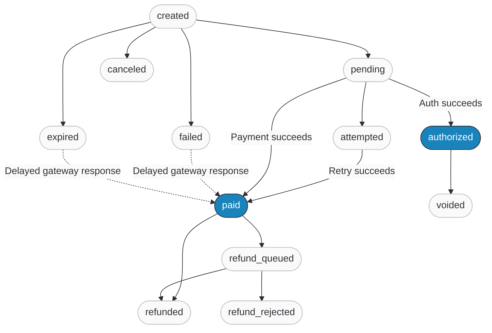
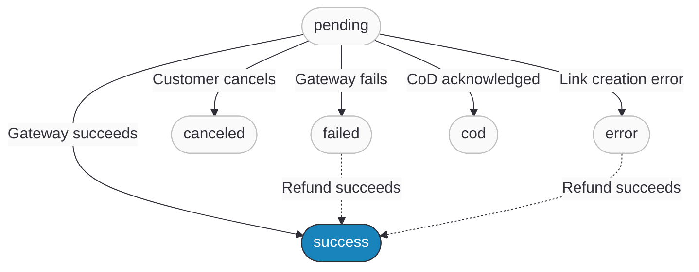

import FAQ, { FAQItem } from '@site/src/components/FAQ';

# Payment States

Every payment in Ottu has two levels: a **payment transaction** (the top-level entity with amount, currency, customer data) and one or more **payment attempts** (individual interactions with the payment gateway). The payment transaction tracks the overall lifecycle — from `created` through `paid`, `expired`, or `refunded`. Each payment attempt tracks a single gateway interaction — from `pending` through `success` or `failed`.

This two-level model exists because a single payment transaction can involve multiple payment attempts. The customer might fail on the first try (wrong card, insufficient funds) and succeed on the second — the payment transaction stays open while individual payment attempts come and go.

:::note Quick Reference
For most integrations, check the `state` field in [webhook payloads](/developers/webhooks/payment-events) or the [Checkout API response](/developers/payments/checkout-api). The success states are **`paid`**, **`authorized`**, and **`cod`**. Everything else means the payment is incomplete or failed.
:::

## Payment Transaction States

| State | Description | Terminal? | Available Operations |
|-------|-------------|:---------:|---------------------|
| `created` | Payment transaction created via the [Checkout API](/developers/payments/checkout-api). Customer has not yet opened the payment link. | No | [Cancel](/developers/operations#cancel), [Expire](/developers/operations#expire) |
| `pending` | Customer opened the payment link; request sent to the payment gateway. | No | [Cancel](/developers/operations#cancel), [Expire](/developers/operations#expire) |
| `attempted` | Customer tried to pay but the payment attempt failed. Payment transaction remains open for retry (see [Multi-Attempt Logic](#multi-attempt-logic)). | No | [Cancel](/developers/operations#cancel), [Expire](/developers/operations#expire) |
| `authorized` | Funds reserved on the customer's bank account but not yet captured. Merchant must [capture](/developers/operations#capture) or [void](/developers/operations#void). | Yes | [Capture](/developers/operations#capture), [Void](/developers/operations#void) |
| `paid` | Payment successful. Funds collected. | Yes | [Refund](/developers/operations#refund) |
| `cod` | Cash on Delivery — payment marked as offline/cash. | Yes | [Cancel](/developers/operations#cancel) |
| `failed` | Payment failed definitively. No retry possible (multi-attempt exhausted or disabled). | Yes | — |
| `canceled` | Administratively canceled by staff or via the [Operations API](/developers/operations#cancel). | Yes | — |
| `expired` | Not paid before expiration date, or customer canceled on gateway page. | Yes | — |
| `invalided` | Configuration change made the payment transaction unprocessable (missing currency, disabled gateway). | Yes | — |
| `refunded` | [Refund operation](/developers/operations#refund) completed. This is a child payment transaction state. | Yes | — |
| `refund_queued` | Refund sent to the payment gateway, awaiting confirmation. The gateway will send a webhook when the refund is processed. | No | Awaiting gateway confirmation |
| `refund_rejected` | Gateway rejected the refund request. | Yes | — |
| `voided` | [Authorization reversed](/developers/operations#void) before the acquirer sent it for processing. Child payment transaction state. | Yes | — |

### Payment Transaction Lifecycle

The diagram below shows the most common state transitions. For the complete list of all possible transitions, see the [State Groups](#state-groups) table.

:::tip
Dashed arrows show that even `failed` and `expired` payment transactions can receive a delayed successful payment from the gateway (e.g., via automatic inquiry). Always handle webhook updates for payment transactions you consider "failed."
:::

## Payment Attempt States

Each payment attempt represents a single interaction with a payment gateway. A payment transaction can have one or many payment attempts.

| State | Description | Triggered By |
|-------|-------------|-------------|
| `pending` | Payment attempt created; request about to be sent to the payment gateway. | Customer initiates payment on checkout page |
| `success` | Payment gateway confirmed the payment succeeded. | Gateway returns successful response |
| `failed` | Payment attempt failed (insufficient funds, card declined, 3DS failure). | Gateway returns failure; or payment attempt times out |
| `canceled` | Customer canceled on the payment gateway page (e.g., clicked "Back" on KNET). | Customer navigates away from gateway |
| `error` | Error occurred creating the payment gateway link (connectivity, invalid config). | PSP link creation fails |
| `cod` | Cash on Delivery payment acknowledged. | CoD gateway confirms offline payment |

## How Payment Transactions and Payment Attempts Interact

### When Payment Attempts Are Created

A new payment attempt is created each time the customer submits a payment on the checkout page. The payment attempt captures gateway-specific details: `gateway_response`, `amount`, `fees`, and `reference_number`. Each payment attempt belongs to exactly one payment transaction (accessed via `payment_transaction.attempts`).

### How Payment Attempt Results Affect the Payment Transaction

:::warning
Payment attempt state changes trigger payment transaction state changes, but the mapping is not 1:1. A failed payment attempt does not always mean a failed payment transaction.
:::

| Payment Attempt Outcome | Multi-Attempt Enabled | Multi-Attempt Disabled |
|----------------|----------------------|----------------------|
| `success` (purchase operation) | Payment transaction → `paid` | Payment transaction → `paid` |
| `success` (authorize operation) | Payment transaction → `authorized` | Payment transaction → `authorized` |
| `cod` | Payment transaction → `cod` | Payment transaction → `cod` |
| `failed` | Payment transaction → `attempted` (retry available) | Payment transaction → `failed` (terminal) |
| `canceled` | Payment transaction → `attempted` (retry available) | Payment transaction → `expired` |
| `error` | Inquiry may resolve later | Payment transaction → `failed` |

### Multi-Attempt Logic

Payment transactions created via the [Checkout API](/developers/payments/checkout-api) or [Invoice API](/developers/invoices) support multiple payment attempts by default. When a payment attempt fails, the payment transaction moves to `attempted` and the customer can retry with a different card or payment method.

Multi-attempt behavior is controlled by two factors:

1. **How the payment transaction was created** — payment transactions created via the Checkout API or Invoice API are eligible for multi-attempt. Those created via legacy APIs are not.
2. **MID configuration** — each payment gateway has a `can_have_multiple_attempts` setting (enabled by default). If disabled, the payment transaction reaches a final state on the first payment attempt result, regardless of how it was created.

When multi-attempt is disabled (or the payment transaction was created via a legacy API), a failed or canceled payment attempt immediately transitions the payment transaction to a terminal state (`failed` or `expired`) — no retry.

:::tip
The `attempted` state exists specifically for multi-attempt payment transactions. It signals "at least one payment attempt was made, but none succeeded yet — the customer can try again."
:::

:::info Type vs Payment Type
Payment transaction **`type`** (e.g., `e_commerce`, `payment_request`) determines the business flow. **`payment_type`** (e.g., `one_off`, `auto_debit`, `save_card`) determines the payment method behavior. Both types can use any payment_type — for example, both `e_commerce` and `payment_request` payment transactions can be `auto_debit`.
:::

## State Groups

These groupings are used by the [Operations API](/developers/operations), [Webhooks](/developers/webhooks/), and [Payment Status Query API](/developers/payments/psq) to determine which actions are valid.

| Group | States | Used By |
|-------|--------|---------|
| **Success states** | `paid`, `authorized`, `cod` | Trigger post-payment logic (webhooks, fulfillment) |
| **Terminal states** | `paid`, `authorized`, `cod`, `failed`, `canceled`, `expired`, `invalided` | No further customer action possible |
| **Cancelable** | `created`, `pending`, `attempted`, `cod` | [Cancel operation](/developers/operations#cancel) |
| **Expirable** | `created`, `pending`, `attempted` | [Expire operation](/developers/operations#expire) or automatic expiration |
| **Can acknowledge payment** | `created`, `pending`, `attempted`, `failed`, `expired` | Gateway can still report success (delayed callback) |
| **Inquirable** | `pending`, `attempted`, `failed`, `expired` | [Payment Status Query](/developers/payments/psq) to check latest status |
| **Child payment transaction states** | `paid`, `refunded`, `refund_queued`, `refund_rejected`, `voided` | Created by [operations](/developers/operations) on a parent payment transaction |

## Child Payment Transactions

When an external [operation](/developers/operations) (refund, capture, void) succeeds, Ottu creates a **child payment transaction** linked to the original parent. Child payment transactions have their own `session_id`, state, amount, and gateway response.

- **Refund** → child in `refunded` state. If the gateway queues the refund (pending confirmation), the child is created in `refund_queued` state and transitions to `refunded` when the gateway confirms via webhook, or to `refund_rejected` if the gateway rejects it.
- **Capture** → child in `paid` state
- **Void** → child in `voided` state

Child payment transactions appear in the parent's webhook payload and can be retrieved via the [Payment Status Query API](/developers/payments/psq). See [Operation Events](/developers/webhooks/operation-events) for webhook payloads.

## FAQ

<FAQ>
  <FAQItem question="What state should I check to confirm a payment succeeded?">
    Check the `state` field in the webhook payload or API response. Success states are `paid` (funds collected), `authorized` (funds reserved, capture needed), and `cod` (offline payment). For most integrations, treat `paid` as the primary success indicator.
  </FAQItem>

  <FAQItem question="Can a `failed` or `expired` payment transaction become `paid`?">
    Yes. If a delayed gateway response arrives (e.g., via automatic inquiry), a `failed` or `expired` payment transaction can transition to `paid`, `authorized`, or `cod`. Always handle webhook updates for payment transactions you consider "failed."
  </FAQItem>

  <FAQItem question="What is the difference between `failed` and `attempted`?">
    `attempted` means the customer tried to pay but the payment attempt failed, and the payment transaction is still open for retry (when [multi-attempt](#multi-attempt-logic) is enabled). `failed` is terminal — no more retries. When multi-attempt is disabled, the payment transaction skips `attempted` and goes directly to `failed`.
  </FAQItem>

  <FAQItem question="What is the difference between `canceled` and `expired`?">
    `canceled` is an explicit action by a staff member or [API call](/developers/operations#cancel). `expired` happens automatically when the expiration date passes, or when the customer cancels on the gateway page (when multi-attempt is disabled).
  </FAQItem>

  <FAQItem question="What does `invalided` mean?">
    A configuration change made the payment transaction unprocessable after creation — for example, the currency was removed or the payment gateway was disabled. This is rare and indicates a backend configuration issue.
  </FAQItem>

  <FAQItem question="What does `refund_queued` mean?">
    The refund request was sent to the payment gateway, but the gateway hasn't confirmed it yet. Some gateways process refunds asynchronously — they accept the request, return a pending status, and later send a webhook to confirm the refund. The state transitions to `refunded` on confirmation or `refund_rejected` if the gateway rejects it.
  </FAQItem>

  <FAQItem question="How do child payment transactions relate to the parent?">
    Child payment transactions are created by [operations](/developers/operations) (refund, capture, void). They have their own state and amount but are linked to the parent. The parent's [webhook payload](/developers/webhooks/operation-events) includes child payment transaction details.
  </FAQItem>
</FAQ>

## What's Next?

- [**Checkout API**](/developers/payments/checkout-api) — Create payment transactions and track their state
- [**Payment Status Query**](/developers/payments/psq) — Check the latest payment transaction status with the gateway
- [**Operations**](/developers/operations) — Refund, capture, void, cancel, and expire payment transactions
- [**Payment Events**](/developers/webhooks/payment-events) — Webhook payloads delivered on state changes
- [**Error Codes**](/developers/reference/error-codes) — Error responses from the API
