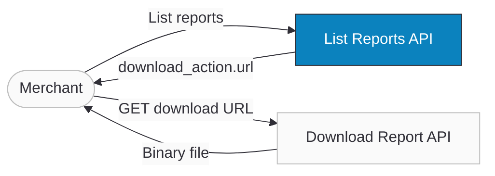

import Tabs from '@theme/Tabs';
import TabItem from '@theme/TabItem';
import ApiDocEmbed from "@site/src/components/ApiDocEmbed";
import FAQ, { FAQItem } from '@site/src/components/FAQ';

# Reports API

The Reports API lets merchants access completed transaction reports programmatically. It's designed for reconciliation, accounting, analytics, and compliance — without exposing any public storage links. Two secure endpoints are provided: **List Reports** (filtered, paginated list of finished reports with a secure download URL) and **Download Report** (authenticated binary file download).

The dashboard already shows reports, but this API enables automated systems (ERP, BI tools, finance scripts) to fetch and download reports safely.

:::tip Boost Your Integration
Ottu offers SDKs and tools to speed up your integration. See [Getting Started](/developers/getting-started/#boost-your-integration) for all available options.
:::

## When to Use

- **Automated reconciliation** — pull transaction reports into your ERP or accounting system on a schedule.
- **Analytics pipelines** — feed reports into BI tools for trend analysis, fraud detection, or financial reporting.
- **Compliance & audit** — download reports for regulatory requirements with full audit trail.
- **Manual download fallback** — when dashboard access is unavailable or you need programmatic access.

## Setup

:::info
If you don't pass date filters, the List Reports API returns the **last 30 days** of finished reports, sorted newest first.
:::

## Guide

### Workflow



1. **Call List Reports** to get available reports — filter by date, interval, or source.
2. **Pick a report** from the `results` array.
3. **Extract `download_action.url`** — a pre-signed, secure download URL with an embedded token.
4. **Call that URL** with the same authentication headers to download the file as binary.

#### Report Sources

Reports are generated in two ways:
- **Auto reports** — scheduled daily, weekly, monthly, or yearly.
- **Manual reports** — created on demand via the dashboard.

#### Visibility & Security

- A merchant can only see **their own reports** (instance-isolated).
- Only **finished reports** are returned — in-progress reports are excluded.
- **No public or raw storage URLs** are ever exposed.
- Reports use `encrypted_id` to prevent ID enumeration.
- Every download attempt is **audit-logged** (success or failure).

#### Download Security

Download URLs are secured with multiple layers:

- **Token-based** — download tokens are UUIDs cached in Redis, not direct file paths.
- **Time-limited** — tokens expire after a configurable TTL.
- **User-bound** — each token is tied to the authenticated user who requested the list.
- **Rate-limited** — downloads are rate-limited per user to prevent abuse.
- **Ownership verification** — the server verifies the user owns the report before serving.

#### File Formats & Delivery

| Format | Content-Type | Details |
|--------|-------------|---------|
| CSV | `text/csv` | UTF-8 encoded, comma-delimited |
| XLSX | `application/vnd.openxmlformats-officedocument.spreadsheetml.sheet` | Standard Excel format |

For S3-backed storage, the download returns a `302` redirect to a pre-signed S3 URL. For local storage, the file is served via `X-Sendfile` header.

### Step-by-Step

#### 1. List available reports

```bash
curl -X GET "https://sandbox.ottu.net/b/api/v1/reports/files/?limit=10" \
  -H "Api-Key: your_private_api_key"
```

The response includes completed reports, each with a secure `download_action.url`. Use query parameters (see [API Reference](#api-reference)) to filter by date, interval, or source.

#### 2. Download a report

Use the `download_action.url` from the response:

```bash
curl -X GET "https://<ottu-url>/b/api/v1/reports/files/{token}/download/" \
  -H "Api-Key: your_private_api_key" \
  -o report.csv
```

The file is returned as binary (CSV or XLSX).

#### 3. Handle errors

| HTTP | When |
|------|------|
| 200 + empty `results` | No reports match your filters |
| 401 | Invalid or missing credentials |
| 403 | Basic Auth user lacks `report.can_view_report` |
| 429 | Rate limit exceeded — backoff and retry |

## API Reference

<Tabs groupId="reports-api" queryString>
<TabItem value="list" label="List Reports">

<ApiDocEmbed path="list-reports.api.mdx" />

</TabItem>
<TabItem value="download" label="Download Report">

<ApiDocEmbed path="download-report.api.mdx" />

</TabItem>
</Tabs>

## Best Practices

#### Use API Key for automation

API Key auth is more stable and doesn't require per-user permission management for system integrations.

#### Always filter by date

Avoid pulling large histories unintentionally. Use `created_after` and `created_before` to fetch only the period you need.

#### Respect pagination

Use `limit` and `offset` (or cursor) until `next` is null. Don't assume all results fit in one response.

#### Handle empty results

A valid response can return zero reports:

```json
{ "count": 0, "next": null, "previous": null, "results": [] }
```

#### Log download tracking

Even though Ottu logs every download, your system should store the report ID, download time, and success state for your own audit trail.

#### Retry safely

On `429 rate_limited`, implement exponential backoff before retrying.

## FAQ

<FAQ>
  <FAQItem question="Can I download reports without listing them first?">
    Technically yes, if you stored the download token previously. But listing first is the safest way to discover available reports and get fresh tokens.
  </FAQItem>

  <FAQItem question="Why don't I see reports that are still generating?">
    The List Reports API returns **finished reports only** to keep results correct and queries fast.
  </FAQItem>

  <FAQItem question="What happens if I don't pass date filters?">
    The API returns reports from the **last 30 days**, newest first.
  </FAQItem>

  <FAQItem question="Can I share download links publicly?">
    No. Download URLs are secure, tokenized, time-limited, and require authentication. They are not permanent or public.
  </FAQItem>

  <FAQItem question="What errors should I expect?">
    | HTTP | Code | Message | When |
    |------|------|---------|------|
    | 400 | `invalid_parameters` | Bad filters | `created_before` < `created_after` |
    | 401 | `unauthorized` | Invalid/missing auth | Header missing or wrong |
    | 403 | `forbidden` | Insufficient permissions | Basic Auth user lacks `report.can_view_report` |
    | 404 | `not_found` | Report not found | Wrong or inaccessible token |
    | 429 | `rate_limited` | Too many requests | Rate limit exceeded |
  </FAQItem>

  <FAQItem question="I'm using Basic Auth but getting 403 — why?">
    Your user is missing `report.can_view_report`. Ask your admin to enable report API access.
  </FAQItem>

  <FAQItem question="Are downloads logged even if they fail?">
    Yes. Every attempt is logged with outcome status for audit compliance.
  </FAQItem>
</FAQ>

## What's Next?

- [**Checkout API**](./payments/checkout-api.mdx) — Create payment transactions that appear in reports
- [**Operations**](./operations.md) — Refund, capture, or void transactions
