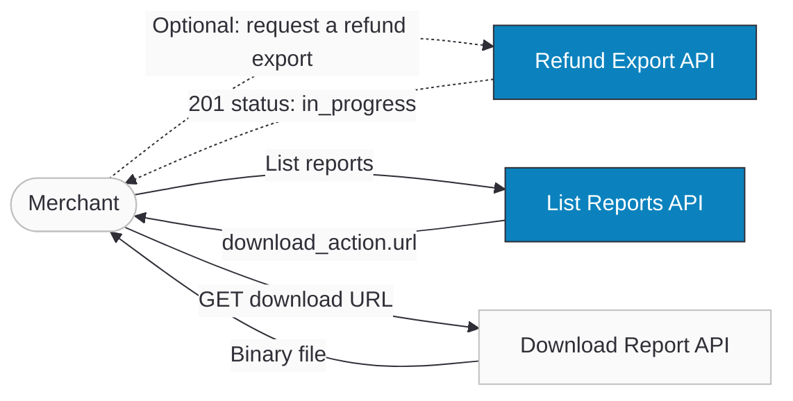

import Tabs from '@theme/Tabs';
import TabItem from '@theme/TabItem';
import CodeBlock from "@theme/CodeBlock";
import ApiDocEmbed from "@site/src/components/ApiDocEmbed";
import FAQ, { FAQItem } from '@site/src/components/FAQ';
import StepGuide from "@site/src/components/StepGuide";
import { OTTU_CONNECT_BASE_URL } from "@site/src/constants/api";

# Reports API

The Reports API lets merchants access transaction reports programmatically. It's designed for reconciliation, accounting, analytics, and compliance — without exposing any public storage links. Three secure endpoints are provided: **Generate a Refund Export** (request a new refund report on demand), **List Reports** (filtered, paginated list of finished reports with a secure download URL), and **Download Report** (authenticated binary file download).

The dashboard already shows reports, but this API enables automated systems (ERP, BI tools, finance scripts) to request, fetch, and download reports safely.

:::tip[Boost Your Integration]
Ottu offers SDKs and tools to speed up your integration. See [Getting Started](/developers/getting-started/#boost-your-integration) for all available options.
:::

## When to Use

- **Automated reconciliation** — pull transaction reports into your ERP or accounting system on a schedule.
- **Refund reconciliation** — request a refund-only export for a period and match it against your own ledger. See [Generating a Refund Export](#generating-a-refund-export).
- **Analytics pipelines** — feed reports into BI tools for trend analysis, fraud detection, or financial reporting.
- **Compliance & audit** — download reports for regulatory requirements with full audit trail.
- **Manual download fallback** — when dashboard access is unavailable or you need programmatic access.

## Setup

:::info
If you don't pass date filters, the List Reports API returns the **last 30 days** of finished reports, sorted newest first.
:::

## Guide

### Workflow



0. **Optionally request a report** — scheduled reports appear on their own, but you can also ask for a refund export on demand. See [Generating a Refund Export](#generating-a-refund-export).
1. **Call List Reports** to get available reports — filter by date, interval, or source.
2. **Pick a report** from the `results` array.
3. **Extract `download_action.url`** — a pre-signed, secure download URL with an embedded token.
4. **Call that URL** with the same authentication headers to download the file as binary.

#### Report Sources

Reports are generated in three ways:
- **Auto reports** — scheduled daily, weekly, monthly, or yearly.
- **Manual reports** — created on demand via the dashboard.
- **API reports** — created on demand by calling [Generate a Refund Export](#generating-a-refund-export).

#### Visibility & Security

- A merchant can only see **their own reports** (instance-isolated).
- Only **finished reports** are returned — in-progress reports are excluded.
- **No public or raw storage URLs** are ever exposed.
- Reports use `encrypted_id` to prevent ID enumeration.
- Every download attempt is **audit-logged** (success or failure).

#### Download Security

Download URLs are secured with multiple layers:

- **Token-based** — download tokens are UUIDs cached in Redis, not direct file paths.
- **Time-limited** — tokens expire after a configurable TTL.
- **User-bound** — each token is tied to the authenticated user who requested the list.
- **Rate-limited** — downloads are rate-limited per user to prevent abuse.
- **Ownership verification** — the server verifies the user owns the report before serving.

#### File Formats & Delivery

| Format | Content-Type | Details |
|--------|-------------|---------|
| CSV | `text/csv` | UTF-8 encoded, comma-delimited |
| XLSX | `application/vnd.openxmlformats-officedocument.spreadsheetml.sheet` | Standard Excel format |

For S3-backed storage, the download returns a `302` redirect to a pre-signed S3 URL. For local storage, the file is served via `X-Sendfile` header.

### Step-by-Step

<StepGuide steps={[
  {
    title: "List available reports",
    description: <><pre><code>{`curl -X GET "${OTTU_CONNECT_BASE_URL}/b/api/v1/reports/files/?limit=10" \\
  -H "Authorization: Api-Key your_private_api_key"`}</code></pre>The response includes completed reports, each with a secure <code>download_action.url</code>. Use query parameters (see <a href="#api-reference">API Reference</a>) to filter by date, interval, or source.</>,
  },
  {
    title: "Download a report",
    description: <>Use the <code>download_action.url</code> from the response:<br /><br /><pre><code>{`curl -X GET "https://<ottu-url>/b/api/v1/reports/files/{token}/download/" \\
  -H "Authorization: Api-Key your_private_api_key" \\
  -o report.csv`}</code></pre>The file is returned as binary (CSV or XLSX).</>,
  },
  {
    title: "Handle errors",
    description: <>
      <table>
        <thead><tr><th>HTTP</th><th>When</th></tr></thead>
        <tbody>
          <tr><td>200 + empty <code>results</code></td><td>No reports match your filters</td></tr>
          <tr><td>401</td><td>Invalid or missing credentials</td></tr>
          <tr><td>403</td><td>Basic Auth user lacks <code>report.can_view_report</code></td></tr>
          <tr><td>429</td><td>Rate limit exceeded — backoff and retry</td></tr>
        </tbody>
      </table>
    </>,
  },
]} nextSectionId="api-reference" />

## Generating a Refund Export

The two endpoints above read reports that already exist. This one **creates** one: it asks Ottu to build a report containing only your refund transactions, filtered however you like, and hands you back the report record to poll.

Use it when a scheduled report isn't the right shape — you need refunds for one currency, one gateway, one order, or one arbitrary date window, and you need it now.

### Endpoint

```
GET /b/api/v1/dashboard/refund-transactions/export/
```

The report covers transactions in the **`refunded`** and **`refund_queued`** states. These are child transactions: each one points at the original payment it refunds, which is why the `order_no` and `product_type` filters match the *parent* transaction (see [Filtering by order](#filtering-by-order)).

### Authentication

Any one of the following is accepted. See [Authentication](./getting-started/authentication.md) for how to obtain each.

| Method | Header |
|---|---|
| Private API key | `Authorization: Api-Key <your_private_api_key>` |
| Basic Auth | `Authorization: Basic <base64(user:password)>` |
| Keycloak JWT | `Authorization: Bearer <token>` |

:::tip
For unattended integrations prefer the **private API key** — it isn't tied to a dashboard user, so it survives staff changes and needs no per-user permission upkeep.
:::

### Quick Implementation

Request a CSV of every refund in January 2026, with dates read and rendered in Riyadh time:

<Tabs groupId="language">
<TabItem value="curl" label="cURL">

<CodeBlock language="bash">{`curl -G "${OTTU_CONNECT_BASE_URL}/b/api/v1/dashboard/refund-transactions/export/" \\
  -H "Authorization: Api-Key your_private_api_key" \\
  -H "X-Timezone: Asia/Riyadh" \\
  --data-urlencode "created_after=01/01/2026 00:00:00" \\
  --data-urlencode "created_before=31/01/2026 23:59:59" \\
  --data-urlencode "file_format=csv"`}</CodeBlock>

</TabItem>
<TabItem value="python" label="Python">

<CodeBlock language="python">{`import requests

response = requests.get(
    "${OTTU_CONNECT_BASE_URL}/b/api/v1/dashboard/refund-transactions/export/",
    headers={
        "Authorization": "Api-Key your_private_api_key",
        "X-Timezone": "Asia/Riyadh",
    },
    params={
        "created_after": "01/01/2026 00:00:00",
        "created_before": "31/01/2026 23:59:59",
        "file_format": "csv",
    },
    timeout=30,
)
response.raise_for_status()

report = response.json()
print(report["id"], report["status"])  # e.g. 4127 in_progress`}</CodeBlock>

</TabItem>
<TabItem value="node" label="Node.js">

<CodeBlock language="javascript">{`const params = new URLSearchParams({
  created_after: "01/01/2026 00:00:00",
  created_before: "31/01/2026 23:59:59",
  file_format: "csv",
});

const response = await fetch(
  \`${OTTU_CONNECT_BASE_URL}/b/api/v1/dashboard/refund-transactions/export/?\${params}\`,
  {
    headers: {
      Authorization: "Api-Key your_private_api_key",
      "X-Timezone": "Asia/Riyadh",
    },
  }
);

if (!response.ok) throw new Error(\`Export failed: \${response.status}\`);

const report = await response.json();
console.log(report.id, report.status); // e.g. 4127 in_progress`}</CodeBlock>

</TabItem>
<TabItem value="php" label="PHP">

<CodeBlock language="php">{`<?php
$params = http_build_query([
    'created_after'  => '01/01/2026 00:00:00',
    'created_before' => '31/01/2026 23:59:59',
    'file_format'    => 'csv',
]);

$ch = curl_init("${OTTU_CONNECT_BASE_URL}/b/api/v1/dashboard/refund-transactions/export/?$params");
curl_setopt($ch, CURLOPT_RETURNTRANSFER, true);
curl_setopt($ch, CURLOPT_HTTPHEADER, [
    'Authorization: Api-Key your_private_api_key',
    'X-Timezone: Asia/Riyadh',
]);

$report = json_decode(curl_exec($ch), true);
curl_close($ch);

echo $report['id'] . ' ' . $report['status']; // e.g. 4127 in_progress`}</CodeBlock>

</TabItem>
</Tabs>

A successful call returns **`201 Created`** with the report record:

```json title="201 Created"
{
  "id": 4127,
  "status": "in_progress",
  "type": "All",
  "file": "",
  "size": 0,
  "file_format": "csv",
  "records_amount": 0,
  "period": "01 Jan, 2026, 12:00 AM - 31 Jan, 2026, 11:59 PM",
  "created_at": "19 Aug, 2026, 10:24 AM",
  "exported_at": null,
  "username": "finance-bot",
  "report_type": "User Report"
}
```

:::warning[The file is not ready yet]
`201` means the export was **accepted and queued**, not finished. The file is built by a background worker, so `file` is empty, `size` is `0`, and `records_amount` is `0` in this first response. Do not treat an empty `file` as a failure.

Poll [List Reports](#api-reference) until the report's `status` is `finished`, then use its `download_action.url` with [Download Report](#api-reference). Large date ranges take longer — back off between polls rather than tight-looping.
:::

### Query Parameters

All parameters are optional. With none, you get every refund transaction visible to your credentials.

#### Output options

| Parameter | Type | Default | Description |
|---|---|---|---|
| `file_format` | string | `csv` | `csv` or `xlsx`. Not validated at request time — send one of the two. |
| `fields` | string | all | Comma-separated column keys, in the order you want them. Discover valid keys with an `OPTIONS` request (below). |
| `language` | string | `en` | Language of the **column headers** in the generated file. `ar` produces Arabic headers. |

#### Date filters

Each accepts `DD/MM/YYYY HH:MM:SS` (for example `31/01/2026 23:59:59`) or ISO 8601 (`2026-01-31 23:59:59`). Use either bound alone for an open-ended range.

| Parameter | Filters on |
|---|---|
| `created_after` / `created_before` | when the refund transaction was created |
| `modified_after` / `modified_before` | when it was last modified |

#### Transaction filters

| Parameter | Description |
|---|---|
| `state` | `refunded` or `refund_queued`. Omit for both. |
| `order_no` | Partial match on the **original** transaction's order number |
| `product_type` | The **original** transaction's plugin, e.g. `payment_request`, `e_commerce` |
| `currency_code` | ISO 4217 code, e.g. `KWD` |
| `gateway_code` | The gateway that processed the refund |
| `initiator` | User who initiated the refund |
| `q` | JSON-encoded search across configured search fields — `{"encrypted_field_key": "value"}`. Keys are instance-specific; read them from the `OPTIONS` response, never hardcode them. |

#### Discovering columns and timezones

Send `OPTIONS` to the same URL to get the available export columns grouped by category, plus every timezone value the endpoint accepts:

<CodeBlock language="bash">{`curl -X OPTIONS "${OTTU_CONNECT_BASE_URL}/b/api/v1/dashboard/refund-transactions/export/" \\
  -H "Authorization: Api-Key your_private_api_key"`}</CodeBlock>

```json title="OPTIONS response (abridged)"
{
  "groups": [
    {
      "label": "Transaction Info",
      "headers": [
        { "key": "order_no", "label": "Order No", "description": "Merchant order reference" },
        { "key": "amount", "label": "Amount", "description": "Transaction amount" }
      ]
    }
  ],
  "timezones": [
    { "value": "Asia/Kuwait", "label": "(UTC+03:00) Asia/Kuwait" },
    { "value": "Asia/Riyadh", "label": "(UTC+03:00) Asia/Riyadh" }
  ]
}
```

Feed the `key` values straight into `fields`, and the `value` values into `timezone`.

### Timezones

Ottu stores every transaction timestamp in UTC. Your date filters are almost certainly not in UTC — so tell the endpoint which timezone you meant.

Set **either**:

- the `X-Timezone` request header, **or**
- the `timezone` query parameter

to an [IANA timezone name](https://en.wikipedia.org/wiki/List_of_tz_database_time_zones) such as `Asia/Riyadh` or `America/New_York`.

That timezone does two jobs: it is the timezone your `created_after` / `created_before` values are **read in**, and the timezone dates are **rendered in** inside the generated file.

#### Worked example

`created_after=01/01/2026 00:00:00` is a wall-clock time with no offset. What it matches depends entirely on the timezone you declare:

| Request | Matches transactions from |
|---|---|
| `X-Timezone: Asia/Riyadh` (UTC+3) | `2025-12-31T21:00:00Z` onward |
| `X-Timezone: America/New_York` (UTC-5) | `2026-01-01T05:00:00Z` onward |
| `X-Timezone: UTC` | `2026-01-01T00:00:00Z` onward |

An eight-hour spread on the same literal request. Declare the timezone and the boundary lands where you meant it to; leave it out and the boundary is read in the **instance's** configured timezone, which is not necessarily yours — so a month-end export can quietly include or drop hours at either edge.

:::warning[The header wins]
If you send both `X-Timezone` and `?timezone=`, the **header takes priority** and the query parameter is ignored. Send one, not both, or you may filter on a timezone you didn't intend.
:::

:::note[Unknown timezone names are rejected, not ignored]
A name that isn't in the IANA database returns `400 Bad Request` — no report is created:

```json
{ "timezone": "Invalid timezone: Asia/Riyad" }
```

Validate against the `timezones` list from the `OPTIONS` response if you build the value dynamically.
:::

The same timezone is applied when the file is written, so the timestamps in the CSV or XLSX read in local time rather than UTC.

### Filtering by order

A refund is recorded as a **child** transaction of the payment it reverses. The child carries the refunded amount and state; the original order number and plugin live on the parent.

`order_no` and `product_type` therefore match against the **parent** transaction, so you can pull every refund for a given order without knowing the refund's own identifiers:

<CodeBlock language="bash">{`curl -G "${OTTU_CONNECT_BASE_URL}/b/api/v1/dashboard/refund-transactions/export/" \\
  -H "Authorization: Api-Key your_private_api_key" \\
  --data-urlencode "order_no=ORD-2026-0042" \\
  --data-urlencode "product_type=e_commerce"`}</CodeBlock>

`order_no` is a partial match, so `ORD-2026` returns every refund whose original order number contains that fragment.

### Response Fields

| Field | Type | Description |
|---|---|---|
| `id` | integer | Report identifier. Use it to recognise this report in [List Reports](#api-reference). |
| `status` | string | `in_progress`, `finished`, or `expired`. Only `finished` reports are downloadable. |
| `type` | string | Transaction types covered by the report |
| `file` | string | Secure download URL. Empty until `status` is `finished`. |
| `size` | integer | File size in bytes. `0` until the file exists. |
| `file_format` | string | `csv` or `xlsx`, echoing your request |
| `records_amount` | integer | Number of rows written. `0` until generation completes. |
| `period` | string | Date range actually covered, or `*` when the result set is empty |
| `created_at` | string | When the report was requested, `DD Mon, YYYY, HH:MM AM/PM` |
| `exported_at` | string | When generation finished. `null` while queued. |
| `username` | string | User the report belongs to |
| `report_type` | string | Report category, e.g. `User Report` |

:::note
`available_until` — the report's expiry — is **not** part of this response. It is computed by [List Reports](#api-reference), so read it there once the report is finished.
:::

### Error Handling

Filter validation happens before anything is queued, so a rejected request creates **no report** — there is nothing to clean up after a `400`.

| HTTP | Body | Cause | Remedy |
|---|---|---|---|
| `400` | `{"timezone": "Invalid timezone: <value>"}` | `X-Timezone` or `?timezone=` is not an IANA name | Use a value from the `OPTIONS` response's `timezones` list |
| `400` | `{"created": ["Enter a valid date/time."]}` | A date filter isn't `DD/MM/YYYY HH:MM:SS` or ISO 8601 | Fix the format. The key is the filter's base name (`created`, `modified`), not `created_after`. |
| `400` | `{"state": ["Select a valid choice. paid is not one of the available choices."]}` | `state` is something other than `refunded` or `refund_queued` | This endpoint only reports refunds — use one of the two, or omit it |
| `401` | `{"detail": "Authentication credentials were not provided."}` | Missing or malformed `Authorization` header | Send `Api-Key`, Basic, or Bearer credentials |
| `403` | `{"detail": "You do not have permission to perform this action."}` | Credentials are valid but lack refund visibility | Ask your admin for the `view_all_transactions` permission |

:::tip
Note the `400` key for a bad date. Send `created_after=nope` and the error comes back under **`created`**, not `created_after` — both bounds share one underlying filter. Map it back to whichever bound you sent.
:::

## API Reference

<Tabs groupId="reports-api" queryString>
<TabItem value="list" label="List Reports">

<ApiDocEmbed path="list-reports.api.mdx" />

</TabItem>
<TabItem value="download" label="Download Report">

<ApiDocEmbed path="download-report.api.mdx" />

</TabItem>
</Tabs>

## Best Practices

#### Use API Key for automation

API Key auth is more stable and doesn't require per-user permission management for system integrations.

#### Always filter by date

Avoid pulling large histories unintentionally. Use `created_after` and `created_before` to fetch only the period you need.

#### Respect pagination

Use `limit` and `offset` (or cursor) until `next` is null. Don't assume all results fit in one response.

#### Handle empty results

A valid response can return zero reports:

```json
{ "count": 0, "next": null, "previous": null, "results": [] }
```

#### Log download tracking

Even though Ottu logs every download, your system should store the report ID, download time, and success state for your own audit trail.

#### Retry safely

On `429 rate_limited`, implement exponential backoff before retrying.

#### Always declare a timezone when exporting

If your date filters come from a human or a local scheduler, send `X-Timezone`. Without it the boundaries are read in the instance's timezone, which quietly shifts a month-end export by hours. See [Timezones](#timezones).

#### Poll, don't assume

A `201` from the refund export means *queued*, not *ready*. Record the returned `id`, then poll List Reports until that report's `status` is `finished` before attempting a download.

## FAQ

<FAQ>
  <FAQItem question="Can I download reports without listing them first?">
    Technically yes, if you stored the download token previously. But listing first is the safest way to discover available reports and get fresh tokens.
  </FAQItem>

  <FAQItem question="Why don't I see reports that are still generating?">
    The List Reports API returns **finished reports only** to keep results correct and queries fast.
  </FAQItem>

  <FAQItem question="What happens if I don't pass date filters?">
    The API returns reports from the **last 30 days**, newest first.
  </FAQItem>

  <FAQItem question="Can I share download links publicly?">
    No. Download URLs are secure, tokenized, time-limited, and require authentication. They are not permanent or public.
  </FAQItem>

  <FAQItem question="What errors should I expect?">
    | HTTP | Code | Message | When |
    |------|------|---------|------|
    | 400 | `invalid_parameters` | Bad filters | `created_before` < `created_after` |
    | 401 | `unauthorized` | Invalid/missing auth | Header missing or wrong |
    | 403 | `forbidden` | Insufficient permissions | Basic Auth user lacks `report.can_view_report` |
    | 404 | `not_found` | Report not found | Wrong or inaccessible token |
    | 429 | `rate_limited` | Too many requests | Rate limit exceeded |
  </FAQItem>

  <FAQItem question="I'm using Basic Auth but getting 403 — why?">
    Your user is missing `report.can_view_report`. Ask your admin to enable report API access.
  </FAQItem>

  <FAQItem question="Are downloads logged even if they fail?">
    Yes. Every attempt is logged with outcome status for audit compliance.
  </FAQItem>

  <FAQItem question="The refund export returned 201 but `file` is empty — did it fail?">
    No. Generation is asynchronous. `201` means the export was queued; `file`, `size`, and `records_amount` stay empty until a background worker finishes writing it. Poll [List Reports](#api-reference) until the report's `status` is `finished`.
  </FAQItem>

  <FAQItem question="I sent both X-Timezone and ?timezone= — which one applies?">
    The **header**. `X-Timezone` takes priority and the query parameter is ignored. Send one, not both.
  </FAQItem>

  <FAQItem question="Why does my refund export miss transactions at the start of the month?">
    Almost always a timezone boundary. `created_after=01/01/2026 00:00:00` with no timezone declared is not the same instant as midnight where you are — in Riyadh (UTC+3) that literal request starts three hours *earlier* in UTC than you intended. Send `X-Timezone` and see [the worked example](#worked-example).
  </FAQItem>

  <FAQItem question="Can I filter refunds by the original order number?">
    Yes. `order_no` and `product_type` match the **parent** transaction, so `?order_no=ORD-2026-0042` returns every refund against that order. Matching is partial. See [Filtering by order](#filtering-by-order).
  </FAQItem>

  <FAQItem question="Why did my date filter come back as an error on `created`?">
    Both bounds share one underlying filter, so a malformed `created_after` or `created_before` is reported under the key `created`. Same for `modified_after` / `modified_before` → `modified`.
  </FAQItem>
</FAQ>

## What's Next?

- [**Checkout API**](./payments/checkout-api.mdx) — Create payment transactions that appear in reports
- [**Operations**](./operations.md) — Refund, capture, or void transactions
- [**Authentication**](./getting-started/authentication.md) — Private API keys, Basic Auth, and JWT setup
- [**API Fundamentals**](./getting-started/api-fundamentals.md) — Request/response conventions, pagination, currencies
