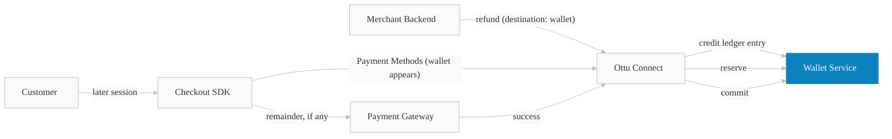

# Wallet Public Documentation Implementation Plan

> **For agentic workers:** REQUIRED SUB-SKILL: Use superpowers:subagent-driven-development (recommended) or superpowers:executing-plans to implement this plan task-by-task. Steps use checkbox (`- [ ]`) syntax for tracking.

**Goal:** Ship public docs for the Wallet feature covering developers and merchants, including a new `developers/payments/wallet/` page, a Wallet section inside Checkout SDK pages, a refund-to-wallet subsection in operations.md, a four-page `business/wallet/` section, an interactive `<WalletDemo />` component, and OpenAPI schema enrichments for the new fields and read APIs.

**Architecture:** Content lives in Docusaurus MDX/Markdown pages. The dev-side wallet page is self-contained with `<ApiDocEmbed>` tabs for the three read APIs. SDK pages use the existing `<StepGuide>` carousel for compact horizontal step display. The `<WalletDemo />` React component mirrors the existing `<CheckoutDemo />` pattern: a `BrowserOnly` wrapper around a state machine that seeds a wallet via a sandbox utility, then mounts the Checkout SDK. Schema enrichments overlay onto the auto-generated OpenAPI docs via the existing `static/api-enrichments/` pipeline.

**Tech Stack:** Docusaurus 3.8.1, TypeScript, MDX, React, `docusaurus-plugin-openapi-docs`, `<StepGuide>` (existing), `<CheckoutDemo>` (reference pattern), CSS modules.

**Sequencing dependency:** Connect must ship the refund operation `destination` field (subticket 150893) and the wallet API proxy endpoints (subticket 150892) before Tasks 19 and 22 produce visible output in `<ApiDocEmbed>`. Markdown content and enrichment YAML can be drafted in advance; final `npm run update-api` runs once Connect lands.

**Spec:** [`docs/superpowers/specs/2026-05-11-wallet-public-docs-design.md`](../specs/2026-05-11-wallet-public-docs-design.md)

---

## Task 1: Scaffold directories and placeholder images

**Files:**
- Create: `docs/developers/payments/wallet/` (directory)
- Create: `docs/business/wallet/` (directory)
- Create: `static/img/developers/wallet/` (directory)
- Create: `static/img/business/wallet/` (directory)
- Create: `static/img/developers/wallet/.gitkeep`
- Create: `static/img/business/wallet/.gitkeep`

- [ ] **Step 1: Create the four directories**

Run:
```bash
mkdir -p docs/developers/payments/wallet docs/business/wallet static/img/developers/wallet static/img/business/wallet
```

- [ ] **Step 2: Add `.gitkeep` to image folders so git tracks them**

Run:
```bash
touch static/img/developers/wallet/.gitkeep static/img/business/wallet/.gitkeep
```

- [ ] **Step 3: Verify the directories exist**

Run:
```bash
ls -la docs/developers/payments/wallet/ docs/business/wallet/ static/img/developers/wallet/ static/img/business/wallet/
```

Expected: each directory listed, image folders contain `.gitkeep`.

- [ ] **Step 4: Commit**

```bash
git add static/img/developers/wallet/.gitkeep static/img/business/wallet/.gitkeep
git commit -m "chore: scaffold wallet documentation directories"
```

---

## Task 2: Add glossary terms

**Files:**
- Modify: `src/data/glossary-terms.ts`

- [ ] **Step 1: Open the glossary file and locate the array of terms**

Run:
```bash
grep -n "^export\|name:" src/data/glossary-terms.ts | head -20
```

Note the structure: each term is an object with at least `name` and `definition` fields. Match the existing shape exactly when adding new ones.

- [ ] **Step 2: Add three new entries in alphabetical position (between existing entries starting with letters near "W")**

Find the existing array entry closest to "W" alphabetically. Insert these three entries in order:

```typescript
{
  name: 'Wallet',
  definition: 'A stored balance held by Ottu for a customer in a specific currency, used as a payment method at checkout. Wallet accounts are keyed by merchant, customer, and currency; each currency maintains a separate balance.',
},
{
  name: 'Wallet Credit',
  definition: 'An immutable ledger entry that adds funds to a wallet, typically issued via a refund-to-wallet operation. Credits cannot be edited or deleted; corrections are made by issuing an opposing entry.',
},
{
  name: 'Wallet Reservation',
  definition: 'A temporary hold on wallet funds during checkout. Reservations commit on payment success and are automatically released approximately four hours after an abandoned, cancelled, or failed payment.',
},
```

Match the existing entries' formatting (trailing commas, quote style, line breaks).

- [ ] **Step 3: Run typecheck**

Run:
```bash
npm run typecheck
```

Expected: no errors.

- [ ] **Step 4: Commit**

```bash
git add src/data/glossary-terms.ts
git commit -m "docs(glossary): add Wallet, Wallet Credit, Wallet Reservation terms"
```

---

## Task 3: Add Wallet entries to sidebars

**Files:**
- Modify: `sidebars.ts:113-122` (Native Payments block, insert Wallet after it)
- Modify: `sidebars.ts:286-292` (Payment Management block in businessSidebar, insert Wallet after it)

- [ ] **Step 1: Add developer Wallet category in `developerSidebar` → Payments**

Open `sidebars.ts`. Find the `Native Payments` category block (around line 113-122). Immediately after the closing `},` of that block, add this new category block:

```typescript
{
  type: 'category',
  label: 'Wallet',
  link: {type: 'doc', id: 'developers/payments/wallet/index'},
  items: [
    {type: 'link', label: 'When to Use',     href: '/developers/payments/wallet#when-to-use'},
    {type: 'link', label: 'Guide',           href: '/developers/payments/wallet#guide'},
    {type: 'link', label: 'API Reference',   href: '/developers/payments/wallet#api-reference'},
    {type: 'link', label: 'Best Practices',  href: '/developers/payments/wallet#best-practices'},
    {type: 'link', label: 'FAQ',             href: '/developers/payments/wallet#faq'},
  ],
},
```

The block must sit between `Native Payments` and `Checkout SDK`.

- [ ] **Step 2: Add business Wallet category in `businessSidebar`**

In the same file, find the `Payment Management` category block (around line 285-293). Immediately after the closing `},` of that block, add this:

```typescript
{
  type: 'category',
  label: 'Wallet',
  link: {type: 'doc', id: 'business/wallet/index'},
  items: [
    'business/wallet/index',
    'business/wallet/refund-to-wallet',
    'business/wallet/using-wallet-at-checkout',
    'business/wallet/reporting',
  ],
},
```

The block must sit between `Payment Management` and `Plugins`.

- [ ] **Step 3: Run typecheck**

Run:
```bash
npm run typecheck
```

Expected: no errors. (The sidebar references doc IDs that don't exist yet; Docusaurus only validates at build time, not type-check time.)

- [ ] **Step 4: Commit**

```bash
git add sidebars.ts
git commit -m "docs(sidebars): add Wallet category to developer and business sidebars"
```

---

## Task 4: Write `business/wallet/index.md` (Wallet Overview)

**Files:**
- Create: `docs/business/wallet/index.md`

- [ ] **Step 1: Create the file with full content**

```markdown
---
title: Wallet
sidebar_label: Wallet
---

# Wallet

Wallet is a stored balance you can grant to a customer in any currency you accept. Once a customer has wallet credit, they can spend it at checkout — fully or partially — on any future order with your business.

## Why use Wallet

- **Refund without returning funds to the original card.** Useful when cards expire, or when you want to issue store credit instead of cash back.
- **Issue goodwill credit or promotional balances** without payment-gateway fees.
- **Reduce PG fees on future orders.** Customers spend wallet credit first; card only covers the remainder.

## How it works

1. **Customer pays for an order** using any payment method.
2. **You refund to wallet** instead of refunding to their card — one action in the dashboard.
3. **Customer returns** for a future order with your business.
4. **They pay with wallet** — fully if the balance covers it, partially with another method otherwise.

## When wallet is offered to the customer

The wallet shows up as a payment method when **both** conditions are met:

- The customer has positive balance in the same currency as the order.
- The order is set to capture immediately. Authorize-only orders do not show wallet.

:::warning Cross-currency wallet payments are not supported
A KWD wallet cannot be used to pay a SAR order, and vice versa. Each currency maintains a separate wallet balance.
:::

## Things to know

- **One wallet per currency.** A customer who buys in both KWD and SAR has two separate wallet balances.
- **No PII.** The wallet service stores only the customer ID and balance — no card details, no personal information.
- **Automatic release.** If a customer abandons checkout, their reserved wallet funds are released automatically after about four hours. No action required from you.
- **Immutable history.** Every credit, debit, and reservation is recorded permanently. Corrections are made by adding an opposing entry — never by editing the original.
- **No expiry.** Wallet credit does not expire today.

## What's Next?

- [Refund to wallet](./refund-to-wallet) — the dashboard workflow.
- [Wallet at checkout](./using-wallet-at-checkout) — what the customer sees.
- [Wallet reporting](./reporting) — viewing balances and ledger.
- [Wallet for developers](/developers/payments/wallet/) — API and SDK integration.
```

- [ ] **Step 2: Run build to verify links and markdown**

Run:
```bash
npm run build 2>&1 | tail -30
```

Expected: build succeeds; warnings for the not-yet-created sibling pages are acceptable at this stage but will go away after Tasks 5-7.

- [ ] **Step 3: Commit**

```bash
git add docs/business/wallet/index.md
git commit -m "docs(business): add wallet overview page"
```

---

## Task 5: Write `business/wallet/refund-to-wallet.md`

**Files:**
- Create: `docs/business/wallet/refund-to-wallet.md`

- [ ] **Step 1: Create the file with full content**

```markdown
---
title: Refund to Wallet
sidebar_label: Refund to Wallet
---

import StepGuide from "@site/src/components/StepGuide";

# Refund to Wallet

Refunding to wallet credits the customer's wallet balance instead of returning funds through the payment gateway. The customer can spend the credit on their next order.

## When to use this

- The customer's card has expired and a gateway refund would fail.
- You want to issue store credit, loyalty, or goodwill credit without payment-gateway fees.
- You are processing a goodwill compensation that wasn't tied to a specific payment.

## Workflow

<StepGuide steps={[
  {
    title: "Open the transaction",
    description: <>From <strong>Payment Management</strong>, open the paid transaction you want to refund.</>,
    image: "/img/business/wallet/refund-01-transaction.png",
    imageAlt: "Paid transaction opened in Payment Management",
  },
  {
    title: "Click Refund",
    description: <>Use the <strong>Refund</strong> button in the operations panel.</>,
    image: "/img/business/wallet/refund-02-refund-button.png",
    imageAlt: "Refund button highlighted in the operations panel",
  },
  {
    title: "Choose destination: Wallet",
    description: <>In the refund dialog, switch destination from <strong>Original Gateway</strong> to <strong>Wallet</strong>.</>,
    image: "/img/business/wallet/refund-03-destination.png",
    imageAlt: "Refund dialog with Wallet destination selected",
  },
  {
    title: "Confirm amount and submit",
    description: <>Enter the full or partial refund amount, add an optional reason, and click <strong>Confirm</strong>. The wallet balance is credited immediately.</>,
    image: "/img/business/wallet/refund-04-confirm.png",
    imageAlt: "Confirming the wallet refund amount",
  },
  {
    title: "See the confirmation",
    description: <>A success banner shows the new wallet balance for the customer. The refund appears in both the transaction history and the wallet ledger.</>,
    image: "/img/business/wallet/refund-05-success.png",
    imageAlt: "Refund-to-wallet success banner showing new balance",
  },
]} />

## What customers see

The next time the customer reaches checkout in your store (same currency), they'll see **Wallet (X.XXX KWD)** as a payment method. For the full customer-side flow, see [Wallet at checkout](./using-wallet-at-checkout).

## FAQ

#### Can I refund partial amounts to wallet?

Yes. Enter any amount up to the original payment amount.

#### Can I refund to a wallet that doesn't exist yet?

Yes. If the customer has no wallet account for that currency, one is created automatically on the first refund.

#### Can I undo a refund-to-wallet?

You cannot edit or delete the original credit — wallet history is immutable. You can issue an opposing debit entry (a reversal) to offset it. Contact [csd@ottu.com](mailto:csd@ottu.com) if you need help raising a reversal.

#### Does the customer get notified?

No, customers are not notified automatically when a wallet credit is issued today. If you want to notify them, message them through your own channels.

## What's Next?

- [Wallet at checkout](./using-wallet-at-checkout) — what the customer sees when paying.
- [Wallet reporting](./reporting) — auditing wallet balances and history.
```

- [ ] **Step 2: Run build**

Run:
```bash
npm run build 2>&1 | tail -30
```

Expected: build succeeds.

- [ ] **Step 3: Commit**

```bash
git add docs/business/wallet/refund-to-wallet.md
git commit -m "docs(business): add refund-to-wallet dashboard workflow"
```

---

## Task 6: Write `business/wallet/using-wallet-at-checkout.md`

**Files:**
- Create: `docs/business/wallet/using-wallet-at-checkout.md`

- [ ] **Step 1: Create the file with full content**

```markdown
---
title: Wallet at Checkout
sidebar_label: Wallet at Checkout
---

import StepGuide from "@site/src/components/StepGuide";

# Wallet at Checkout

This page explains what your customer sees when they have a wallet balance and reach checkout — so you can answer support questions and design messaging on your own site.

## The customer's experience

<StepGuide steps={[
  {
    title: "Wallet appears as a method",
    description: <>If the customer has balance in the order currency, <strong>Wallet (X.XXX KWD)</strong> shows up alongside other payment methods.</>,
    image: "/img/business/wallet/checkout-01-method.png",
    imageAlt: "Checkout showing Wallet as a payment method",
  },
  {
    title: "Full coverage",
    description: <>If the wallet balance is enough to cover the order, only the order amount is deducted. Any surplus stays in the wallet for the next order.</>,
    image: "/img/business/wallet/checkout-02-full.png",
    imageAlt: "Wallet fully covering the order amount",
  },
  {
    title: "Partial coverage",
    description: <>If the balance is smaller than the order, the customer is prompted to choose a second method for the remainder. Both payments confirm together at submit.</>,
    image: "/img/business/wallet/checkout-03-partial.png",
    imageAlt: "Wallet plus another method for partial coverage",
  },
  {
    title: "Reservation while paying",
    description: <>Wallet funds are reserved the moment the customer hits <strong>Pay</strong> — they cannot be spent twice in parallel sessions.</>,
    image: "/img/business/wallet/checkout-04-reservation.png",
    imageAlt: "Reservation hold placed on wallet funds during payment",
  },
  {
    title: "Automatic release",
    description: <>If the customer abandons checkout or the payment fails, the reservation is released automatically after about four hours. No action is needed from your team.</>,
    image: "/img/business/wallet/checkout-05-release.png",
    imageAlt: "Reserved wallet funds released automatically after four hours",
  },
]} />

:::note Reservation auto-release
If a customer abandons, cancels, or fails a payment, the reserved wallet amount is restored to their balance about **four hours** later. The wait is intentional — it gives slow gateway confirmations time to land. There is no human in the loop.
:::

## Rules customers cannot change

- They cannot choose how much wallet credit to apply — Ottu deducts the required amount automatically, no more.
- They cannot transfer credit between currencies — each currency has its own wallet.
- They cannot use wallet on authorize-only orders. Wallet supports immediate-capture flows only.

:::warning Cross-currency wallet payments are not supported
The wallet only appears when its currency matches the order currency.
:::

## What you can do

- Display the customer's wallet balance on your own site or app — call the [Wallet Accounts API](/developers/payments/wallet/#api-reference).
- Refund any future order to the same wallet to top it up.
- View full credit and debit history per customer in [Wallet reporting](./reporting).

## FAQ

#### Why doesn't wallet show for some orders?

The order may be authorize-only, the customer may have zero balance in that currency, or the `customer_id` may differ between sessions. Check the order's `customer_id` matches the wallet's.

#### What happens if the customer disputes the original payment after the refund-to-wallet?

Disputes can be resolved manually. Contact [csd@ottu.com](mailto:csd@ottu.com) to raise a reversal.

#### Does wallet credit expire?

No, wallet credit does not expire today.

#### If a customer cancels or their payment fails, when do they get their wallet credit back?

Reserved wallet funds are automatically restored about four hours after an abandoned, cancelled, or failed payment. No action is needed.

## What's Next?

- [Refund to wallet](./refund-to-wallet) — issuing wallet credits.
- [Wallet reporting](./reporting) — auditing balances and history.
```

- [ ] **Step 2: Run build**

Run:
```bash
npm run build 2>&1 | tail -30
```

Expected: build succeeds.

- [ ] **Step 3: Commit**

```bash
git add docs/business/wallet/using-wallet-at-checkout.md
git commit -m "docs(business): add wallet-at-checkout customer experience page"
```

---

## Task 7: Write `business/wallet/reporting.md`

**Files:**
- Create: `docs/business/wallet/reporting.md`

- [ ] **Step 1: Create the file with full content**

```markdown
---
title: Wallet Reporting
sidebar_label: Wallet Reporting
---

import StepGuide from "@site/src/components/StepGuide";

# Wallet Reporting

The dashboard provides three screens for tracking wallet activity: **Accounts**, **Ledger**, and **Operations**.

## Accounts screen

Lists every customer who has a wallet account with your business, with current balance per currency.

<StepGuide steps={[
  {
    title: "Open Wallet → Accounts",
    description: <>From the main navigation, go to <strong>Wallet → Accounts</strong>.</>,
    image: "/img/business/wallet/reporting-01-accounts.png",
    imageAlt: "Wallet Accounts screen in the dashboard",
  },
  {
    title: "Search and filter",
    description: <>Filter by customer ID, currency, or balance range. Sort by balance to find top-credit customers.</>,
    image: "/img/business/wallet/reporting-02-filter.png",
    imageAlt: "Filter and sort controls on the Accounts screen",
  },
  {
    title: "Open an account",
    description: <>Click any row to open the account's full ledger history for that customer and currency.</>,
    image: "/img/business/wallet/reporting-03-detail.png",
    imageAlt: "Individual wallet account ledger view",
  },
]} />

## Ledger screen

Shows every credit, debit, and reservation entry for an account. Entries are immutable — they cannot be edited or deleted. Corrections are made via reversals.

Each entry shows:

- **Entry ID** — unique identifier for the ledger row.
- **Type** — `credit`, `debit`, or `reservation`.
- **Amount** — signed amount in the wallet currency.
- **Balance after** — wallet balance immediately after this entry.
- **Funding source** — `refund_from_payment`, `manual_adjustment`, `promo`, or `goodwill` for credits.
- **Linked session** — the original payment session this entry references, if any.
- **Timestamp** — when the entry was recorded.

[Screenshot placeholder: `/img/business/wallet/reporting-04-ledger.png` — Ledger screen with columns visible]

## Operations screen

Lists individual wallet operations (a single credit, debit, or reservation cycle) across all accounts. Useful for audit and reconciliation.

[Screenshot placeholder: `/img/business/wallet/reporting-05-operations.png` — Operations screen with filters and operation rows]

Filter by:

- Operation type (credit / debit / reservation / commit / release)
- Customer ID
- Currency
- Date range
- Linked session ID

## Exporting

You can export Accounts, Ledger, or Operations data as **CSV** or **XLSX** for offline analysis and accounting.

[Screenshot placeholder: `/img/business/wallet/reporting-06-export.png` — Export dropdown showing CSV and XLSX options]

## FAQ

#### Can I edit a wallet entry?

No. Entries are immutable. To correct an error, issue a reversal — an opposing debit or credit. Contact [csd@ottu.com](mailto:csd@ottu.com) for help.

#### Can I close a customer's wallet?

No. A wallet account opens automatically on the first refund-to-wallet and behaves as non-existent when the balance is zero — no maintenance needed.

#### How do I find the original payment behind a wallet credit?

Open the ledger entry — the **Linked session** field gives you the original payment's `session_id`. Click it to jump to the payment in Payment Management.

## What's Next?

- [Refund to wallet](./refund-to-wallet) — issuing credits.
- [Wallet at checkout](./using-wallet-at-checkout) — the customer-side flow.
- [Wallet for developers](/developers/payments/wallet/) — querying balances and history programmatically.
```

- [ ] **Step 2: Run build**

Run:
```bash
npm run build 2>&1 | tail -30
```

Expected: build succeeds. All four business pages now resolve their internal links.

- [ ] **Step 3: Commit**

```bash
git add docs/business/wallet/reporting.md
git commit -m "docs(business): add wallet reporting screens page"
```

---

## Task 8: Write `developers/payments/wallet/index.mdx`

**Files:**
- Create: `docs/developers/payments/wallet/index.mdx`

- [ ] **Step 1: Create the file with full content (WalletDemo import will be added in Task 18; for now use a placeholder)**

```mdx
---
title: Wallet
description: Customer wallet credits — refund, store, and spend balances at checkout.
toc_min_heading_level: 2
toc_max_heading_level: 3
hide_table_of_contents: true
---

import Tabs from "@theme/Tabs";
import TabItem from "@theme/TabItem";
import ApiDocEmbed from "@site/src/components/ApiDocEmbed";

# Wallet

Wallet lets you refund customer payments to a stored balance keyed by merchant, customer, and currency, then let the customer spend that credit at any future Ottu checkout in the same currency. No PII is stored on the wallet service.

Authentication for merchant-facing endpoints follows the standard [Ottu API key](/developers/getting-started/authentication) flow — the same key you use for the [Checkout API](../checkout-api). Service-to-service auth between Ottu Connect and the wallet service uses OAuth 2.0 internally and is invisible to merchants.

:::tip Boost Your Integration
Ottu offers SDKs and tools to speed up your integration. See [Getting Started](../../getting-started/#boost-your-integration) for all available options.
:::

## When to Use

- Refunding without returning funds to the original card or gateway — loyalty, goodwill, or voucher use cases.
- Letting customers carry over balance between sessions.
- Reducing payment-gateway fees by spending wallet credit before charging a card.
- Multi-currency merchants — each currency maintains its own wallet account.

## Guide

### Workflow



1. **Merchant refunds to wallet** — the refund operation accepts `destination: "wallet"`, which credits the customer's wallet instead of reversing through the gateway.
2. **Customer returns** — at the next checkout, the wallet service confirms positive balance in the order currency.
3. **Wallet appears as a method** — the SDK renders "Wallet (X.XXX CCC)" alongside other payment options.
4. **Reservation on submit** — when the customer pays, the required amount is reserved. Any shortfall is collected from a second method.
5. **Commit or release** — on success the reservation commits to a debit entry; on abandon, cancel, or failure it auto-releases after about four hours.

### Live Demo

The interactive demo seeds a wallet on the fly for a fresh customer, then launches the Checkout SDK with wallet enabled. It will be wired in once the demo component is implemented — see [Wallet for merchants](/business/wallet/) for screenshots of the flow.

{/* <WalletDemo /> — added in Task 18 */}

### Step-by-Step

#### 1. Discover wallet availability for a customer

Call the [Payment Methods API](../payment-methods) with the `customer_id` for the session. When the customer has positive balance in the session currency, a payment method with `type: "wallet"` appears in the response.

<Tabs groupId="language">
<TabItem value="curl" label="cURL">

```bash title="Discover wallet availability"
curl -X POST https://yourdomain.ottu.com/b/checkout/v1/pymt-txn/payment-methods/ \
  -H "Authorization: Api-Key YOUR_API_KEY" \
  -H "Content-Type: application/json" \
  -d '{
    "customer_id": "cust_abc123",
    "currency_code": "KWD",
    "amount": "15.000"
  }'
```

</TabItem>
<TabItem value="python" label="Python">

```python title="Discover wallet availability"
import requests

response = requests.post(
    "https://yourdomain.ottu.com/b/checkout/v1/pymt-txn/payment-methods/",
    headers={
        "Authorization": "Api-Key YOUR_API_KEY",
        "Content-Type": "application/json",
    },
    json={
        "customer_id": "cust_abc123",
        "currency_code": "KWD",
        "amount": "15.000",
    },
)
methods = response.json()
```

</TabItem>
<TabItem value="node" label="Node.js">

```javascript title="Discover wallet availability"
const response = await fetch(
  "https://yourdomain.ottu.com/b/checkout/v1/pymt-txn/payment-methods/",
  {
    method: "POST",
    headers: {
      Authorization: "Api-Key YOUR_API_KEY",
      "Content-Type": "application/json",
    },
    body: JSON.stringify({
      customer_id: "cust_abc123",
      currency_code: "KWD",
      amount: "15.000",
    }),
  }
);
const methods = await response.json();
```

</TabItem>
<TabItem value="php" label="PHP">

```php title="Discover wallet availability"
$response = file_get_contents(
    'https://yourdomain.ottu.com/b/checkout/v1/pymt-txn/payment-methods/',
    false,
    stream_context_create([
        'http' => [
            'method' => 'POST',
            'header' => "Authorization: Api-Key YOUR_API_KEY\r\nContent-Type: application/json\r\n",
            'content' => json_encode([
                'customer_id' => 'cust_abc123',
                'currency_code' => 'KWD',
                'amount' => '15.000',
            ]),
        ],
    ])
);
$methods = json_decode($response, true);
```

</TabItem>
</Tabs>

#### 2. Initialize Checkout with wallet enabled

Pass the `customer_id` when creating the session. On the SDK side, wallet appears automatically when the customer has positive balance — no extra init config is required beyond including `'wallet'` in `formsOfPayment` (or omitting `formsOfPayment` to show all methods).

```javascript title="Checkout SDK init with wallet enabled"
Checkout.init({
  selector: "checkout",
  merchant_id: "yourdomain.ottu.com",
  apiKey: "YOUR_API_PUBLIC_KEY",
  session_id: "sess_9f8e7d6c5b4a",
  formsOfPayment: ["wallet", "ottu_sandbox"], // or omit to show all
});
```

#### 3. Customer applies wallet credit at checkout

The SDK reserves the required amount (or the full balance, whichever is lower). If the session amount exceeds the wallet balance, the customer is prompted to pick a second method for the remainder. On submit, all reservations confirm together. On success the wallet entry commits; on cancel, error, or four-hour timeout it auto-releases.

#### 4. Read wallet state from your backend

Use the three read APIs (see [API Reference](#api-reference)) to display balance, transaction history, or specific operations in your own UI.

### Use Cases

#### Partial payments (wallet plus another method)

Three balance-versus-amount cases:

| Wallet balance vs amount | Behavior |
|---|---|
| Balance ≥ amount | Only `amount` is deducted. Surplus stays in the wallet. |
| Balance == amount | Wallet fully covers; balance becomes 0. |
| Balance &lt; amount | Full balance is consumed; customer pays the difference with another method. |

Customers cannot choose how much wallet credit to apply — Ottu computes it automatically.

#### Reservation lifecycle

- **Reserved** when the customer submits payment.
- **Committed** on payment success.
- **Released automatically** about four hours after an abandoned, cancelled, or failed payment. No human intervention.

#### Wallet hidden for authorize-only sessions

When the session is configured for authorization-only (no immediate capture), wallet is not offered as a payment method. Wallet supports immediate-capture flows only.

#### Refunding to wallet

See [Refund to Wallet](../../operations#refund-to-wallet) on the Operations page for the full API and behavior. The refund endpoint accepts `destination: "wallet"` to credit the wallet instead of reversing through the gateway.

:::warning Cross-currency wallet payments are not supported
A KWD wallet cannot be used to pay a SAR order, and vice versa. Each currency maintains a separate wallet account.
:::

## API Reference

Three read APIs let you query wallet state from your backend. All three accept the standard Ottu API key authentication.

<Tabs>
  <TabItem value="accounts" label="List Wallet Accounts">
    <ApiDocEmbed path="developers/apis/wallet-accounts-list" />
  </TabItem>
  <TabItem value="ledger" label="List Ledger Entries">
    <ApiDocEmbed path="developers/apis/wallet-ledger-list" />
  </TabItem>
  <TabItem value="operation" label="Get Operation by ID">
    <ApiDocEmbed path="developers/apis/wallet-operation-retrieve" />
  </TabItem>
</Tabs>

## Best Practices

- **Discover per session.** Always call [Payment Methods API](../payment-methods) per session — don't assume balance from a prior call.
- **Display balance fresh.** Call List Accounts on page load if you show balance in your own UI. Cache only briefly; balance changes on every payment.
- **Append-only ledger.** Never derive balance client-side from history — rely on the Accounts endpoint for authoritative balance.
- **Match the currency.** For multi-currency merchants, present the wallet matching the session currency only.

## FAQ

#### Can a customer choose how much wallet credit to apply?

No. Ottu computes the amount automatically based on session amount versus balance.

#### What happens to a reservation if the customer abandons checkout?

It is automatically released about four hours after the abandoned, cancelled, or failed payment. No human intervention is required.

#### Is wallet available for authorization-only payments?

No. Wallet supports immediate-capture sessions only.

#### Where does refund-to-wallet data go?

The original payment session is linked to the wallet credit entry, visible in both the wallet ledger and the operation log.

#### Does the wallet store any customer PII?

No. The service holds only ledger entries scoped by `merchant_id`, `customer_id`, and `currency`.

#### Does wallet credit expire?

No. Wallet credit does not expire today.

## What's Next?

- [Refund to Wallet (Operations)](../../operations#refund-to-wallet) — the refund API change that creates wallet credits.
- [Checkout SDK — Wallet section](../checkout-sdk/web#wallet) — how wallet appears in the SDK.
- [Payment Methods API](../payment-methods) — discovering available payment methods.
- [Wallet for merchants](/business/wallet/) — business-side documentation.
```

- [ ] **Step 2: Run build**

Run:
```bash
npm run build 2>&1 | tail -30
```

Expected: build succeeds. Two `<ApiDocEmbed>` paths reference auto-generated MDX that doesn't exist yet — Docusaurus will emit a warning but the page renders without them. Final wiring happens in Task 22.

- [ ] **Step 3: Commit**

```bash
git add docs/developers/payments/wallet/index.mdx
git commit -m "docs(developers): add wallet integration page with workflow and read APIs"
```

---

## Task 9: Add Wallet StepGuide section to `web.mdx`

**Files:**
- Modify: `docs/developers/payments/checkout-sdk/web.mdx`

- [ ] **Step 1: Locate insertion point**

Run:
```bash
grep -n "^## Wallet Configuration\|^## Onsite Checkout\|^import StepGuide" docs/developers/payments/checkout-sdk/web.mdx
```

The `## Wallet` section must sit between `## Wallet Configuration` and `## Onsite Checkout`.

- [ ] **Step 2: Add the StepGuide import**

At the top of `web.mdx`, near the existing imports (around lines 6-10), add this line if it's not already present:

```mdx
import StepGuide from "@site/src/components/StepGuide";
```

- [ ] **Step 3: Insert the `## Wallet` section before `## Onsite Checkout`**

Find the line `## Onsite Checkout` in `web.mdx`. Immediately before it, paste this block:

````mdx
## Wallet

When a customer has wallet credit in the session currency, the SDK renders a **Wallet** payment method automatically — no init config is required. Pass the `customer_id` when creating the session, and either include `'wallet'` in `formsOfPayment` or omit `formsOfPayment` to show all available methods. Wallet is hidden for authorize-only sessions.

For full balance behavior, partial-payment rules, and the four-hour reservation auto-release, see the [Wallet section](../wallet/).

:::warning Cross-currency wallet payments are not supported
The wallet only appears when its currency matches the order currency.
:::

<StepGuide steps={[
  {
    title: "Wallet appears as a method",
    description: <>When the customer has positive balance in the session currency, <strong>Wallet (10.000 KWD)</strong> renders alongside cards and other gateways. No SDK config is needed beyond passing <code>customer_id</code> on the Checkout API session.</>,
    image: "/img/developers/wallet/sdk-01-wallet-method.png",
    imageAlt: "Checkout SDK showing Wallet as a payment method with balance",
  },
  {
    title: "Full coverage: balance ≥ amount",
    description: <>Customer selects Wallet → SDK shows "10.000 KWD will be applied" → submits → only the session amount is deducted. Surplus stays in the wallet.</>,
    image: "/img/developers/wallet/sdk-02-full-coverage.png",
    imageAlt: "Wallet selected with full coverage of the session amount",
  },
  {
    title: "Partial coverage: balance < amount",
    description: <>Customer selects Wallet → SDK shows "10.000 KWD will be applied; pick a method for the remaining 5.000 KWD" → adds a card → both reservations confirm together at submit.</>,
    image: "/img/developers/wallet/sdk-03-partial-coverage.png",
    imageAlt: "Wallet plus card combined for partial coverage",
  },
  {
    title: "Authorize-only: wallet hidden",
    description: <>When the session is configured for authorization-only, wallet is not offered. Wallet supports immediate-capture flows only.</>,
    image: "/img/developers/wallet/sdk-04-authorize-hidden.png",
    imageAlt: "Authorize-only checkout without wallet method",
  },
  {
    title: "Try it",
    description: <>The live demo seeds a fresh wallet for a generated customer_id and launches the SDK with wallet enabled. Use the demo on the <a href="../wallet/">Wallet overview page</a>.</>,
    image: "/img/developers/wallet/sdk-05-live-demo.png",
    imageAlt: "Wallet live demo entry point",
  },
]} />

````

- [ ] **Step 4: Run build**

Run:
```bash
npm run build 2>&1 | tail -30
```

Expected: build succeeds. Image references resolve to placeholder paths (404 OK at runtime — Docusaurus tolerates missing images in dev/build).

- [ ] **Step 5: Commit**

```bash
git add docs/developers/payments/checkout-sdk/web.mdx
git commit -m "docs(checkout-sdk): add Wallet section to web SDK page"
```

---

## Task 10: Add Wallet section to `ios.md`

**Files:**
- Modify: `docs/developers/payments/checkout-sdk/ios.md`

- [ ] **Step 1: Locate insertion point**

Run:
```bash
grep -n "^## Wallet Configuration\|^## Onsite Checkout\|^## Callbacks" docs/developers/payments/checkout-sdk/ios.md
```

If iOS doesn't have `## Onsite Checkout` (mobile platforms typically don't), insert `## Wallet` immediately before `## Callbacks`. If neither exists yet, insert after `## Wallet Configuration`.

- [ ] **Step 2: Convert page to MDX if needed**

`ios.md` is a `.md` file. To use `<StepGuide>`, rename it to `.mdx` first:

```bash
git mv docs/developers/payments/checkout-sdk/ios.md docs/developers/payments/checkout-sdk/ios.mdx
```

Update the sidebar reference if needed — check `sidebars.ts` for `developers/payments/checkout-sdk/ios` and confirm Docusaurus picks up the new extension automatically (it usually does — `id` ignores the extension).

- [ ] **Step 3: Add the StepGuide import at the top**

At the top of `ios.mdx`, after the frontmatter, add:

```mdx
import StepGuide from "@site/src/components/StepGuide";
```

- [ ] **Step 4: Insert the Wallet section**

At the appropriate insertion point identified in Step 1, paste the same StepGuide block as Task 9 Step 3, but swap two card image paths to native iOS captures (filenames suffixed `-ios`):

```mdx
## Wallet

When a customer has wallet credit in the session currency, the SDK renders a **Wallet** payment method automatically — no init config is required. Pass the `customer_id` when creating the session, and either include `'wallet'` in `formsOfPayment` or omit `formsOfPayment` to show all available methods. Wallet is hidden for authorize-only sessions.

For full balance behavior, partial-payment rules, and the four-hour reservation auto-release, see the [Wallet section](../wallet/).

:::warning Cross-currency wallet payments are not supported
The wallet only appears when its currency matches the order currency.
:::

<StepGuide steps={[
  {
    title: "Wallet appears as a method",
    description: <>When the customer has positive balance in the session currency, <strong>Wallet (10.000 KWD)</strong> renders alongside cards and other gateways. No SDK config is needed beyond passing <code>customer_id</code> on the Checkout API session.</>,
    image: "/img/developers/wallet/sdk-01-wallet-method-ios.png",
    imageAlt: "iOS Checkout SDK showing Wallet as a payment method",
  },
  {
    title: "Full coverage: balance ≥ amount",
    description: <>Customer selects Wallet → SDK shows "10.000 KWD will be applied" → submits → only the session amount is deducted. Surplus stays in the wallet.</>,
    image: "/img/developers/wallet/sdk-02-full-coverage-ios.png",
    imageAlt: "iOS wallet selected with full coverage",
  },
  {
    title: "Partial coverage: balance < amount",
    description: <>Customer selects Wallet → SDK shows "10.000 KWD will be applied; pick a method for the remaining 5.000 KWD" → adds a card → both reservations confirm together at submit.</>,
    image: "/img/developers/wallet/sdk-03-partial-coverage-ios.png",
    imageAlt: "iOS wallet plus card combined for partial coverage",
  },
  {
    title: "Authorize-only: wallet hidden",
    description: <>When the session is configured for authorization-only, wallet is not offered. Wallet supports immediate-capture flows only.</>,
    image: "/img/developers/wallet/sdk-04-authorize-hidden-ios.png",
    imageAlt: "iOS authorize-only checkout without wallet method",
  },
  {
    title: "Try it",
    description: <>The live demo seeds a fresh wallet for a generated customer_id and launches the SDK with wallet enabled. Use the demo on the <a href="../wallet/">Wallet overview page</a>.</>,
    image: "/img/developers/wallet/sdk-05-live-demo.png",
    imageAlt: "Wallet live demo entry point",
  },
]} />
```

- [ ] **Step 5: Run build**

Run:
```bash
npm run build 2>&1 | tail -30
```

Expected: build succeeds.

- [ ] **Step 6: Commit**

```bash
git add docs/developers/payments/checkout-sdk/ios.mdx
git commit -m "docs(checkout-sdk): add Wallet section to iOS SDK page"
```

---

## Task 11: Add Wallet section to `android.md`

**Files:**
- Modify: `docs/developers/payments/checkout-sdk/android.md`

- [ ] **Step 1: Rename to `.mdx`**

```bash
git mv docs/developers/payments/checkout-sdk/android.md docs/developers/payments/checkout-sdk/android.mdx
```

- [ ] **Step 2: Add the StepGuide import at the top**

After the frontmatter, add:

```mdx
import StepGuide from "@site/src/components/StepGuide";
```

- [ ] **Step 3: Insert the Wallet section**

Find the insertion point (before `## Callbacks` if `## Onsite Checkout` doesn't exist). Paste the same block as Task 10 Step 4, but swap image suffixes from `-ios` to `-android`:

```mdx
## Wallet

When a customer has wallet credit in the session currency, the SDK renders a **Wallet** payment method automatically — no init config is required. Pass the `customer_id` when creating the session, and either include `'wallet'` in `formsOfPayment` or omit `formsOfPayment` to show all available methods. Wallet is hidden for authorize-only sessions.

For full balance behavior, partial-payment rules, and the four-hour reservation auto-release, see the [Wallet section](../wallet/).

:::warning Cross-currency wallet payments are not supported
The wallet only appears when its currency matches the order currency.
:::

<StepGuide steps={[
  {
    title: "Wallet appears as a method",
    description: <>When the customer has positive balance in the session currency, <strong>Wallet (10.000 KWD)</strong> renders alongside cards and other gateways. No SDK config is needed beyond passing <code>customer_id</code> on the Checkout API session.</>,
    image: "/img/developers/wallet/sdk-01-wallet-method-android.png",
    imageAlt: "Android Checkout SDK showing Wallet as a payment method",
  },
  {
    title: "Full coverage: balance ≥ amount",
    description: <>Customer selects Wallet → SDK shows "10.000 KWD will be applied" → submits → only the session amount is deducted. Surplus stays in the wallet.</>,
    image: "/img/developers/wallet/sdk-02-full-coverage-android.png",
    imageAlt: "Android wallet selected with full coverage",
  },
  {
    title: "Partial coverage: balance < amount",
    description: <>Customer selects Wallet → SDK shows "10.000 KWD will be applied; pick a method for the remaining 5.000 KWD" → adds a card → both reservations confirm together at submit.</>,
    image: "/img/developers/wallet/sdk-03-partial-coverage-android.png",
    imageAlt: "Android wallet plus card combined for partial coverage",
  },
  {
    title: "Authorize-only: wallet hidden",
    description: <>When the session is configured for authorization-only, wallet is not offered. Wallet supports immediate-capture flows only.</>,
    image: "/img/developers/wallet/sdk-04-authorize-hidden-android.png",
    imageAlt: "Android authorize-only checkout without wallet method",
  },
  {
    title: "Try it",
    description: <>The live demo seeds a fresh wallet for a generated customer_id and launches the SDK with wallet enabled. Use the demo on the <a href="../wallet/">Wallet overview page</a>.</>,
    image: "/img/developers/wallet/sdk-05-live-demo.png",
    imageAlt: "Wallet live demo entry point",
  },
]} />
```

- [ ] **Step 4: Run build**

Run:
```bash
npm run build 2>&1 | tail -30
```

Expected: build succeeds.

- [ ] **Step 5: Commit**

```bash
git add docs/developers/payments/checkout-sdk/android.mdx
git commit -m "docs(checkout-sdk): add Wallet section to Android SDK page"
```

---

## Task 12: Add Wallet section to `flutter.md`

**Files:**
- Modify: `docs/developers/payments/checkout-sdk/flutter.md`

- [ ] **Step 1: Rename to `.mdx`**

```bash
git mv docs/developers/payments/checkout-sdk/flutter.md docs/developers/payments/checkout-sdk/flutter.mdx
```

- [ ] **Step 2: Add the StepGuide import at the top**

After the frontmatter, add:

```mdx
import StepGuide from "@site/src/components/StepGuide";
```

- [ ] **Step 3: Insert the Wallet section**

Paste the same block as Task 11 Step 3, but swap image suffixes to `-flutter`:

```mdx
## Wallet

When a customer has wallet credit in the session currency, the SDK renders a **Wallet** payment method automatically — no init config is required. Pass the `customer_id` when creating the session, and either include `'wallet'` in `formsOfPayment` or omit `formsOfPayment` to show all available methods. Wallet is hidden for authorize-only sessions.

For full balance behavior, partial-payment rules, and the four-hour reservation auto-release, see the [Wallet section](../wallet/).

:::warning Cross-currency wallet payments are not supported
The wallet only appears when its currency matches the order currency.
:::

<StepGuide steps={[
  {
    title: "Wallet appears as a method",
    description: <>When the customer has positive balance in the session currency, <strong>Wallet (10.000 KWD)</strong> renders alongside cards and other gateways. No SDK config is needed beyond passing <code>customer_id</code> on the Checkout API session.</>,
    image: "/img/developers/wallet/sdk-01-wallet-method-flutter.png",
    imageAlt: "Flutter Checkout SDK showing Wallet as a payment method",
  },
  {
    title: "Full coverage: balance ≥ amount",
    description: <>Customer selects Wallet → SDK shows "10.000 KWD will be applied" → submits → only the session amount is deducted. Surplus stays in the wallet.</>,
    image: "/img/developers/wallet/sdk-02-full-coverage-flutter.png",
    imageAlt: "Flutter wallet selected with full coverage",
  },
  {
    title: "Partial coverage: balance < amount",
    description: <>Customer selects Wallet → SDK shows "10.000 KWD will be applied; pick a method for the remaining 5.000 KWD" → adds a card → both reservations confirm together at submit.</>,
    image: "/img/developers/wallet/sdk-03-partial-coverage-flutter.png",
    imageAlt: "Flutter wallet plus card combined for partial coverage",
  },
  {
    title: "Authorize-only: wallet hidden",
    description: <>When the session is configured for authorization-only, wallet is not offered. Wallet supports immediate-capture flows only.</>,
    image: "/img/developers/wallet/sdk-04-authorize-hidden-flutter.png",
    imageAlt: "Flutter authorize-only checkout without wallet method",
  },
  {
    title: "Try it",
    description: <>The live demo seeds a fresh wallet for a generated customer_id and launches the SDK with wallet enabled. Use the demo on the <a href="../wallet/">Wallet overview page</a>.</>,
    image: "/img/developers/wallet/sdk-05-live-demo.png",
    imageAlt: "Wallet live demo entry point",
  },
]} />
```

- [ ] **Step 4: Run build**

Run:
```bash
npm run build 2>&1 | tail -30
```

Expected: build succeeds.

- [ ] **Step 5: Commit**

```bash
git add docs/developers/payments/checkout-sdk/flutter.mdx
git commit -m "docs(checkout-sdk): add Wallet section to Flutter SDK page"
```

---

## Task 13: Add Refund to Wallet subsection to `operations.md`

**Files:**
- Modify: `docs/developers/operations.md` (after the existing Refund operation description, before Capture)

- [ ] **Step 1: Locate the existing Refund block**

Run:
```bash
grep -n "^##### Refund\|^##### Capture\|^##### Void" docs/developers/operations.md
```

The new `### Refund to Wallet` H3 (or `#### Refund to Wallet` H4 depending on how the existing Refund content is nested) must sit immediately after the refund description block and before the next operation. Match the heading depth used by the surrounding operations — if Refund uses `##### Refund`, the new subsection uses `##### Refund to Wallet`.

- [ ] **Step 2: Insert the Refund to Wallet block**

Immediately after the existing Refund operation description block (and any examples that belong to it), insert:

````markdown
##### Refund to Wallet {#refund-to-wallet}

Instead of returning funds through the original payment gateway, you can refund a payment directly to the customer's **wallet** balance. The customer can then spend that credit at any future Ottu checkout in the same currency. See [Wallet](./payments/wallet/) for the full feature overview.

**When to use:**

- The customer's original card has expired or been reissued.
- You want to issue store credit, loyalty, or goodwill credit without payment-gateway fees.
- The original gateway doesn't support refunds for that transaction type.

Set `destination: "wallet"` on the refund operation request:

```json title="POST /b/pbl/v2/operation/"
{
  "session_id": "sess_9f8e7d6c5b4a",
  "operation": "refund",
  "amount": "10.000",
  "destination": "wallet",
  "metadata": {
    "reason": "goodwill_credit"
  }
}
```

The `destination` field defaults to `"gateway"` when omitted, preserving the original refund behavior. Setting `"wallet"` switches the destination — no other request fields change.

**Behavior:**

- A wallet account is created automatically if one doesn't exist for the (merchant, customer, currency) combination.
- The credit is recorded as an immutable ledger entry — corrections require an opposing reversal entry.
- The original payment session is linked to the credit entry for audit.
- No PII is stored on the wallet service.
- Disputes against the original payment after a refund-to-wallet can be resolved manually — contact [csd@ottu.com](mailto:csd@ottu.com) to raise a reversal.

**Errors:**

| HTTP | Code | When |
|------|------|------|
| 400 | `account_inactive` | Wallet account is suspended |
| 400 | `policy_violation` | Refund amount violates a wallet policy rule |
| 409 | `idempotency_conflict` | Same Idempotency-Key reused with different payload |
| 422 | `validation_error` | Schema validation failed on the refund payload |

For the full wallet integration, including the read APIs and SDK behavior, see [Wallet](./payments/wallet/). For the merchant dashboard workflow, see [Refund to wallet (business docs)](/business/wallet/refund-to-wallet).
````

- [ ] **Step 3: Run build**

Run:
```bash
npm run build 2>&1 | tail -30
```

Expected: build succeeds.

- [ ] **Step 4: Commit**

```bash
git add docs/developers/operations.md
git commit -m "docs(operations): add Refund to Wallet subsection with destination field"
```

---

## Task 14: Add cross-links in existing developer pages

**Files:**
- Modify: `docs/developers/payments/payment-methods.md` (note wallet as discoverable method)
- Modify: `docs/developers/payments/index.md` (list wallet under available methods, if the page has such a list)
- Modify: `docs/business/payment-management/transaction-states.md` (note refund destination can be wallet)

- [ ] **Step 1: Add a wallet note to `payment-methods.md`**

Run:
```bash
grep -n "available payment methods\|payment method\|method_type" docs/developers/payments/payment-methods.md | head -10
```

Find a natural insertion point near where payment-method types are listed or discussed. Add this paragraph:

```markdown
:::tip Wallet as a payment method
When a customer has positive wallet balance in the session currency, a method with `type: "wallet"` appears in the response. See [Wallet](./wallet/) for the full integration.
:::
```

- [ ] **Step 2: Check `payments/index.md` for a method list**

Run:
```bash
cat docs/developers/payments/index.md | head -50
```

If the page lists payment options (Checkout API, Native Payments, etc.), add Wallet as one of them with a one-line description and link to `./wallet/`. If the page is empty or has no such list, skip this step — the sidebar entry from Task 3 covers discoverability.

- [ ] **Step 3: Update `transaction-states.md`**

Run:
```bash
grep -n "refund\|Refund" docs/business/payment-management/transaction-states.md | head -10
```

Find any mention of refund states. Add a one-line note near the most relevant occurrence:

```markdown
:::note
Refunds can target the **original payment gateway** (default) or the **customer's wallet**. See [Refund to wallet](/business/wallet/refund-to-wallet) for the wallet workflow.
:::
```

- [ ] **Step 4: Run build**

Run:
```bash
npm run build 2>&1 | tail -30
```

Expected: build succeeds.

- [ ] **Step 5: Commit**

```bash
git add docs/developers/payments/payment-methods.md docs/developers/payments/index.md docs/business/payment-management/transaction-states.md
git commit -m "docs: cross-link wallet from payment methods, payments index, and transaction states"
```

---

## Task 15: Add `basic_auth_wallet_read` shared permission

**Files:**
- Modify: `static/api-enrichments/_shared/permissions.yaml`

- [ ] **Step 1: Inspect the existing permission shapes**

Run:
```bash
cat static/api-enrichments/_shared/permissions.yaml
```

Note the exact YAML key naming convention used for existing permission entries (e.g., `basic_auth_operations`). The new entry must follow the same shape.

- [ ] **Step 2: Add `basic_auth_wallet_read`**

Add this entry at the end of the file (or in alphabetical position if entries are sorted):

```yaml
basic_auth_wallet_read:
  scopes:
    - "Wallet: Read"
  description: |
    Required to query wallet accounts, ledger entries, or operations.

    **Header:** `Authorization: Api-Key YOUR_API_KEY`

    Read-only access. Refund-to-wallet (which credits a wallet) requires the
    same permission as standard refund operations — see `basic_auth_operations`.
```

Match the exact field names (`scopes`, `description`) used by the surrounding entries; if the actual schema differs, copy that shape instead.

- [ ] **Step 3: Run enrichment validation**

Run:
```bash
npm run enrich-api 2>&1 | tail -20
```

Expected: enrichment runs without errors. The new permission entry is loaded but not yet referenced — that happens in Task 16.

- [ ] **Step 4: Commit**

```bash
git add static/api-enrichments/_shared/permissions.yaml
git commit -m "chore(api-enrichments): add basic_auth_wallet_read shared permission"
```

---

## Task 16: Create wallet operations enrichment

**Files:**
- Create: `static/api-enrichments/operations/wallet.yaml`

- [ ] **Step 1: Inspect the existing operations enrichment shape**

Run:
```bash
cat static/api-enrichments/operations/user-cards.yaml
```

Note the exact YAML structure — the top-level keys, the per-operation entries, and how permissions are referenced (likely with `$perm:` prefix per existing patterns).

- [ ] **Step 2: Create the wallet operations enrichment**

```yaml
operations:
  wallet_accounts_list:
    summary: List Wallet Accounts
    permissions:
      - $perm:basic_auth_wallet_read
    description: |
      Returns all wallet accounts for a customer, one per currency.

      Accounts are created lazily — they exist only after the first credit
      (refund-to-wallet, manual adjustment, promo, or goodwill). If a customer
      has never received a wallet credit in a given currency, no account
      will be returned for that currency.

      The `balance` field reflects confirmed funds only; amounts reserved
      during in-flight checkouts are excluded.

  wallet_ledger_list:
    summary: List Ledger Entries
    permissions:
      - $perm:basic_auth_wallet_read
    description: |
      Returns the immutable ledger of credits, debits, and reservations for a
      single wallet account.

      Uses cursor-based pagination — pass the `cursor` parameter returned in
      the previous response to fetch the next page.

      Each entry references the originating payment session via
      `linked_session_id` when applicable. Entries are append-only;
      corrections are made by issuing an opposing entry, never by editing
      or deleting an existing one.

  wallet_operation_retrieve:
    summary: Get Wallet Operation
    permissions:
      - $perm:basic_auth_wallet_read
    description: |
      Returns a single wallet operation (credit, debit, or reservation) by
      its `operation_id`.

      Use this when you have an operation ID from a previous response (e.g.,
      the operation returned by a refund-to-wallet call) and want to fetch
      the canonical record for audit or reconciliation.
```

**Important:** The exact operation keys (`wallet_accounts_list`, `wallet_ledger_list`, `wallet_operation_retrieve`) must match the `operationId` values that Connect emits in `Ottu_API.yaml` once the wallet proxy ships (subticket 150892). If those IDs differ, rename these keys to match — otherwise the enrichment overlay won't apply.

- [ ] **Step 3: Run enrichment validation**

Run:
```bash
npm run enrich-api 2>&1 | tail -30
```

Expected: no errors. The operations referenced may not yet exist in the source spec; the enricher should log warnings but not fail.

- [ ] **Step 4: Commit**

```bash
git add static/api-enrichments/operations/wallet.yaml
git commit -m "chore(api-enrichments): add wallet read operations enrichment"
```

---

## Task 17: Create wallet schema enrichments

**Files:**
- Create: `static/api-enrichments/schemas/WalletAccount.yaml`
- Create: `static/api-enrichments/schemas/WalletLedgerEntry.yaml`
- Create: `static/api-enrichments/schemas/WalletOperation.yaml`
- Create: `static/api-enrichments/schemas/PaymentOperationRequest.yaml`
- Modify: `static/api-enrichments/operations/payment-operations.yaml`

- [ ] **Step 1: Inspect an existing schema enrichment**

Run:
```bash
cat static/api-enrichments/schemas/Card.yaml
```

Note the exact structure — typically a `properties:` key with one entry per field, each having a `description:`.

- [ ] **Step 2: Create `WalletAccount.yaml`**

```yaml
properties:
  account_uuid:
    description: |
      Unique identifier for the wallet account. Stable across the account's
      lifetime; used as the primary key in ledger and operation queries.
  customer_id:
    description: |
      The customer this wallet belongs to. Matches the `customer_id` you pass
      when creating Checkout sessions.
  currency:
    description: |
      ISO 4217 currency code of this wallet. A customer who transacts in
      multiple currencies has one wallet per currency.
  balance:
    description: |
      Confirmed balance available for the customer to spend at checkout.
      Excludes amounts currently held by active reservations.
  status:
    description: |
      Account status. `active` accepts new credits and reservations;
      `suspended` rejects new entries (existing balance remains queryable).
  created_at:
    description: |
      ISO 8601 timestamp of when this account was first created (i.e., the
      first credit landed).
```

- [ ] **Step 3: Create `WalletLedgerEntry.yaml`**

```yaml
properties:
  entry_id:
    description: |
      Unique identifier for this ledger entry. Entries are immutable — to
      correct an error, issue an opposing entry rather than modifying this one.
  operation_id:
    description: |
      ID of the wallet operation that produced this entry. One operation can
      produce multiple entries (e.g., a reserve operation produces a
      reservation entry, then a commit operation produces a debit entry that
      closes the reservation).
  type:
    description: |
      Entry type. `credit` adds funds; `debit` removes funds; `reservation`
      holds funds without yet committing them.
  amount:
    description: |
      Signed amount in the wallet's currency. Credits are positive; debits
      are negative.
  balance_after:
    description: |
      The account's balance immediately after this entry was applied.
      Reservations do not affect `balance_after` — they are tracked separately.
  funding_source_type:
    description: |
      For credits only. One of `refund_from_payment`, `manual_adjustment`,
      `promo`, `goodwill`. Used for reporting and reconciliation.
  linked_session_id:
    description: |
      The Ottu Checkout session that originated this entry, if applicable.
      Refund-to-wallet credits reference the original payment session.
  created_at:
    description: |
      ISO 8601 timestamp when this entry was recorded.
```

- [ ] **Step 4: Create `WalletOperation.yaml`**

```yaml
properties:
  operation_id:
    description: |
      Unique identifier for the operation. Use this to retrieve the full
      operation record via the Get Operation endpoint.
  type:
    description: |
      Operation type. One of `credit`, `debit`, `reserve`, `commit`,
      `release`, `reversal`.
  amount:
    description: |
      Amount involved in the operation, in the wallet's currency. Always
      positive — the `type` indicates direction.
  status:
    description: |
      Operation status. `completed` is terminal; `pending` is in-flight;
      `failed` is terminal with an error.
  account_uuid:
    description: |
      The wallet account this operation acted on.
  linked_session_id:
    description: |
      The Ottu Checkout session that originated this operation, if applicable.
  entries:
    description: |
      The ledger entries produced by this operation. Most operations produce
      a single entry; reserve/commit pairs produce a reservation entry
      followed by a debit entry.
  created_at:
    description: |
      ISO 8601 timestamp when this operation was initiated.
```

- [ ] **Step 5: Create `PaymentOperationRequest.yaml`**

```yaml
properties:
  destination:
    description: |
      Target for refund proceeds. Applies only when `operation` is `refund`;
      ignored for other operation types.

      - `"gateway"` (default) — funds returned via the original payment gateway.
      - `"wallet"` — funds credited to the customer's wallet balance for use at future checkouts.

      When set to `"wallet"`, a wallet account is created automatically if
      one doesn't already exist for the (merchant, customer, currency)
      combination. The credit is recorded as an immutable ledger entry
      linked to the original payment session.

      Cross-currency credits are not supported — the refund currency must
      match the original payment currency.
```

**Important:** The actual schema name in `Ottu_API.yaml` for the refund/operation request body may differ. Run `grep -n "operationId\|properties:" static/Ottu_API.yaml | grep -i "operation\|refund" | head -20` after Connect ships the schema change, and rename `PaymentOperationRequest.yaml` to match the exact schema name used by the enriched plugin output.

- [ ] **Step 6: Update `payment-operations.yaml` to mention wallet destination**

Open `static/api-enrichments/operations/payment-operations.yaml`. Locate the `public_operations` description (it currently mentions `refund`, `capture`, `void`, etc.) and replace it with this expanded version:

```yaml
public_operations:
  permissions:
    - $perm:basic_auth_operations
  description: |
    Perform operations on existing payment transactions. Supports `refund`,
    `capture`, `void`, `cancel`, `expire`, and `delete`.

    Refunds can target the **original payment gateway** (default) or the
    **customer's wallet** by setting `destination: "wallet"`. See
    [Refund to Wallet](/developers/operations#refund-to-wallet) and the
    [Wallet integration page](/developers/payments/wallet/) for full behavior.

    Include `Tracking-Key` header on external operations to prevent
    duplicates and retrieve status.
```

Keep the rest of the file (other operation enrichments) intact.

- [ ] **Step 7: Run enrichment**

Run:
```bash
npm run enrich-api 2>&1 | tail -30
```

Expected: enrichment runs without errors. The new schemas may not yet exist in the source spec (waiting on Connect); the enricher should log warnings but not fail.

- [ ] **Step 8: Commit**

```bash
git add static/api-enrichments/schemas/WalletAccount.yaml \
        static/api-enrichments/schemas/WalletLedgerEntry.yaml \
        static/api-enrichments/schemas/WalletOperation.yaml \
        static/api-enrichments/schemas/PaymentOperationRequest.yaml \
        static/api-enrichments/operations/payment-operations.yaml
git commit -m "chore(api-enrichments): add wallet schemas and refund destination field"
```

---

## Task 18: Add `createSandboxWalletCredit` utility (TDD)

**Files:**
- Modify: `src/utils/sandbox.ts`
- Create: `src/utils/__tests__/sandbox.test.ts` (only if a test runner exists in this repo; otherwise skip the test step and verify via type-check + smoke usage)

- [ ] **Step 1: Check if a test runner is configured**

Run:
```bash
grep -l "jest\|vitest" package.json && cat package.json | grep -A2 '"scripts"'
```

If no test runner is found (typical for Docusaurus content sites), skip the failing-test step and rely on type-check + manual smoke test in Task 19. If a runner exists, follow the TDD pattern in Step 2.

- [ ] **Step 2 (only if test runner exists): Write a failing test**

Create `src/utils/__tests__/sandbox.test.ts`:

```typescript
import { describe, it, expect, vi, beforeEach } from "vitest";
import { createSandboxWalletCredit } from "../sandbox";

describe("createSandboxWalletCredit", () => {
  beforeEach(() => {
    global.fetch = vi.fn();
  });

  it("posts to /b/wallet/v1/credits/ with required headers", async () => {
    (global.fetch as any).mockResolvedValue({
      ok: true,
      json: async () => ({
        customer_id: "demo_abc123",
        balance: "10.000",
        currency: "KWD",
        account_uuid: "acc_uuid_1",
      }),
    });

    const result = await createSandboxWalletCredit({
      amount: "10.000",
      currency: "KWD",
      pg_code: "ottu_sandbox",
    });

    expect(result.customer_id).toMatch(/^demo_/);
    expect(result.balance).toBe("10.000");
    expect(result.currency).toBe("KWD");

    const fetchCall = (global.fetch as any).mock.calls[0];
    expect(fetchCall[0]).toContain("/b/wallet/v1/credits/");
    expect(fetchCall[1].headers["Idempotency-Key"]).toBeDefined();
  });

  it("throws when the response is not ok", async () => {
    (global.fetch as any).mockResolvedValue({
      ok: false,
      status: 400,
      statusText: "Bad Request",
      text: async () => "policy violation",
    });

    await expect(
      createSandboxWalletCredit({ amount: "10.000", currency: "KWD", pg_code: "ottu_sandbox" })
    ).rejects.toThrow(/policy violation/);
  });
});
```

Run:
```bash
npx vitest run src/utils/__tests__/sandbox.test.ts
```

Expected: FAIL (function not defined).

- [ ] **Step 3: Add the function to `src/utils/sandbox.ts`**

Open `src/utils/sandbox.ts`. After `callAutoDebit` (around line 118), add:

```typescript
export interface CreateWalletCreditOptions {
  amount: string;
  currency: string;
  pg_code: string;
  customer_id?: string;
}

export interface WalletCreditResult {
  customer_id: string;
  balance: string;
  currency: string;
  account_uuid: string;
}

function generateDemoCustomerId(): string {
  return `demo_${Math.random().toString(36).slice(2, 10)}`;
}

function generateIdempotencyKey(): string {
  return `idem_${Date.now()}_${Math.random().toString(36).slice(2, 10)}`;
}

/**
 * Seed a wallet credit on the sandbox merchant for the WalletDemo component.
 *
 * Generates a fresh customer_id per call so each demo run starts with a
 * clean wallet. Uses the same public sandbox API key as `createSandboxSession`.
 *
 * The wallet endpoint path and auth scheme reflect the public sandbox proxy
 * exposed by Connect (subticket 150892). If Connect ships a different path or
 * auth, update this function — the public component contract (returning
 * customer_id + balance + currency) does not change.
 */
export async function createSandboxWalletCredit(
  options: CreateWalletCreditOptions
): Promise<WalletCreditResult> {
  const customer_id = options.customer_id ?? generateDemoCustomerId();
  const idempotencyKey = generateIdempotencyKey();

  const response = await fetch(
    `https://${SANDBOX_MERCHANT_ID}/b/wallet/v1/credits/`,
    {
      method: "POST",
      headers: {
        Authorization: `Api-Key ${ACTIVE_CONNECT.sdkApiKey}`,
        "Content-Type": "application/json",
        "Merchant-Id": SANDBOX_MERCHANT_ID,
        "Idempotency-Key": idempotencyKey,
      },
      body: JSON.stringify({
        customer_id,
        currency: options.currency,
        amount: options.amount,
        funding_source_type: "promo",
        pg_code: options.pg_code,
        reference_number: `ref_demo_${idempotencyKey}`,
        order_no: `ord_demo_${idempotencyKey}`,
        metadata: {
          source: "docs_walletdemo",
          synthetic: true,
        },
      }),
    }
  );

  if (!response.ok) {
    const text = await response.text().catch(() => "");
    throw new Error(
      `Wallet credit failed (${response.status}): ${text || response.statusText}`
    );
  }

  const data = await response.json();
  return {
    customer_id,
    balance: data.balance,
    currency: data.currency ?? options.currency,
    account_uuid: data.account_uuid,
  };
}
```

- [ ] **Step 4: Run typecheck**

Run:
```bash
npm run typecheck
```

Expected: no errors.

- [ ] **Step 5 (only if test runner exists): Run tests to verify they pass**

```bash
npx vitest run src/utils/__tests__/sandbox.test.ts
```

Expected: PASS.

- [ ] **Step 6: Commit**

```bash
git add src/utils/sandbox.ts src/utils/__tests__/sandbox.test.ts 2>/dev/null || git add src/utils/sandbox.ts
git commit -m "feat(sandbox): add createSandboxWalletCredit utility for WalletDemo"
```

---

## Task 19: Build `<WalletDemo />` component

**Files:**
- Create: `src/components/WalletDemo/index.tsx`
- Create: `src/components/WalletDemo/WalletDemoInner.tsx`
- Create: `src/components/WalletDemo/styles.module.css`

- [ ] **Step 1: Inspect the existing `<CheckoutDemo />` for the BrowserOnly + state-machine pattern**

```bash
cat src/components/CheckoutDemo/index.tsx
```

The `index.tsx` typically wraps `<BrowserOnly>` around an inner component to avoid SSR issues with `window`/Checkout SDK references.

- [ ] **Step 2: Create `src/components/WalletDemo/index.tsx`**

```tsx
import React from "react";
import BrowserOnly from "@docusaurus/BrowserOnly";

export default function WalletDemo(): React.ReactElement {
  return (
    <BrowserOnly fallback={<div>Loading demo…</div>}>
      {() => {
        const Inner = require("./WalletDemoInner").default;
        return <Inner />;
      }}
    </BrowserOnly>
  );
}
```

- [ ] **Step 3: Create `src/components/WalletDemo/styles.module.css`**

```css
.container {
  border: 1px solid var(--ifm-color-emphasis-300);
  border-radius: 8px;
  padding: 1.5rem;
  margin: 1.5rem 0;
  background: var(--ifm-background-surface-color);
}

.header {
  display: flex;
  align-items: center;
  justify-content: space-between;
  margin-bottom: 1rem;
}

.title {
  font-weight: 600;
  font-size: 1.05rem;
  margin: 0;
}

.progress {
  display: flex;
  align-items: center;
  gap: 0.75rem;
  padding: 1rem;
  background: var(--ifm-color-emphasis-100);
  border-radius: 6px;
}

.progressIcon {
  width: 20px;
  height: 20px;
  border: 2px solid var(--ifm-color-emphasis-400);
  border-top-color: #0B82BE;
  border-radius: 50%;
  animation: spin 0.8s linear infinite;
}

@keyframes spin {
  to { transform: rotate(360deg); }
}

.success {
  color: #2E7D32;
  font-weight: 500;
}

.error {
  color: var(--ifm-color-danger);
  padding: 0.75rem;
  background: rgba(237, 40, 51, 0.08);
  border-radius: 6px;
}

.startButton {
  background: #0B82BE;
  color: white;
  border: none;
  padding: 0.6rem 1.2rem;
  border-radius: 6px;
  font-weight: 500;
  cursor: pointer;
}

.startButton:hover {
  background: #0a6fa3;
}

.restartButton {
  background: transparent;
  color: #0B82BE;
  border: 1px solid #0B82BE;
  padding: 0.5rem 1rem;
  border-radius: 6px;
  font-weight: 500;
  cursor: pointer;
  margin-top: 1rem;
}

.checkoutMount {
  margin-top: 1rem;
  min-height: 400px;
}

.resultCard {
  padding: 1rem;
  background: var(--ifm-color-emphasis-100);
  border-radius: 6px;
  margin-top: 1rem;
}
```

- [ ] **Step 4: Create `src/components/WalletDemo/WalletDemoInner.tsx`**

```tsx
import React, { useState, useEffect, useRef } from "react";
import {
  createSandboxSession,
  createSandboxWalletCredit,
  SANDBOX_MERCHANT_ID,
  ACTIVE_CONNECT,
  type WalletCreditResult,
} from "@site/src/utils/sandbox";
import styles from "./styles.module.css";

declare global {
  interface Window {
    Checkout: any;
  }
}

type State =
  | { kind: "idle" }
  | { kind: "seeding" }
  | { kind: "ready"; credit: WalletCreditResult }
  | { kind: "checkout"; credit: WalletCreditResult; sessionId: string }
  | { kind: "done"; message: string }
  | { kind: "seed_error"; message: string }
  | { kind: "pay_error"; message: string };

const SCRIPT_SRC = "https://assets.ottu.net/checkout/v3/checkout.min.js";

function useCheckoutScript(): boolean {
  const [loaded, setLoaded] = useState(false);
  useEffect(() => {
    if (window.Checkout) {
      setLoaded(true);
      return;
    }
    const existing = document.querySelector<HTMLScriptElement>(
      `script[src="${SCRIPT_SRC}"]`
    );
    if (existing) {
      existing.addEventListener("load", () => setLoaded(true));
      return;
    }
    const script = document.createElement("script");
    script.src = SCRIPT_SRC;
    script.onload = () => setLoaded(true);
    document.head.appendChild(script);
  }, []);
  return loaded;
}

export default function WalletDemoInner(): React.ReactElement {
  const [state, setState] = useState<State>({ kind: "idle" });
  const scriptLoaded = useCheckoutScript();
  const mountRef = useRef<HTMLDivElement>(null);

  // Auto-advance from "ready" to "checkout" after 1.5s
  useEffect(() => {
    if (state.kind !== "ready") return;
    const timer = setTimeout(async () => {
      try {
        const session = await createSandboxSession({
          pg_codes: ["ottu_sandbox"],
          amount: "15.000",
          currency_code: state.credit.currency,
          customer_id: state.credit.customer_id,
        });
        setState({
          kind: "checkout",
          credit: state.credit,
          sessionId: session.session_id,
        });
      } catch (err) {
        setState({
          kind: "pay_error",
          message: err instanceof Error ? err.message : String(err),
        });
      }
    }, 1500);
    return () => clearTimeout(timer);
  }, [state]);

  // Mount Checkout SDK when entering "checkout" state
  useEffect(() => {
    if (state.kind !== "checkout" || !scriptLoaded || !mountRef.current) return;

    const handlers = {
      successCallback: (data: unknown) => {
        setState({
          kind: "done",
          message: `Paid successfully. ${JSON.stringify(data)}`,
        });
      },
      errorCallback: (err: unknown) => {
        setState({
          kind: "pay_error",
          message: `Payment error: ${JSON.stringify(err)}`,
        });
      },
      cancelCallback: () => {
        setState({
          kind: "pay_error",
          message: "Payment was cancelled.",
        });
      },
    };

    (window as any).walletDemoSuccess = handlers.successCallback;
    (window as any).walletDemoError = handlers.errorCallback;
    (window as any).walletDemoCancel = handlers.cancelCallback;

    window.Checkout.init({
      selector: "wallet-demo-mount",
      merchant_id: ACTIVE_CONNECT.merchantId,
      apiKey: ACTIVE_CONNECT.sdkApiKey,
      session_id: state.sessionId,
      formsOfPayment: ["wallet", "ottu_sandbox"],
    });
  }, [state, scriptLoaded]);

  const start = async () => {
    setState({ kind: "seeding" });
    try {
      const credit = await createSandboxWalletCredit({
        amount: "10.000",
        currency: "KWD",
        pg_code: "ottu_sandbox",
      });
      setState({ kind: "ready", credit });
    } catch (err) {
      setState({
        kind: "seed_error",
        message: err instanceof Error ? err.message : String(err),
      });
    }
  };

  const restart = () => setState({ kind: "idle" });

  return (
    <div className={styles.container}>
      <div className={styles.header}>
        <h3 className={styles.title}>Wallet at Checkout — Live Demo</h3>
        {state.kind !== "idle" && state.kind !== "seeding" && state.kind !== "ready" && (
          <button className={styles.restartButton} onClick={restart}>
            Try again
          </button>
        )}
      </div>

      {state.kind === "idle" && (
        <button className={styles.startButton} onClick={start}>
          Try Wallet at Checkout
        </button>
      )}

      {state.kind === "seeding" && (
        <div className={styles.progress}>
          <div className={styles.progressIcon} />
          <span>Setting up your demo wallet…</span>
        </div>
      )}

      {state.kind === "ready" && (
        <div className={styles.progress}>
          <span className={styles.success}>
            ✓ Wallet funded: {state.credit.balance} {state.credit.currency}
          </span>
        </div>
      )}

      {state.kind === "checkout" && (
        <div ref={mountRef} id="wallet-demo-mount" className={styles.checkoutMount} />
      )}

      {state.kind === "done" && (
        <div className={styles.resultCard}>
          <p>{state.message}</p>
        </div>
      )}

      {state.kind === "seed_error" && (
        <div className={styles.error}>
          <p><strong>Could not fund wallet:</strong> {state.message}</p>
          <button className={styles.restartButton} onClick={restart}>
            Retry
          </button>
        </div>
      )}

      {state.kind === "pay_error" && (
        <div className={styles.error}>
          <p><strong>Payment issue:</strong> {state.message}</p>
        </div>
      )}
    </div>
  );
}
```

- [ ] **Step 5: Run typecheck**

Run:
```bash
npm run typecheck
```

Expected: no errors.

- [ ] **Step 6: Run build**

Run:
```bash
npm run build 2>&1 | tail -30
```

Expected: build succeeds.

- [ ] **Step 7: Commit**

```bash
git add src/components/WalletDemo/
git commit -m "feat(walletdemo): add interactive wallet seeding + checkout demo component"
```

---

## Task 20: Wire `<WalletDemo />` into the wallet overview page

**Files:**
- Modify: `docs/developers/payments/wallet/index.mdx`

- [ ] **Step 1: Add the WalletDemo import**

Open `docs/developers/payments/wallet/index.mdx`. Just below the existing imports (Tabs, TabItem, ApiDocEmbed), add:

```mdx
import WalletDemo from "@site/src/components/WalletDemo";
```

- [ ] **Step 2: Replace the demo placeholder**

Find this block in the `### Live Demo` section:

```mdx
{/* <WalletDemo /> — added in Task 18 */}
```

Replace it with:

```mdx
<WalletDemo />
```

- [ ] **Step 3: Run build**

Run:
```bash
npm run build 2>&1 | tail -30
```

Expected: build succeeds.

- [ ] **Step 4: Smoke test in dev server**

Run:
```bash
npm start
```

Open `http://localhost:3000/developers/payments/wallet/` in a browser. Confirm:

- The "Try Wallet at Checkout" button renders.
- Clicking it shows "Setting up your demo wallet…" with the spinner.
- If Connect's wallet proxy endpoint is live on sandbox, the demo proceeds to "Wallet funded" → Checkout SDK mount.
- If the proxy is not yet live, the seed_error state shows a clear error message — this is expected pre-launch and is acceptable. Document the error message text in the Task 22 verification.

Stop the dev server with Ctrl-C when done.

- [ ] **Step 5: Commit**

```bash
git add docs/developers/payments/wallet/index.mdx
git commit -m "docs(developers): wire WalletDemo into wallet overview page"
```

---

## Task 21: Image placeholder pass

**Files:**
- Create: `static/img/developers/wallet/sdk-01-wallet-method.png` (and 4 more, plus per-platform variants)
- Create: `static/img/business/wallet/refund-01-transaction.png` (and ~14 more)

- [ ] **Step 1: Decide on placeholder strategy**

Option A: Create real 1x1 transparent PNG placeholders so the image elements render without 404. Option B: Leave the paths broken; Docusaurus tolerates missing static images during build and the live screenshots will be added in a follow-up. **Pick Option A** — it gives QA a cleaner preview.

- [ ] **Step 2: Create a 1x1 transparent placeholder template**

Run:
```bash
# 1x1 transparent PNG (67 bytes base64)
PLACEHOLDER_B64="iVBORw0KGgoAAAANSUhEUgAAAAEAAAABCAQAAAC1HAwCAAAAC0lEQVR42mNkYAAAAAYAAjCB0C8AAAAASUVORK5CYII="
echo $PLACEHOLDER_B64 | base64 -d > /tmp/placeholder.png
ls -la /tmp/placeholder.png
```

Expected: a 67-byte PNG at `/tmp/placeholder.png`.

- [ ] **Step 3: Copy the placeholder to every needed path**

Run:
```bash
# Developer SDK screenshots (web + per-platform variants)
for n in 01-wallet-method 02-full-coverage 03-partial-coverage 04-authorize-hidden 05-live-demo; do
  cp /tmp/placeholder.png static/img/developers/wallet/sdk-${n}.png
  for p in ios android flutter; do
    cp /tmp/placeholder.png static/img/developers/wallet/sdk-${n}-${p}.png
  done
done

# Business refund flow
for n in 01-transaction 02-refund-button 03-destination 04-confirm 05-success; do
  cp /tmp/placeholder.png static/img/business/wallet/refund-${n}.png
done

# Business checkout flow
for n in 01-method 02-full 03-partial 04-reservation 05-release; do
  cp /tmp/placeholder.png static/img/business/wallet/checkout-${n}.png
done

# Business reporting flow
for n in 01-accounts 02-filter 03-detail 04-ledger 05-operations 06-export; do
  cp /tmp/placeholder.png static/img/business/wallet/reporting-${n}.png
done
```

- [ ] **Step 4: Run build and confirm no missing-image warnings**

```bash
npm run build 2>&1 | grep -i "image\|asset\|404" | head -10
```

Expected: no asset warnings related to wallet image paths.

- [ ] **Step 5: Commit**

```bash
git add static/img/developers/wallet/ static/img/business/wallet/
git commit -m "chore(assets): add wallet screenshot placeholders (replace with final captures before publish)"
```

---

## Task 22: Final pipeline run and verification (blocked: requires Connect ship)

**Files:** None new. Verification + the actual `npm run update-api` once Connect's changes are merged.

- [ ] **Step 1: Confirm Connect has shipped the dependencies**

Check that the wallet APIs and the refund `destination` field are visible in the source spec:

```bash
npm run fetch-api
grep -i "wallet\|destination" static/Ottu_API.yaml | head -30
```

Expected: presence of wallet endpoints and the `destination` field on the operation request schema.

**If they are NOT present yet:** stop here. The plan ships markdown + enrichment YAML in advance; Tasks 22-23 wait until Connect lands subtickets 150892 and 150893.

- [ ] **Step 2: Confirm schema names match enrichment file names**

Run:
```bash
grep "operationId" static/Ottu_API.yaml | grep -i wallet
grep "^  [A-Z]" static/Ottu_API.yaml | grep -iE "wallet|operation" | head -20
```

Compare the `operationId` values to the keys in `static/api-enrichments/operations/wallet.yaml`. Compare the schema names to the filenames in `static/api-enrichments/schemas/`. If any differ, rename:

```bash
# Example: if the actual schema is named WalletAccountResponse instead of WalletAccount:
git mv static/api-enrichments/schemas/WalletAccount.yaml static/api-enrichments/schemas/WalletAccountResponse.yaml
```

Update the corresponding wallet operation key names in `wallet.yaml` to match the real `operationId` values, then re-run enrichment.

- [ ] **Step 3: Regenerate the API docs**

```bash
npm run update-api
```

Expected: new auto-generated `.api.mdx` files appear under `docs/developers/apis/` for the wallet endpoints. Verify:

```bash
ls docs/developers/apis/ | grep -i wallet
```

- [ ] **Step 4: Update the wallet page `<ApiDocEmbed>` paths if needed**

If the generated MDX file names differ from the assumed paths (`developers/apis/wallet-accounts-list`, `wallet-ledger-list`, `wallet-operation-retrieve`), update them in `docs/developers/payments/wallet/index.mdx` to match the real filenames.

- [ ] **Step 5: Run full build**

```bash
npm run build 2>&1 | tail -50
```

Expected: build succeeds with zero broken-link errors.

- [ ] **Step 6: Smoke test the full flow**

```bash
npm start
```

Verify in browser:

1. `/developers/payments/wallet/` — page renders, sidebar has Wallet entry, `<WalletDemo />` runs end-to-end, the three `<ApiDocEmbed>` tabs render with the new field descriptions.
2. `/developers/payments/checkout-sdk/web` — StepGuide carousel renders with placeholder images, links to `/developers/payments/wallet/` resolve.
3. `/developers/operations` — Refund to Wallet subsection renders, `destination` field appears in the `<ApiDocEmbed>` schema panel.
4. `/business/wallet/` — overview page renders, sidebar shows all four wallet pages, internal links resolve.

Stop the dev server with Ctrl-C.

- [ ] **Step 7: Commit**

```bash
git add -A
git commit -m "docs(wallet): regenerate API docs with shipped Connect changes" || echo "Nothing to commit if Connect already shipped"
```

---

## Task 23: Pre-publish QA pass

- [ ] **Step 1: Run typecheck and build one more time**

```bash
npm run typecheck && npm run build 2>&1 | tail -40
```

Expected: typecheck clean; build clean with no broken-link errors.

- [ ] **Step 2: Verify cross-currency warning appears in all four contexts**

```bash
grep -lr "Cross-currency wallet payments are not supported" docs/ | sort
```

Expected output includes:
- `docs/developers/payments/wallet/index.mdx`
- `docs/developers/payments/checkout-sdk/web.mdx`
- `docs/developers/payments/checkout-sdk/ios.mdx`
- `docs/developers/payments/checkout-sdk/android.mdx`
- `docs/developers/payments/checkout-sdk/flutter.mdx`
- `docs/business/wallet/index.md`
- `docs/business/wallet/using-wallet-at-checkout.md`

- [ ] **Step 3: Verify the 4-hour auto-release language appears in customer-facing contexts**

```bash
grep -lr "four hours\|4 hours" docs/business/wallet/ docs/developers/payments/wallet/
```

Expected output includes at minimum:
- `docs/developers/payments/wallet/index.mdx`
- `docs/business/wallet/index.md`
- `docs/business/wallet/using-wallet-at-checkout.md`

- [ ] **Step 4: Verify glossary entries are linked from first use**

Open `docs/developers/payments/wallet/index.mdx` and confirm the first mention of "Wallet Reservation" links to `/glossary/#wallet-reservation` (or the project's actual glossary anchor pattern — check existing glossary links in `payments/index.md`). If not yet linked, add the link.

- [ ] **Step 5: Push the branch**

```bash
git push -u origin task/150388-wallet-docs
```

- [ ] **Step 6: Open the PR**

```bash
gh pr create --base dev --title "docs(wallet): add public wallet documentation for developers and merchants" --body "$(cat <<'EOF'
## Summary

- New `developers/payments/wallet/` self-contained page with workflow, live demo, partial-payment rules, and 3 read APIs.
- Wallet section added to all four Checkout SDK pages (web/iOS/Android/Flutter) using `<StepGuide>` carousels.
- Refund to Wallet subsection added to `operations.md` with the new `destination` field.
- New `business/wallet/` section: overview, refund-to-wallet workflow, customer experience, reporting screens.
- `<WalletDemo />` component that seeds a fresh sandbox wallet and launches the Checkout SDK with wallet enabled.
- OpenAPI schema enrichments for the `destination` field and the three wallet read endpoints.
- Three glossary entries: Wallet, Wallet Credit, Wallet Reservation.

Spec: [`docs/superpowers/specs/2026-05-11-wallet-public-docs-design.md`](../blob/task/150388-wallet-docs/docs/superpowers/specs/2026-05-11-wallet-public-docs-design.md)
Ticket: [Redmine #150388](https://pm.kuwaitnet.com/issues/150388)
Docs subticket: [Redmine #150394](https://pm.kuwaitnet.com/issues/150394)

## Sequencing notes

- Schema-pipeline `<ApiDocEmbed>` outputs depend on Connect shipping subticket 150892 (wallet API proxy) and 150893 (refund `destination` field). Pre-merge, the enrichments and markdown are in place; `npm run update-api` should be re-run on dev once Connect lands.
- Screenshots are placeholders. Final captures will land in a follow-up commit once the dashboard and SDK are testable on staging.

## Test plan

- [ ] `npm run typecheck` passes
- [ ] `npm run build` passes with no broken-link errors
- [ ] `<WalletDemo />` renders and seeding succeeds on `npm start` (against live sandbox)
- [ ] Sidebar entries appear for both Developer → Payments → Wallet and Business → Wallet
- [ ] Cross-currency `:::warning` is present on all four customer-facing pages
- [ ] 4-hour auto-release language is present on the dev wallet page, SDK section, business overview, and business checkout page
- [ ] Glossary terms (Wallet, Wallet Credit, Wallet Reservation) link correctly

🤖 Generated with [Claude Code](https://claude.com/claude-code)
EOF
)"
```

Expected: PR URL printed.

- [ ] **Step 7: Return the PR URL**

Capture and report the PR URL to the user.

---

## Self-Review Notes

**Spec coverage check** — every section of the design doc maps to one or more tasks:

| Spec section | Task(s) |
|---|---|
| Directory scaffolding | Task 1 |
| Sidebar updates | Task 3 |
| Cross-links in existing pages | Task 14 |
| Glossary additions | Task 2 |
| `developers/payments/wallet/index.mdx` | Task 8 |
| Checkout SDK Wallet sections (web/iOS/Android/Flutter) | Tasks 9-12 |
| `operations.md` Refund to Wallet subsection | Task 13 |
| `business/wallet/` four pages | Tasks 4-7 |
| `<WalletDemo />` component + sandbox utility | Tasks 18-20 |
| Schema enrichments — wallet operations + permissions | Tasks 15-16 |
| Schema enrichments — wallet response shapes + destination field | Task 17 |
| Image placeholders | Task 21 |
| Final pipeline run (blocked: Connect ship) | Task 22 |
| Pre-publish QA + PR | Task 23 |

**Sequencing dependency** — Tasks 1-21 can proceed independently of Connect's API changes. Task 22 is explicitly gated on subtickets 150892 (wallet proxy) and 150893 (refund `destination` field). The plan ships markdown + enrichment YAML in advance; final auto-doc generation happens once Connect lands.

**Open items deferred to implementation** (preserved from the spec):

- Exact `operationId` and schema names produced by Connect (Task 17 / Task 22 step 2 includes a rename pattern)
- Final screenshots (Task 21 ships placeholders; follow-up commit replaces them)
- The exact wallet endpoint path on the sandbox (`createSandboxWalletCredit` assumes `/b/wallet/v1/credits/`; update in Task 18 if Connect lands a different path)
