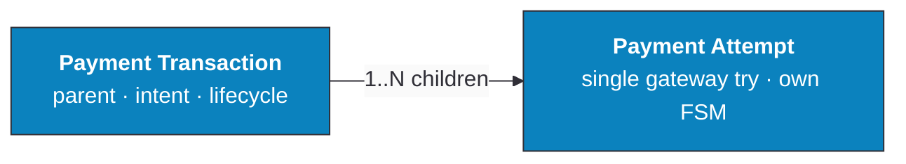
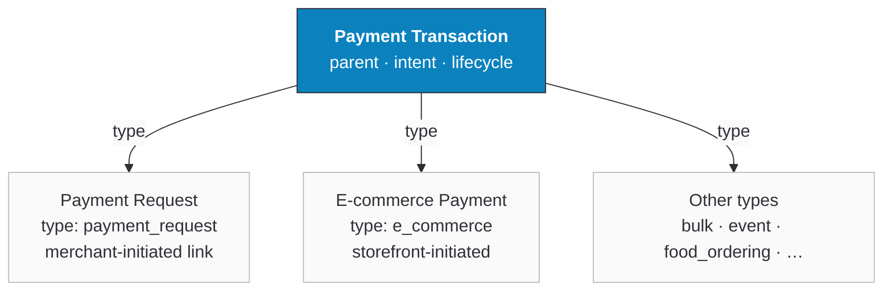

## Payment Object Model

Every payment in Ottu is described by four core objects. Knowing what each one is — and how they relate — makes the state tables below much easier to follow.

- **[Payment Transaction](/glossary#term-payment-transaction)** — the parent record holding the customer's intent to pay (amount, currency, allowed gateways, lifecycle state).
- **[Payment Attempt](/glossary#term-payment-attempt)** — a single gateway-level try against a `Payment Transaction`. One transaction can have many attempts; at most one reaches a `paid` state.
- **[Payment Request](/glossary#term-payment-request)** — a `Payment Transaction` with `type: payment_request`, merchant-initiated and typically delivered as a payment link.
- **[E-commerce Payment](/glossary#term-e-commerce-payment)** — a `Payment Transaction` with `type: e_commerce`, customer-initiated from an external storefront (Shopify, WooCommerce, Magento, etc.).

### Hierarchy

A `Payment Transaction` is the parent record. Every gateway-level try against it is a `Payment Attempt` child:

The `type` field on `Payment Transaction` tells you what kind of intent it represents — a `Payment Request`, an `E-commerce Payment`, or one of several other types:

